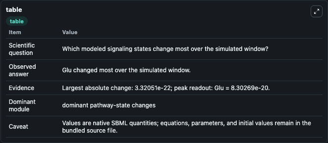
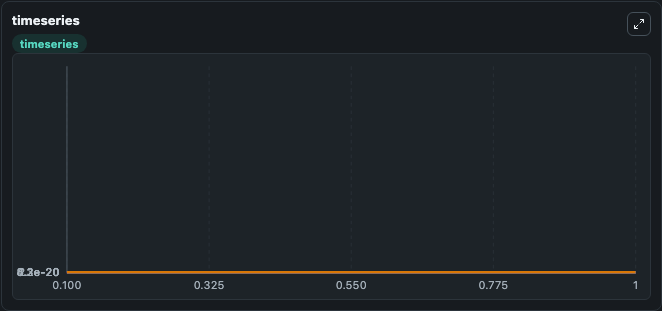
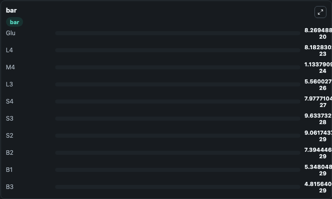

# Dutta-Roy2015 - Opening of the multiple AMPA receptor conductance states

This Biosimulant lab wraps `Dutta-Roy2015 - Opening of the multiple AMPA receptor conductance states` as a runnable signaling model with a companion visualization module.
Clean Biosimulant lab for systems signaling model: Dutta-Roy2015 - Opening of the multiple AMPA receptor conductance states. It can be used to explore second-messenger and pathway-signaling dynamics and compare scenario outcomes across configurations.

## What You'll See

The lab asks: How does Dutta-Roy2015 - Opening of the multiple AMPA receptor conductance states transmit cytokine receptor activity into STAT pathway states? It runs for 1.0 time units with a communication step of 0.1. The run uses the model defaults declared by the curated SBML wrapper. The generated visualizations focus on source-defined B0 state, source-defined S0 state, source-defined B1 state, source-defined S1 state, source-defined B2 state, and source-defined S2 state, and related outputs, combining trajectory, endpoint-comparison, and summary-table views from one completed dark-mode run.

In this captured run, **Glu** moved from 8.3e-20 to 8.27e-20 across 1.0 simulation windows.

<!-- BIOSIMULANT_VISUALS_START -->
### Output Visualizations



*Summary table for Dutta-Roy2015 - Opening of the multiple AMPA receptor conductance states, reporting the scientific question, observed answer, dominant module, and caveat.*



*Trajectories of Glu, B0, L4, M4, L3, and S4 across the 1.0 simulation. In this run **L4** climbed from 0 to 8.18e-23 and **Glu** fell from 8.3e-20 to 8.27e-20 — the largest movements among the focused observables.*



*Largest-excursion ranking of the focused observables — the absolute movement magnitude during the run. Top 3: **Glu** = 8.27e-20, **L4** = 8.18e-23, **M4** = 1.13e-24, with 7 more observables below.*

<!-- BIOSIMULANT_VISUALS_END -->

## Model Context

- Core model: `models/core`
- Visualization model: `models/visualisation`
- Standard: `other`
- Upstream source: `biomodels_ebi:BIOMD0000000569`
- License: `CC0`
- Visual scope: JAK/STAT receptor-to-transcription signaling
- Caveat: Values are native SBML quantities; equations, parameters, units, and initial values remain in the bundled source file.

## Inputs

| Input | Maps To | Default | Notes |
|---|---|---|---|
| Initial source-defined B0 state | `signaling_sbml_dutta_roy2015_opening_of_the_multiple_ampa_recep_biomd0000000569_model.initial_source_defined_b0_state` |  | Initial level of source-defined B0 state. Maps to SBML symbol `B0`; exposed as a traceable initial-condition perturbation. |

## Outputs

| Output | Maps To | Role |
|---|---|---|
| `glutamate` | `signaling_sbml_dutta_roy2015_opening_of_the_multiple_ampa_recep_biomd0000000569_model.glutamate` | glutamate. |
| `source_defined_b0_state` | `signaling_sbml_dutta_roy2015_opening_of_the_multiple_ampa_recep_biomd0000000569_model.source_defined_b0_state` | source-defined B0 state. |
| `source_defined_s0_state` | `signaling_sbml_dutta_roy2015_opening_of_the_multiple_ampa_recep_biomd0000000569_model.source_defined_s0_state` | source-defined S0 state. |
| `state` | `signaling_sbml_dutta_roy2015_opening_of_the_multiple_ampa_recep_biomd0000000569_model.state` | Available to the visualization model and downstream workflows. |
| `summary` | `signaling_sbml_dutta_roy2015_opening_of_the_multiple_ampa_recep_biomd0000000569_model.summary` | Available to the visualization model and downstream workflows. |
| `species_labels` | `signaling_sbml_dutta_roy2015_opening_of_the_multiple_ampa_recep_biomd0000000569_model.species_labels` | Available to the visualization model and downstream workflows. |

## Runtime

- Duration: `1.0`
- Communication step: `0.1`

## Running Locally

```bash
biosimulant labs serve .
```
