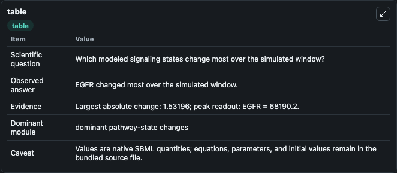
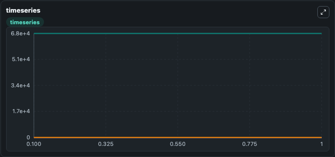
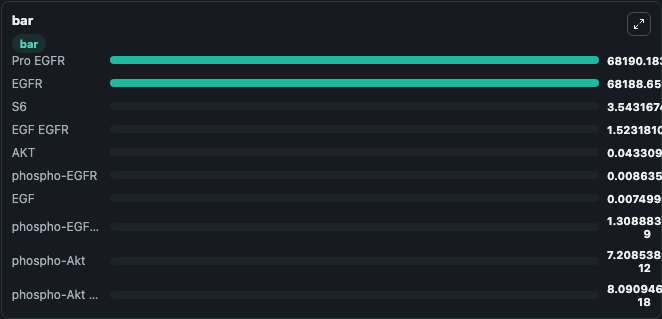

# Fujita2010_Akt_Signalling_EGF

This Biosimulant lab wraps `Fujita2010_Akt_Signalling_EGF` as a runnable signaling model with a companion visualization module.
Clean Biosimulant lab for systems signaling model: Fujita2010_Akt_Signalling_EGF. It can be used to explore second-messenger and pathway-signaling dynamics and compare scenario outcomes across configurations.

## What You'll See

The lab asks: How does Fujita2010 Akt Signalling EGF propagate receptor or RAS/ERK pathway activity? It runs for 1.0 time units with a communication step of 0.1. The run uses the model defaults declared by the curated SBML wrapper. The generated visualizations focus on EGF, EGFR, P EGFR, P EGFR AKT, AKT, and source-defined PAKT state, and related outputs, combining trajectory, endpoint-comparison, and summary-table views from one completed dark-mode run.

In this captured run, **EGFR** moved from 6.82e+04 to 6.82e+04 across 1.0 simulation windows.

<!-- BIOSIMULANT_VISUALS_START -->
### Output Visualizations



*Summary table for Fujita2010_Akt_Signalling_EGF, reporting the scientific question, observed answer, dominant module, and caveat.*



*Trajectories of EGFR, EGF EGFR, phospho-EGFR, EGF, AKT, and phospho-EGFR AKT across the 1.0 simulation. In this run **EGF EGFR** climbed from 0 to 1.523 and **EGFR** fell from 6.82e+04 to 6.82e+04 — the largest movements among the focused observables.*



*Largest-excursion ranking of the focused observables — the absolute movement magnitude during the run. Top 3: **Pro EGFR** = 6.82e+04, **EGFR** = 6.82e+04, **S6** = 3.543, with 7 more observables below.*

<!-- BIOSIMULANT_VISUALS_END -->

## Model Context

- Core model: `models/core`
- Visualization model: `models/visualisation`
- Standard: `other`
- Upstream source: `biomodels_ebi:BIOMD0000000262`
- License: `CC0`
- Visual scope: receptor-to-MAPK cascade signaling
- Caveat: Values are native SBML quantities; equations, parameters, units, and initial values remain in the bundled source file.

## Inputs

| Input | Maps To | Default | Notes |
|---|---|---|---|
| EGF Conc Impulse | `signaling_sbml_fujita2010_akt_signalling_egf_biomd0000000262_model.initial_egf_conc_impulse_level` |  | EGF Conc Impulse source parameter. Maps to SBML symbol `EGF_conc_impulse` and preserves the bundled default. |
| EGF Conc Ramp | `signaling_sbml_fujita2010_akt_signalling_egf_biomd0000000262_model.initial_egf_conc_ramp_level` |  | EGF Conc Ramp source parameter. Maps to SBML symbol `EGF_conc_ramp` and preserves the bundled default. |
| EGF Conc Step | `signaling_sbml_fujita2010_akt_signalling_egf_biomd0000000262_model.initial_egf_conc_step_level` |  | EGF Conc Step source parameter. Maps to SBML symbol `EGF_conc_step` and preserves the bundled default. |

## Outputs

| Output | Maps To | Role |
|---|---|---|
| `p_egfr_akt` | `signaling_sbml_fujita2010_akt_signalling_egf_biomd0000000262_model.p_egfr_akt` | P EGFR AKT. |
| `akt` | `signaling_sbml_fujita2010_akt_signalling_egf_biomd0000000262_model.akt` | AKT. |
| `source_defined_pakt_state` | `signaling_sbml_fujita2010_akt_signalling_egf_biomd0000000262_model.source_defined_pakt_state` | source-defined PAKT state. |
| `state` | `signaling_sbml_fujita2010_akt_signalling_egf_biomd0000000262_model.state` | Available to the visualization model and downstream workflows. |
| `summary` | `signaling_sbml_fujita2010_akt_signalling_egf_biomd0000000262_model.summary` | Available to the visualization model and downstream workflows. |
| `species_labels` | `signaling_sbml_fujita2010_akt_signalling_egf_biomd0000000262_model.species_labels` | Available to the visualization model and downstream workflows. |

## Runtime

- Duration: `1.0`
- Communication step: `0.1`

## Running Locally

```bash
biosimulant labs serve .
```
