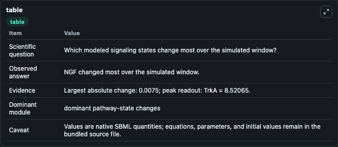
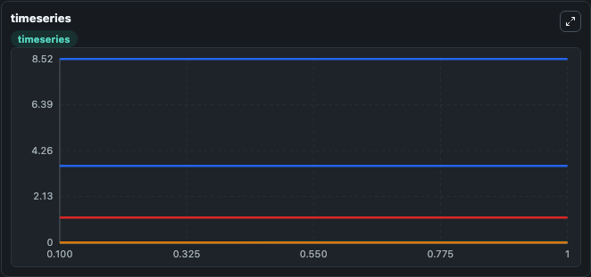
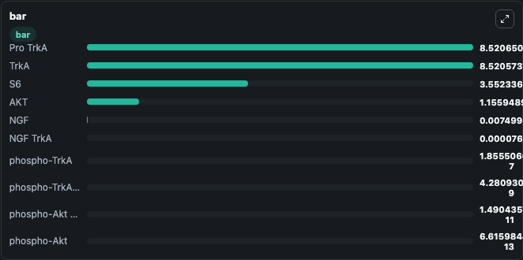

# Fujita2010_Akt_Signalling_NGF

This Biosimulant lab wraps `Fujita2010_Akt_Signalling_NGF` as a runnable signaling model with a companion visualization module.
Clean Biosimulant lab for systems signaling model: Fujita2010_Akt_Signalling_NGF. It can be used to explore second-messenger and pathway-signaling dynamics and compare scenario outcomes across configurations.

## What You'll See

The lab asks: How does Fujita2010 Akt Signalling NGF propagate receptor or RAS/ERK pathway activity? It runs for 1.0 time units with a communication step of 0.1. The run uses the model defaults declared by the curated SBML wrapper. The generated visualizations focus on nerve growth factor, source-defined TRKA state, P Trk A, P Trk A AKT, AKT, and source-defined PAKT state, and related outputs, combining trajectory, endpoint-comparison, and summary-table views from one completed dark-mode run.

In this captured run, **NGF** moved from 0 to 0.0075 across 1.0 simulation windows.

<!-- BIOSIMULANT_VISUALS_START -->
### Output Visualizations



*Summary table for Fujita2010_Akt_Signalling_NGF, reporting the scientific question, observed answer, dominant module, and caveat.*



*Trajectories of NGF, TrkA, NGF TrkA, phospho-TrkA, AKT, and phospho-TrkA AKT across the 1.0 simulation. In this run **NGF** climbed from 0 to 0.0075 and **TrkA** fell from 8.521 to 8.521 — the largest movements among the focused observables.*



*Largest-excursion ranking of the focused observables — the absolute movement magnitude during the run. Top 3: **Pro TrkA** = 8.521, **TrkA** = 8.521, **S6** = 3.552, with 7 more observables below.*

<!-- BIOSIMULANT_VISUALS_END -->

## Model Context

- Core model: `models/core`
- Visualization model: `models/visualisation`
- Standard: `other`
- Upstream source: `biomodels_ebi:BIOMD0000000263`
- License: `CC0`
- Visual scope: receptor-to-MAPK cascade signaling
- Caveat: Values are native SBML quantities; equations, parameters, units, and initial values remain in the bundled source file.

## Inputs

| Input | Maps To | Default | Notes |
|---|---|---|---|
| P AKT Scale Factor | `signaling_sbml_fujita2010_akt_signalling_ngf_biomd0000000263_model.initial_p_akt_scale_factor_level` |  | P AKT Scale Factor source parameter. Maps to SBML symbol `pAkt_scaleFactor` and preserves the bundled default. |
| Initial nerve growth factor | `signaling_sbml_fujita2010_akt_signalling_ngf_biomd0000000263_model.initial_nerve_growth_factor` |  | Initial level of nerve growth factor. Maps to SBML symbol `NGF`; exposed as a traceable initial-condition perturbation. |
| Initial Pro Trk A | `signaling_sbml_fujita2010_akt_signalling_ngf_biomd0000000263_model.initial_pro_trk_a` |  | Initial level of Pro Trk A. Maps to SBML symbol `pro_TrkA`; exposed as a traceable initial-condition perturbation. |

## Outputs

| Output | Maps To | Role |
|---|---|---|
| `p_trk_a_akt` | `signaling_sbml_fujita2010_akt_signalling_ngf_biomd0000000263_model.p_trk_a_akt` | P Trk A AKT. |
| `akt` | `signaling_sbml_fujita2010_akt_signalling_ngf_biomd0000000263_model.akt` | AKT. |
| `source_defined_pakt_state` | `signaling_sbml_fujita2010_akt_signalling_ngf_biomd0000000263_model.source_defined_pakt_state` | source-defined PAKT state. |
| `state` | `signaling_sbml_fujita2010_akt_signalling_ngf_biomd0000000263_model.state` | Available to the visualization model and downstream workflows. |
| `summary` | `signaling_sbml_fujita2010_akt_signalling_ngf_biomd0000000263_model.summary` | Available to the visualization model and downstream workflows. |
| `species_labels` | `signaling_sbml_fujita2010_akt_signalling_ngf_biomd0000000263_model.species_labels` | Available to the visualization model and downstream workflows. |

## Runtime

- Duration: `1.0`
- Communication step: `0.1`

## Running Locally

```bash
biosimulant labs serve .
```
