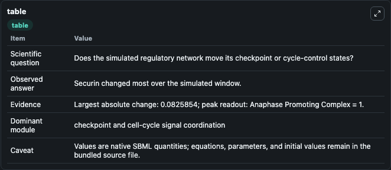
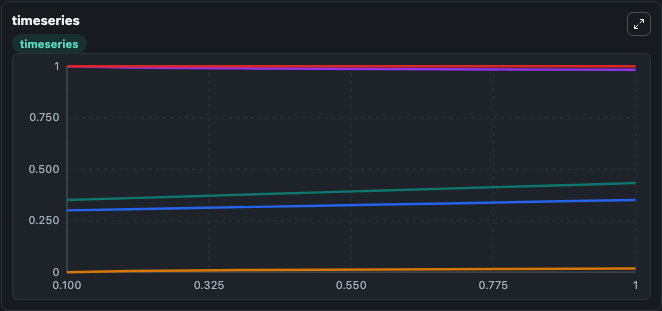
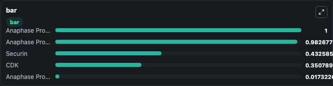

# Gerard2013 - Model 3 - Embryonic-type eukaryotic Cell Cycle regulation based on negative feedback between Cdk/cyclin and APC and competitive inhibition between Cdk/cyclin and securin for polyubiquitylation_1

This Biosimulant lab wraps `Gerard2013 - Model 3 - Embryonic-type eukaryotic Cell Cycle regulation based on negative feedback between Cdk/cyclin and APC and competitive inhibition between Cdk/cyclin and securin for polyubiquitylation_1` as a runnable signaling model with a companion visualization module.
Clean Biosimulant lab for cell-cycle regulatory signaling. It can be used to explore second-messenger and pathway-signaling dynamics and compare scenario outcomes across configurations.

## What You'll See

The lab asks: How does Gerard2013 - Model 3 - Embryonic-type eukaryotic Cell Cycle regulation based on negative feedback between Cdk/cyclin and APC and competitive inhibition between Cdk/cyclin and securin for polyubiquitylation 1 move checkpoint or cycle-control signaling states? It runs for 1.0 time units with a communication step of 0.1. The run uses the model defaults declared by the curated SBML wrapper. The generated visualizations focus on source-defined CDK state, Anaphase Promoting Complex Phosphorylated, Securin, Anaphase Promoting Complex, and Anaphase Promoting Complex Total, combining trajectory, endpoint-comparison, and summary-table views from one completed dark-mode run.

In this captured run, **Securin** moved from 0.3500 to 0.4326 across 1.0 simulation windows.

<!-- BIOSIMULANT_VISUALS_START -->
### Output Visualizations



*Summary table for Gerard2013 - Model 3 - Embryonic-type eukaryotic Cell Cycle regulation based on negative feedback between Cdk/cyclin and APC and competitive inhibition between Cdk/cyclin and securin for polyubiquitylation_1, reporting the scientific question, observed answer, dominant module, and caveat.*



*Trajectories of Securin, CDK, Anaphase Promoting Complex Phosphorylated, Anaphase Promoting Complex, and Anaphase Promoting Complex Total across the 1.0 simulation. In this run **Securin** climbed from 0.3500 to 0.4326 and **Anaphase Promoting Complex** fell from 1.000 to 0.9827 — the largest movements among the focused observables.*



*Largest-excursion ranking of the focused observables — the absolute movement magnitude during the run. Top 3: **Anaphase Promoting Complex Total** = 1.000, **Anaphase Promoting Complex** = 0.9827, **Securin** = 0.4326, with 2 more observables below.*

<!-- BIOSIMULANT_VISUALS_END -->

## Model Context

- Core model: `models/core`
- Visualization model: `models/visualisation`
- Standard: `other`
- Upstream source: `biomodels_ebi:BIOMD0000000938`
- License: `CC0`
- Visual scope: cell-cycle regulatory signaling
- Caveat: Values are native SBML quantities; equations, parameters, units, and initial values remain in the bundled source file.

## Inputs

| Input | Maps To | Default | Notes |
|---|---|---|---|
| Initial Anaphase Promoting Complex | `signaling_sbml_gerard2013_model_3_embryonic_type_eukaryotic_cel_biomd0000000938_model.initial_anaphase_promoting_complex` |  | Initial level of Anaphase Promoting Complex. Maps to SBML symbol `Anaphase_promoting_complex`; exposed as a traceable initial-condition perturbation. |
| Initial Anaphase Promoting Complex Total | `signaling_sbml_gerard2013_model_3_embryonic_type_eukaryotic_cel_biomd0000000938_model.initial_anaphase_promoting_complex_total` |  | Initial level of Anaphase Promoting Complex Total. Maps to SBML symbol `Anaphase_promoting_complex_total`; exposed as a traceable initial-condition perturbation. |

## Outputs

| Output | Maps To | Role |
|---|---|---|
| `anaphase_promoting_complex_phosphorylated` | `signaling_sbml_gerard2013_model_3_embryonic_type_eukaryotic_cel_biomd0000000938_model.anaphase_promoting_complex_phosphorylated` | Anaphase Promoting Complex Phosphorylated. |
| `anaphase_promoting_complex` | `signaling_sbml_gerard2013_model_3_embryonic_type_eukaryotic_cel_biomd0000000938_model.anaphase_promoting_complex` | Anaphase Promoting Complex. |
| `anaphase_promoting_complex_total` | `signaling_sbml_gerard2013_model_3_embryonic_type_eukaryotic_cel_biomd0000000938_model.anaphase_promoting_complex_total` | Anaphase Promoting Complex Total. |
| `state` | `signaling_sbml_gerard2013_model_3_embryonic_type_eukaryotic_cel_biomd0000000938_model.state` | Available to the visualization model and downstream workflows. |
| `summary` | `signaling_sbml_gerard2013_model_3_embryonic_type_eukaryotic_cel_biomd0000000938_model.summary` | Available to the visualization model and downstream workflows. |
| `species_labels` | `signaling_sbml_gerard2013_model_3_embryonic_type_eukaryotic_cel_biomd0000000938_model.species_labels` | Available to the visualization model and downstream workflows. |

## Runtime

- Duration: `1.0`
- Communication step: `0.1`

## Running Locally

```bash
biosimulant labs serve .
```
