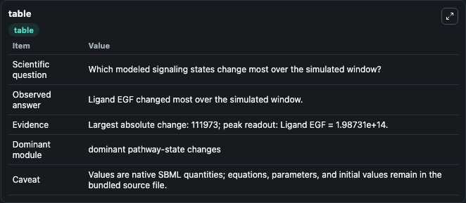
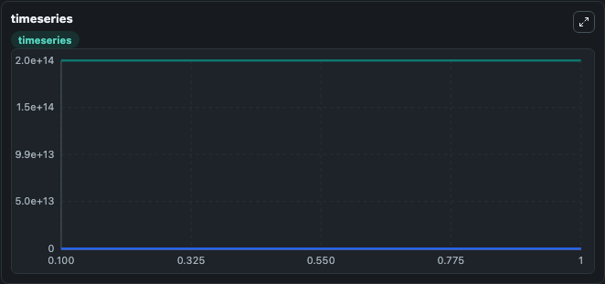
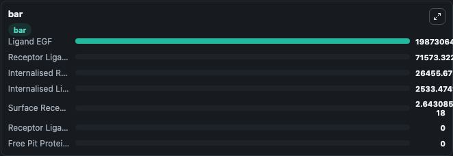

# Gex-Fabry1984 - model of receptor-mediated endocytosis of EGF in BALB/c 3T3 cells

This Biosimulant lab wraps `Gex-Fabry1984 - model of receptor-mediated endocytosis of EGF in BALB/c 3T3 cells` as a runnable signaling model with a companion visualization module.
Clean Biosimulant lab for systems signaling model: Gex-Fabry1984 - model of receptor-mediated endocytosis of EGF in BALB/c 3T3 cells. It can be used to explore second-messenger and pathway-signaling dynamics and compare scenario outcomes across configurations.

## What You'll See

The lab asks: How does Gex-Fabry1984 - model of receptor-mediated endocytosis of EGF in BALB/c 3T3 cells propagate receptor or RAS/ERK pathway activity? It runs for 1.0 time units with a communication step of 0.1. The run uses the model defaults declared by the curated SBML wrapper. The generated visualizations focus on Ligand EGF, Surface Receptor External, Receptor Ligand Complex, Internalised Receptors, Receptor Ligand Pit Protein Complex, and free Pit Proteins, and related outputs, combining trajectory, endpoint-comparison, and summary-table views from one completed dark-mode run.

In this captured run, **Ligand EGF** moved from 1.99e+14 to 1.99e+14 across 1.0 simulation windows.

<!-- BIOSIMULANT_VISUALS_START -->
### Output Visualizations



*Summary table for Gex-Fabry1984 - model of receptor-mediated endocytosis of EGF in BALB/c 3T3 cells, reporting the scientific question, observed answer, dominant module, and caveat.*



*Trajectories of Ligand EGF, Surface Receptor External, Receptor Ligand Complex, Internalised Ligand, Internalised Receptors, and Receptor Ligand Pit Protein Complex across the 1.0 simulation. In this run **Receptor Ligand Complex** climbed from 0 to 7.16e+04 and **Ligand EGF** fell from 1.99e+14 to 1.99e+14 — the largest movements among the focused observables.*



*Largest-excursion ranking of the focused observables — the absolute movement magnitude during the run. Top 3: **Ligand EGF** = 1.99e+14, **Receptor Ligand Complex** = 7.16e+04, **Internalised Receptors** = 2.65e+04, with 4 more observables below.*

<!-- BIOSIMULANT_VISUALS_END -->

## Model Context

- Core model: `models/core`
- Visualization model: `models/visualisation`
- Standard: `other`
- Upstream source: `biomodels_ebi:BIOMD0000000985`
- License: `CC0`
- Visual scope: receptor-to-MAPK cascade signaling
- Caveat: Values are native SBML quantities; equations, parameters, units, and initial values remain in the bundled source file.

## Inputs

| Input | Maps To | Default | Notes |
|---|---|---|---|
| Initial Internalised Ligand | `signaling_sbml_gex_fabry1984_model_of_receptor_mediated_endocyt_biomd0000000985_model.initial_internalised_ligand` |  | Initial level of Internalised Ligand. Maps to SBML symbol `Internalised_Ligand`; exposed as a traceable initial-condition perturbation. |
| Initial Ligand EGF | `signaling_sbml_gex_fabry1984_model_of_receptor_mediated_endocyt_biomd0000000985_model.initial_ligand_egf` |  | Initial level of Ligand EGF. Maps to SBML symbol `Ligand_EGF`; exposed as a traceable initial-condition perturbation. |
| Initial Receptor Ligand Complex | `signaling_sbml_gex_fabry1984_model_of_receptor_mediated_endocyt_biomd0000000985_model.initial_receptor_ligand_complex` |  | Initial level of Receptor Ligand Complex. Maps to SBML symbol `Receptor_Ligand_Complex`; exposed as a traceable initial-condition perturbation. |

## Outputs

| Output | Maps To | Role |
|---|---|---|
| `surface_receptor_external` | `signaling_sbml_gex_fabry1984_model_of_receptor_mediated_endocyt_biomd0000000985_model.surface_receptor_external` | Surface Receptor External. |
| `receptor_ligand_complex` | `signaling_sbml_gex_fabry1984_model_of_receptor_mediated_endocyt_biomd0000000985_model.receptor_ligand_complex` | Receptor Ligand Complex. |
| `internalised_receptors` | `signaling_sbml_gex_fabry1984_model_of_receptor_mediated_endocyt_biomd0000000985_model.internalised_receptors` | Internalised Receptors. |
| `state` | `signaling_sbml_gex_fabry1984_model_of_receptor_mediated_endocyt_biomd0000000985_model.state` | Available to the visualization model and downstream workflows. |
| `summary` | `signaling_sbml_gex_fabry1984_model_of_receptor_mediated_endocyt_biomd0000000985_model.summary` | Available to the visualization model and downstream workflows. |
| `species_labels` | `signaling_sbml_gex_fabry1984_model_of_receptor_mediated_endocyt_biomd0000000985_model.species_labels` | Available to the visualization model and downstream workflows. |

## Runtime

- Duration: `1.0`
- Communication step: `0.1`

## Running Locally

```bash
biosimulant labs serve .
```
