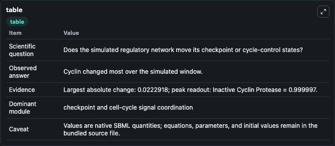
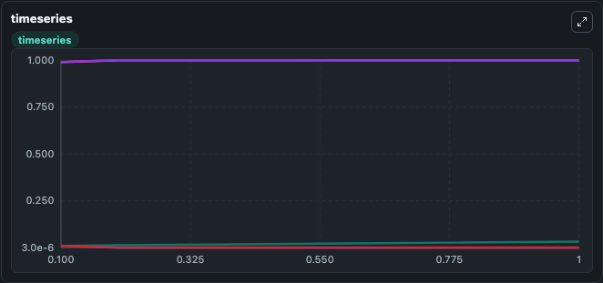
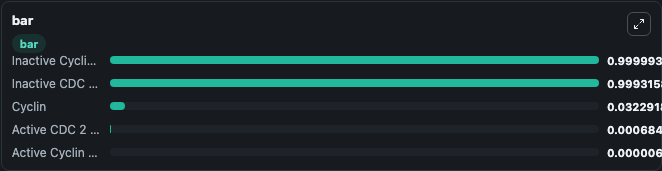

# Goldbeter1991 - Min Mit Oscil, Expl Inact

This Biosimulant lab wraps `Goldbeter1991 - Min Mit Oscil, Expl Inact` as a runnable signaling model with a companion visualization module.
Clean Biosimulant lab for cell-cycle regulatory signaling. It can be used to explore second-messenger and pathway-signaling dynamics and compare scenario outcomes across configurations.

## What You'll See

The lab asks: How does Goldbeter1991 - Min Mit Oscil, Expl Inact move checkpoint or cycle-control signaling states? It runs for 1.0 time units with a communication step of 0.1. The run uses the model defaults declared by the curated SBML wrapper. The generated visualizations focus on Cyclin, active CDC 2 Kinase, active Cyclin Protease, Inactive CDC 2 Kinase, and Inactive Cyclin Protease, combining trajectory, endpoint-comparison, and summary-table views from one completed dark-mode run.

In this captured run, **Cyclin** moved from 0.0100 to 0.0323 across 1.0 simulation windows.

<!-- BIOSIMULANT_VISUALS_START -->
### Output Visualizations



*Summary table for Goldbeter1991 - Min Mit Oscil, Expl Inact, reporting the scientific question, observed answer, dominant module, and caveat.*



*Trajectories of Cyclin, Active Cyclin Protease, Inactive Cyclin Protease, Inactive CDC 2 Kinase, and Active CDC 2 Kinase across the 1.0 simulation. In this run **Cyclin** climbed from 0.0100 to 0.0323 and **Active Cyclin Protease** fell from 0.0100 to 6.76e-06 — the largest movements among the focused observables.*



*Largest-excursion ranking of the focused observables — the absolute movement magnitude during the run. Top 3: **Inactive Cyclin Protease** = 1.0000, **Inactive CDC 2 Kinase** = 0.9993, **Cyclin** = 0.0323, with 2 more observables below.*

<!-- BIOSIMULANT_VISUALS_END -->

## Model Context

- Core model: `models/core`
- Visualization model: `models/visualisation`
- Standard: `other`
- Upstream source: `biomodels_ebi:BIOMD0000000004`
- License: `CC0`
- Visual scope: cell-cycle regulatory signaling
- Caveat: Values are native SBML quantities; equations, parameters, units, and initial values remain in the bundled source file.

## Inputs

| Input | Maps To | Default | Notes |
|---|---|---|---|
| Initial Cyclin | `signaling_sbml_goldbeter1991_min_mit_oscil_expl_inact_biomd0000000004_model.initial_cyclin` |  | Initial level of Cyclin. Maps to SBML symbol `C`; exposed as a traceable initial-condition perturbation. |

## Outputs

| Output | Maps To | Role |
|---|---|---|
| `active_cdc_2_kinase` | `signaling_sbml_goldbeter1991_min_mit_oscil_expl_inact_biomd0000000004_model.active_cdc_2_kinase` | active CDC 2 Kinase. |
| `active_cyclin_protease` | `signaling_sbml_goldbeter1991_min_mit_oscil_expl_inact_biomd0000000004_model.active_cyclin_protease` | active Cyclin Protease. |
| `inactive_cdc_2_kinase` | `signaling_sbml_goldbeter1991_min_mit_oscil_expl_inact_biomd0000000004_model.inactive_cdc_2_kinase` | Inactive CDC 2 Kinase. |
| `state` | `signaling_sbml_goldbeter1991_min_mit_oscil_expl_inact_biomd0000000004_model.state` | Available to the visualization model and downstream workflows. |
| `summary` | `signaling_sbml_goldbeter1991_min_mit_oscil_expl_inact_biomd0000000004_model.summary` | Available to the visualization model and downstream workflows. |
| `species_labels` | `signaling_sbml_goldbeter1991_min_mit_oscil_expl_inact_biomd0000000004_model.species_labels` | Available to the visualization model and downstream workflows. |

## Runtime

- Duration: `1.0`
- Communication step: `0.1`

## Running Locally

```bash
biosimulant labs serve .
```
