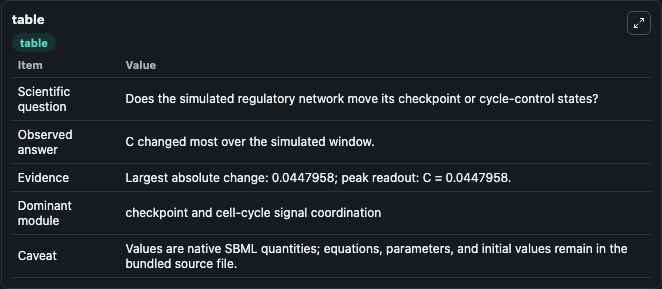
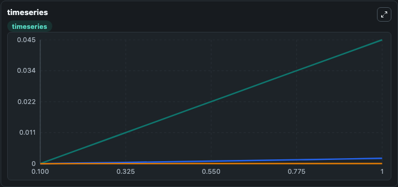
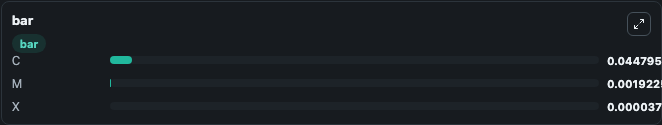

# Goldbeter1996 - Cyclin Cdc2 kinase Oscillations

This Biosimulant lab wraps `Goldbeter1996 - Cyclin Cdc2 kinase Oscillations` as a runnable signaling model with a companion visualization module.
Clean Biosimulant lab for cell-cycle regulatory signaling. It can be used to explore second-messenger and pathway-signaling dynamics and compare scenario outcomes across configurations.

## What You'll See

The lab asks: How does Goldbeter1996 - Cyclin Cdc2 kinase Oscillations move checkpoint or cycle-control signaling states? It runs for 1.0 time units with a communication step of 0.1. The run uses the model defaults declared by the curated SBML wrapper. The generated visualizations focus on source-defined C state, source-defined M state, and response node X, combining trajectory, endpoint-comparison, and summary-table views from one completed dark-mode run.

In this captured run, **C** moved from 0 to 0.0448 across 1.0 simulation windows.

<!-- BIOSIMULANT_VISUALS_START -->
### Output Visualizations



*Summary table for Goldbeter1996 - Cyclin Cdc2 kinase Oscillations, reporting the scientific question, observed answer, dominant module, and caveat.*



*Trajectories of C, M, and X across the 1.0 simulation. In this run **C** climbed from 0 to 0.0448 — the largest movements among the focused observables.*



*Largest-excursion ranking of the focused observables — the absolute movement magnitude during the run. Top 3: **C** = 0.0448, **M** = 0.00192, **X** = 3.73e-05.*

<!-- BIOSIMULANT_VISUALS_END -->

## Model Context

- Core model: `models/core`
- Visualization model: `models/visualisation`
- Standard: `other`
- Upstream source: `biomodels_ebi:BIOMD0000000729`
- License: `CC0`
- Visual scope: cell-cycle regulatory signaling
- Caveat: Values are native SBML quantities; equations, parameters, units, and initial values remain in the bundled source file.

## Inputs

| Input | Maps To | Default | Notes |
|---|---|---|---|
| Initial source-defined C state | `signaling_sbml_goldbeter1996_cyclin_cdc2_kinase_oscillations_biomd0000000729_model.initial_source_defined_c_state` |  | Initial level of source-defined C state. Maps to SBML symbol `C`; exposed as a traceable initial-condition perturbation. |

## Outputs

| Output | Maps To | Role |
|---|---|---|
| `source_defined_c_state` | `signaling_sbml_goldbeter1996_cyclin_cdc2_kinase_oscillations_biomd0000000729_model.source_defined_c_state` | source-defined C state. |
| `source_defined_m_state` | `signaling_sbml_goldbeter1996_cyclin_cdc2_kinase_oscillations_biomd0000000729_model.source_defined_m_state` | source-defined M state. |
| `response_node_x` | `signaling_sbml_goldbeter1996_cyclin_cdc2_kinase_oscillations_biomd0000000729_model.response_node_x` | response node X. |
| `state` | `signaling_sbml_goldbeter1996_cyclin_cdc2_kinase_oscillations_biomd0000000729_model.state` | Available to the visualization model and downstream workflows. |
| `summary` | `signaling_sbml_goldbeter1996_cyclin_cdc2_kinase_oscillations_biomd0000000729_model.summary` | Available to the visualization model and downstream workflows. |
| `species_labels` | `signaling_sbml_goldbeter1996_cyclin_cdc2_kinase_oscillations_biomd0000000729_model.species_labels` | Available to the visualization model and downstream workflows. |

## Runtime

- Duration: `1.0`
- Communication step: `0.1`

## Running Locally

```bash
biosimulant labs serve .
```
