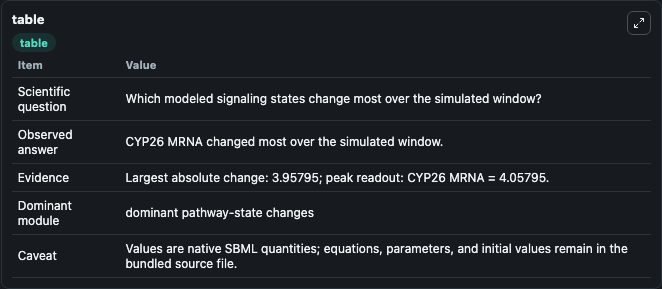
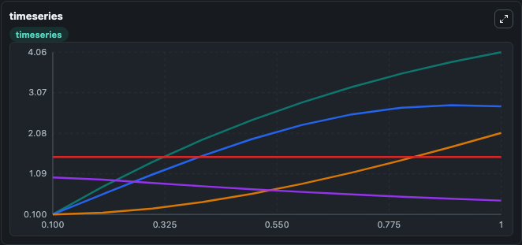
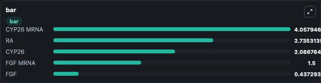

# Goldbeter2007_Somitogenesis_Switch

This Biosimulant lab wraps `Goldbeter2007_Somitogenesis_Switch` as a runnable signaling model with a companion visualization module.
Clean Biosimulant lab for systems signaling model: Goldbeter2007_Somitogenesis_Switch. It can be used to explore second-messenger and pathway-signaling dynamics and compare scenario outcomes across configurations.

## What You'll See

The lab asks: How does Goldbeter2007 Somitogenesis Switch move checkpoint or cycle-control signaling states? It runs for 1.0 time units with a communication step of 0.1. The run uses the model defaults declared by the curated SBML wrapper. The generated visualizations focus on Source Defined RA State, Cyp26 M RNA, CYP26, source-defined FGF state, and FGF M RNA, combining trajectory, endpoint-comparison, and summary-table views from one completed dark-mode run.

In this captured run, **CYP26 MRNA** moved from 0.1000 to 4.058 across 1.0 simulation windows.

<!-- BIOSIMULANT_VISUALS_START -->
### Output Visualizations



*Summary table for Goldbeter2007_Somitogenesis_Switch, reporting the scientific question, observed answer, dominant module, and caveat.*



*Trajectories of CYP26 MRNA, RA, CYP26, FGF, and FGF MRNA across the 1.0 simulation. In this run **CYP26 MRNA** climbed from 0.1000 to 4.058 and **FGF** fell from 1.000 to 0.4373 — the largest movements among the focused observables.*



*Largest-excursion ranking of the focused observables — the absolute movement magnitude during the run. Top 3: **CYP26 MRNA** = 4.058, **RA** = 2.735, **CYP26** = 2.087, with 2 more observables below.*

<!-- BIOSIMULANT_VISUALS_END -->

## Model Context

- Core model: `models/core`
- Visualization model: `models/visualisation`
- Standard: `other`
- Upstream source: `biomodels_ebi:BIOMD0000000275`
- License: `CC0`
- Visual scope: cell-cycle regulatory signaling
- Caveat: Values are native SBML quantities; equations, parameters, units, and initial values remain in the bundled source file.

## Inputs

| Input | Maps To | Default | Notes |
|---|---|---|---|
| Initial source-defined RA state | `signaling_sbml_goldbeter2007_somitogenesis_switch_biomd0000000275_model.initial_source_defined_ra_state` |  | Initial level of source-defined RA state. Maps to SBML symbol `RA`; exposed as a traceable initial-condition perturbation. |

## Outputs

| Output | Maps To | Role |
|---|---|---|
| `cyp26_m_rna` | `signaling_sbml_goldbeter2007_somitogenesis_switch_biomd0000000275_model.cyp26_m_rna` | Cyp26 M RNA. |
| `cyp26` | `signaling_sbml_goldbeter2007_somitogenesis_switch_biomd0000000275_model.cyp26` | CYP26. |
| `source_defined_fgf_state` | `signaling_sbml_goldbeter2007_somitogenesis_switch_biomd0000000275_model.source_defined_fgf_state` | source-defined FGF state. |
| `state` | `signaling_sbml_goldbeter2007_somitogenesis_switch_biomd0000000275_model.state` | Available to the visualization model and downstream workflows. |
| `summary` | `signaling_sbml_goldbeter2007_somitogenesis_switch_biomd0000000275_model.summary` | Available to the visualization model and downstream workflows. |
| `species_labels` | `signaling_sbml_goldbeter2007_somitogenesis_switch_biomd0000000275_model.species_labels` | Available to the visualization model and downstream workflows. |

## Runtime

- Duration: `1.0`
- Communication step: `0.1`

## Running Locally

```bash
biosimulant labs serve .
```
