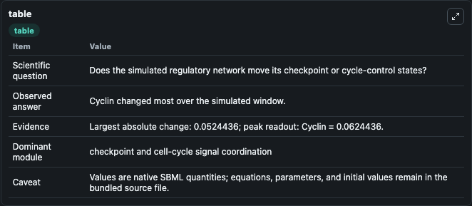
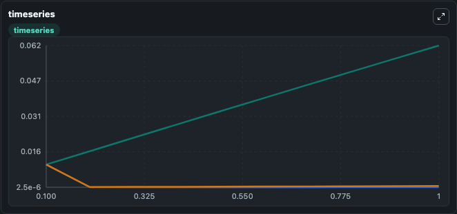
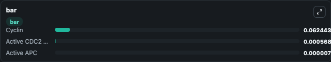

# Goldbeter2013-Oscillatory activity of cyclin-dependent kinases in the cell cycle

This Biosimulant lab wraps `Goldbeter2013-Oscillatory activity of cyclin-dependent kinases in the cell cycle` as a runnable signaling model with a companion visualization module.
Clean Biosimulant lab for cell-cycle regulatory signaling. It can be used to explore second-messenger and pathway-signaling dynamics and compare scenario outcomes across configurations.

## What You'll See

The lab asks: How does Goldbeter2013-Oscillatory activity of cyclin-dependent kinases in the cell cycle move checkpoint or cycle-control signaling states? It runs for 1.0 time units with a communication step of 0.1. The run uses the model defaults declared by the curated SBML wrapper. The generated visualizations focus on Cyclin, active Cdc2 Kinase, and active APC, combining trajectory, endpoint-comparison, and summary-table views from one completed dark-mode run.

In this captured run, **Cyclin** moved from 0.0100 to 0.0624 across 1.0 simulation windows.

<!-- BIOSIMULANT_VISUALS_START -->
### Output Visualizations



*Summary table for Goldbeter2013-Oscillatory activity of cyclin-dependent kinases in the cell cycle, reporting the scientific question, observed answer, dominant module, and caveat.*



*Trajectories of Cyclin, Active APC, and Active CDC2 Kinase across the 1.0 simulation. In this run **Cyclin** climbed from 0.0100 to 0.0624 and **Active APC** fell from 0.0100 to 7.93e-06 — the largest movements among the focused observables.*



*Largest-excursion ranking of the focused observables — the absolute movement magnitude during the run. Top 3: **Cyclin** = 0.0624, **Active CDC2 Kinase** = 0.000568, **Active APC** = 7.93e-06.*

<!-- BIOSIMULANT_VISUALS_END -->

## Model Context

- Core model: `models/core`
- Visualization model: `models/visualisation`
- Standard: `other`
- Upstream source: `biomodels_ebi:BIOMD0000000944`
- License: `CC0`
- Visual scope: cell-cycle regulatory signaling
- Caveat: Values are native SBML quantities; equations, parameters, units, and initial values remain in the bundled source file.

## Inputs

| Input | Maps To | Default | Notes |
|---|---|---|---|
| Initial Cyclin | `signaling_sbml_goldbeter2013_oscillatory_activity_of_cyclin_dep_biomd0000000944_model.initial_cyclin` |  | Initial level of Cyclin. Maps to SBML symbol `Cyclin`; exposed as a traceable initial-condition perturbation. |

## Outputs

| Output | Maps To | Role |
|---|---|---|
| `active_cdc2_kinase` | `signaling_sbml_goldbeter2013_oscillatory_activity_of_cyclin_dep_biomd0000000944_model.active_cdc2_kinase` | active Cdc2 Kinase. |
| `active_apc` | `signaling_sbml_goldbeter2013_oscillatory_activity_of_cyclin_dep_biomd0000000944_model.active_apc` | active APC. |
| `cyclin` | `signaling_sbml_goldbeter2013_oscillatory_activity_of_cyclin_dep_biomd0000000944_model.cyclin` | Cyclin. |
| `state` | `signaling_sbml_goldbeter2013_oscillatory_activity_of_cyclin_dep_biomd0000000944_model.state` | Available to the visualization model and downstream workflows. |
| `summary` | `signaling_sbml_goldbeter2013_oscillatory_activity_of_cyclin_dep_biomd0000000944_model.summary` | Available to the visualization model and downstream workflows. |
| `species_labels` | `signaling_sbml_goldbeter2013_oscillatory_activity_of_cyclin_dep_biomd0000000944_model.species_labels` | Available to the visualization model and downstream workflows. |

## Runtime

- Duration: `1.0`
- Communication step: `0.1`

## Running Locally

```bash
biosimulant labs serve .
```
