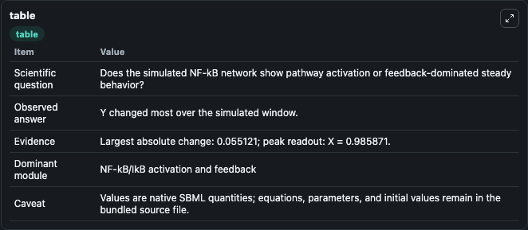
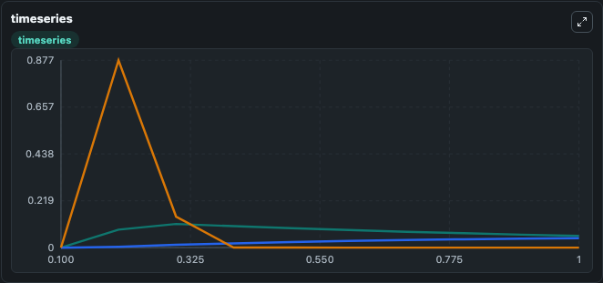
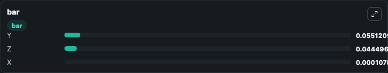

# GonzalezMiranda2013 - The effect of circadian oscillations on biochemical cell signaling by NF-κB

This Biosimulant lab wraps `GonzalezMiranda2013 - The effect of circadian oscillations on biochemical cell signaling by NF-κB` as a runnable signaling model with a companion visualization module.
Clean Biosimulant lab for NF-kB pathway signaling. It can be used to explore second-messenger and pathway-signaling dynamics and compare scenario outcomes across configurations.

## What You'll See

The lab asks: How does GonzalezMiranda2013 - The effect of circadian oscillations on biochemical cell signaling by NF-κB move NF-kB and inhibitor-linked signaling states? It runs for 1.0 time units with a communication step of 0.1. The run uses the model defaults declared by the curated SBML wrapper. The generated visualizations focus on response node X, source-defined Y state, and source-defined Z state, combining trajectory, endpoint-comparison, and summary-table views from one completed dark-mode run.

In this captured run, **Y** moved from 0 to 0.0551 across 1.0 simulation windows.

<!-- BIOSIMULANT_VISUALS_START -->
### Output Visualizations



*Summary table for GonzalezMiranda2013 - The effect of circadian oscillations on biochemical cell signaling by NF-κB, reporting the scientific question, observed answer, dominant module, and caveat.*



*Trajectories of Y, Z, and X across the 1.0 simulation. In this run **Y** climbed from 0 to 0.0551 — the largest movements among the focused observables.*



*Largest-excursion ranking of the focused observables — the absolute movement magnitude during the run. Top 3: **Y** = 0.0551, **Z** = 0.0445, **X** = 0.000108.*

<!-- BIOSIMULANT_VISUALS_END -->

## Model Context

- Core model: `models/core`
- Visualization model: `models/visualisation`
- Standard: `other`
- Upstream source: `biomodels_ebi:BIOMD0000000893`
- License: `CC0`
- Visual scope: NF-kB activation and feedback signaling
- Caveat: Values are native SBML quantities; equations, parameters, units, and initial values remain in the bundled source file.

## Inputs

| Input | Maps To | Default | Notes |
|---|---|---|---|
| Initial response node X | `signaling_sbml_gonzalezmiranda2013_the_effect_of_circadian_osci_biomd0000000893_model.initial_response_node_x` |  | Initial level of response node X. Maps to SBML symbol `x`; exposed as a traceable initial-condition perturbation. |

## Outputs

| Output | Maps To | Role |
|---|---|---|
| `response_node_x` | `signaling_sbml_gonzalezmiranda2013_the_effect_of_circadian_osci_biomd0000000893_model.response_node_x` | response node X. |
| `source_defined_y_state` | `signaling_sbml_gonzalezmiranda2013_the_effect_of_circadian_osci_biomd0000000893_model.source_defined_y_state` | source-defined Y state. |
| `source_defined_z_state` | `signaling_sbml_gonzalezmiranda2013_the_effect_of_circadian_osci_biomd0000000893_model.source_defined_z_state` | source-defined Z state. |
| `state` | `signaling_sbml_gonzalezmiranda2013_the_effect_of_circadian_osci_biomd0000000893_model.state` | Available to the visualization model and downstream workflows. |
| `summary` | `signaling_sbml_gonzalezmiranda2013_the_effect_of_circadian_osci_biomd0000000893_model.summary` | Available to the visualization model and downstream workflows. |
| `species_labels` | `signaling_sbml_gonzalezmiranda2013_the_effect_of_circadian_osci_biomd0000000893_model.species_labels` | Available to the visualization model and downstream workflows. |

## Runtime

- Duration: `1.0`
- Communication step: `0.1`

## Running Locally

```bash
biosimulant labs serve .
```
