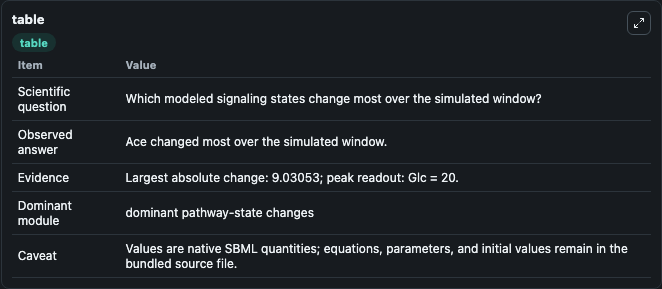
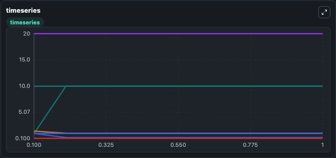
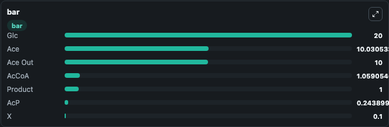

# Gosselin2025 - Ecoli_bioproduction_sensitive

This Biosimulant lab wraps `Gosselin2025 - Ecoli_bioproduction_sensitive` as a runnable signaling model with a companion visualization module.
Clean Biosimulant lab for systems signaling model: Gosselin2025 - Ecoli_bioproduction_sensitive. It can be used to explore second-messenger and pathway-signaling dynamics and compare scenario outcomes across configurations.

## What You'll See

The lab asks: What baseline signaling response is generated by Gosselin2025 - Ecoli bioproduction sensitive? It runs for 1.0 time units with a communication step of 0.1. The run uses the model defaults declared by the curated SBML wrapper. The generated visualizations focus on glucose, source-defined ACP state, acetate, Ac Co A, response node X, and acetate Out, and related outputs, combining trajectory, endpoint-comparison, and summary-table views from one completed dark-mode run.

In this captured run, **Ace** moved from 1.000 to 10.031 across 1.0 simulation windows.

<!-- BIOSIMULANT_VISUALS_START -->
### Output Visualizations



*Summary table for Gosselin2025 - Ecoli_bioproduction_sensitive, reporting the scientific question, observed answer, dominant module, and caveat.*



*Trajectories of Ace, AcP, AcCoA, Glc, X, and Ace Out across the 1.0 simulation. In this run **Ace** climbed from 1.000 to 10.031 and **AcP** fell from 1.000 to 0.2439 — the largest movements among the focused observables.*



*Largest-excursion ranking of the focused observables — the absolute movement magnitude during the run. Top 3: **Glc** = 20.000, **Ace** = 10.031, **Ace Out** = 10.000, with 4 more observables below.*

<!-- BIOSIMULANT_VISUALS_END -->

## Model Context

- Core model: `models/core`
- Visualization model: `models/visualisation`
- Standard: `other`
- Upstream source: `biomodels_ebi:MODEL2506160002`
- License: `CC0`
- Visual scope: curated source-model signaling response
- Caveat: Values are native SBML quantities; equations, parameters, units, and initial values remain in the bundled source file.

## Inputs

| Input | Maps To | Default | Notes |
|---|---|---|---|
| Initial acetate Out | `signaling_sbml_gosselin2025_ecoli_bioproduction_sensitive_model2506160002_model.initial_acetate_out` |  | Initial level of acetate Out. Maps to SBML symbol `Ace_out`; exposed as a traceable initial-condition perturbation. |
| Initial glucose | `signaling_sbml_gosselin2025_ecoli_bioproduction_sensitive_model2506160002_model.initial_glucose` |  | Initial level of glucose. Maps to SBML symbol `Glc`; exposed as a traceable initial-condition perturbation. |
| Initial response node X | `signaling_sbml_gosselin2025_ecoli_bioproduction_sensitive_model2506160002_model.initial_response_node_x` |  | Initial level of response node X. Maps to SBML symbol `X`; exposed as a traceable initial-condition perturbation. |

## Outputs

| Output | Maps To | Role |
|---|---|---|
| `glucose` | `signaling_sbml_gosselin2025_ecoli_bioproduction_sensitive_model2506160002_model.glucose` | glucose. |
| `source_defined_acp_state` | `signaling_sbml_gosselin2025_ecoli_bioproduction_sensitive_model2506160002_model.source_defined_acp_state` | source-defined ACP state. |
| `acetate` | `signaling_sbml_gosselin2025_ecoli_bioproduction_sensitive_model2506160002_model.acetate` | acetate. |
| `state` | `signaling_sbml_gosselin2025_ecoli_bioproduction_sensitive_model2506160002_model.state` | Available to the visualization model and downstream workflows. |
| `summary` | `signaling_sbml_gosselin2025_ecoli_bioproduction_sensitive_model2506160002_model.summary` | Available to the visualization model and downstream workflows. |
| `species_labels` | `signaling_sbml_gosselin2025_ecoli_bioproduction_sensitive_model2506160002_model.species_labels` | Available to the visualization model and downstream workflows. |

## Runtime

- Duration: `1.0`
- Communication step: `0.1`

## Running Locally

```bash
biosimulant labs serve .
```
