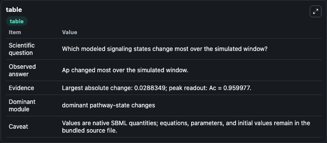
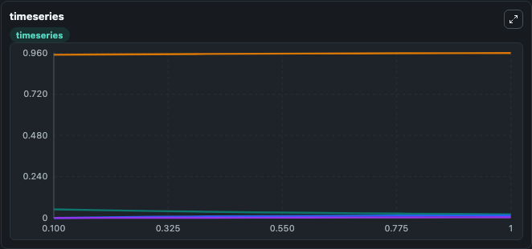
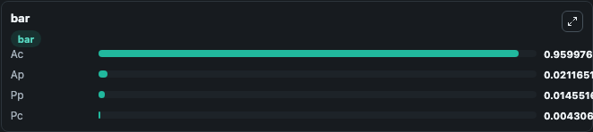

# Gray2016 - The Akt switch model

This Biosimulant lab wraps `Gray2016 - The Akt switch model` as a runnable signaling model with a companion visualization module.
Clean Biosimulant lab for systems signaling model: Gray2016 - The Akt switch model. It can be used to explore second-messenger and pathway-signaling dynamics and compare scenario outcomes across configurations.

## What You'll See

The lab asks: How does Gray2016 - The Akt switch model propagate receptor or RAS/ERK pathway activity? It runs for 1.0 time units with a communication step of 0.1. The run uses the model defaults declared by the curated SBML wrapper. The generated visualizations focus on source-defined AC state, source-defined PC state, source-defined AP state, and source-defined PP state, combining trajectory, endpoint-comparison, and summary-table views from one completed dark-mode run.

In this captured run, **Ap** moved from 0.0500 to 0.0212 across 1.0 simulation windows.

<!-- BIOSIMULANT_VISUALS_START -->
### Output Visualizations



*Summary table for Gray2016 - The Akt switch model, reporting the scientific question, observed answer, dominant module, and caveat.*



*Trajectories of Ap, Pp, Ac, and Pc across the 1.0 simulation. In this run **Pp** climbed from 0 to 0.0146 and **Ap** fell from 0.0500 to 0.0212 — the largest movements among the focused observables.*



*Largest-excursion ranking of the focused observables — the absolute movement magnitude during the run. Top 3: **Ac** = 0.9600, **Ap** = 0.0212, **Pp** = 0.0146, with 1 more observable below.*

<!-- BIOSIMULANT_VISUALS_END -->

## Model Context

- Core model: `models/core`
- Visualization model: `models/visualisation`
- Standard: `other`
- Upstream source: `biomodels_ebi:BIOMD0000000854`
- License: `CC0`
- Visual scope: receptor-to-MAPK cascade signaling
- Caveat: Values are native SBML quantities; equations, parameters, units, and initial values remain in the bundled source file.

## Inputs

| Input | Maps To | Default | Notes |
|---|---|---|---|
| Initial source-defined AC state | `signaling_sbml_gray2016_the_akt_switch_model_biomd0000000854_model.initial_source_defined_ac_state` |  | Initial level of source-defined AC state. Maps to SBML symbol `Ac`; exposed as a traceable initial-condition perturbation. |

## Outputs

| Output | Maps To | Role |
|---|---|---|
| `source_defined_ac_state` | `signaling_sbml_gray2016_the_akt_switch_model_biomd0000000854_model.source_defined_ac_state` | source-defined AC state. |
| `source_defined_pc_state` | `signaling_sbml_gray2016_the_akt_switch_model_biomd0000000854_model.source_defined_pc_state` | source-defined PC state. |
| `source_defined_ap_state` | `signaling_sbml_gray2016_the_akt_switch_model_biomd0000000854_model.source_defined_ap_state` | source-defined AP state. |
| `state` | `signaling_sbml_gray2016_the_akt_switch_model_biomd0000000854_model.state` | Available to the visualization model and downstream workflows. |
| `summary` | `signaling_sbml_gray2016_the_akt_switch_model_biomd0000000854_model.summary` | Available to the visualization model and downstream workflows. |
| `species_labels` | `signaling_sbml_gray2016_the_akt_switch_model_biomd0000000854_model.species_labels` | Available to the visualization model and downstream workflows. |

## Runtime

- Duration: `1.0`
- Communication step: `0.1`

## Running Locally

```bash
biosimulant labs serve .
```
