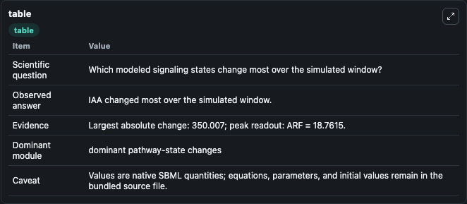
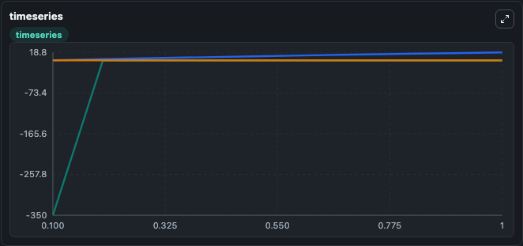
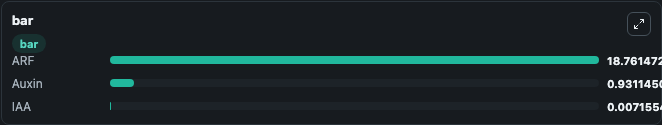

# Grigolon2018 - Responses to auxin signals

This Biosimulant lab wraps `Grigolon2018 - Responses to auxin signals` as a runnable signaling model with a companion visualization module.
Clean Biosimulant lab for systems signaling model: Grigolon2018 - Responses to auxin signals. It can be used to explore second-messenger and pathway-signaling dynamics and compare scenario outcomes across configurations.

## What You'll See

The lab asks: How does Grigolon2018 - Responses to auxin signals shift hormone-linked signaling readouts? It runs for 1.0 time units with a communication step of 0.1. The run uses the model defaults declared by the curated SBML wrapper. The generated visualizations focus on Auxin, indole-3-acetic acid, and auxin response factor, combining trajectory, endpoint-comparison, and summary-table views from one completed dark-mode run.

In this captured run, **IAA** moved from -350.0 to 0.00716 across 1.0 simulation windows.

<!-- BIOSIMULANT_VISUALS_START -->
### Output Visualizations



*Summary table for Grigolon2018 - Responses to auxin signals, reporting the scientific question, observed answer, dominant module, and caveat.*



*Trajectories of IAA, ARF, and Auxin across the 1.0 simulation. In this run **IAA** climbed from -350.0 to 0.00716 and **Auxin** fell from 1.000 to 0.9311 — the largest movements among the focused observables.*



*Largest-excursion ranking of the focused observables — the absolute movement magnitude during the run. Top 3: **ARF** = 18.761, **Auxin** = 0.9311, **IAA** = 0.00716.*

<!-- BIOSIMULANT_VISUALS_END -->

## Model Context

- Core model: `models/core`
- Visualization model: `models/visualisation`
- Standard: `other`
- Upstream source: `biomodels_ebi:MODEL2003060002`
- License: `CC0`
- Visual scope: metabolic and hormone signaling response
- Caveat: Values are native SBML quantities; equations, parameters, units, and initial values remain in the bundled source file.

## Inputs

| Input | Maps To | Default | Notes |
|---|---|---|---|
| Sauxin | `signaling_sbml_grigolon2018_responses_to_auxin_signals_model2003060002_model.initial_sauxin_level` |  | Sauxin source parameter. Maps to SBML symbol `Sauxin` and preserves the bundled default. |
| Tauxin | `signaling_sbml_grigolon2018_responses_to_auxin_signals_model2003060002_model.initial_tauxin_level` |  | Tauxin source parameter. Maps to SBML symbol `Tauxin` and preserves the bundled default. |
| Initial Auxin | `signaling_sbml_grigolon2018_responses_to_auxin_signals_model2003060002_model.initial_auxin` |  | Initial level of Auxin. Maps to SBML symbol `auxin`; exposed as a traceable initial-condition perturbation. |

## Outputs

| Output | Maps To | Role |
|---|---|---|
| `auxin` | `signaling_sbml_grigolon2018_responses_to_auxin_signals_model2003060002_model.auxin` | Auxin. |
| `indole_3_acetic_acid` | `signaling_sbml_grigolon2018_responses_to_auxin_signals_model2003060002_model.indole_3_acetic_acid` | indole-3-acetic acid. |
| `auxin_response_factor` | `signaling_sbml_grigolon2018_responses_to_auxin_signals_model2003060002_model.auxin_response_factor` | auxin response factor. |
| `state` | `signaling_sbml_grigolon2018_responses_to_auxin_signals_model2003060002_model.state` | Available to the visualization model and downstream workflows. |
| `summary` | `signaling_sbml_grigolon2018_responses_to_auxin_signals_model2003060002_model.summary` | Available to the visualization model and downstream workflows. |
| `species_labels` | `signaling_sbml_grigolon2018_responses_to_auxin_signals_model2003060002_model.species_labels` | Available to the visualization model and downstream workflows. |

## Runtime

- Duration: `1.0`
- Communication step: `0.1`

## Running Locally

```bash
biosimulant labs serve .
```
