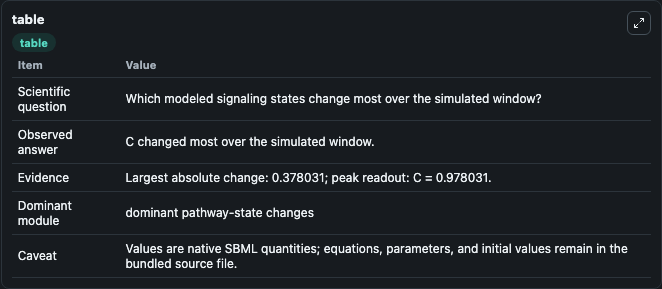
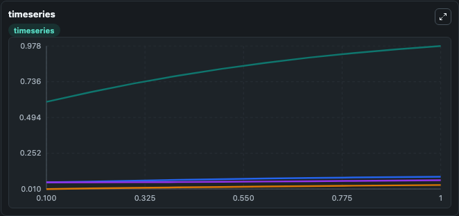
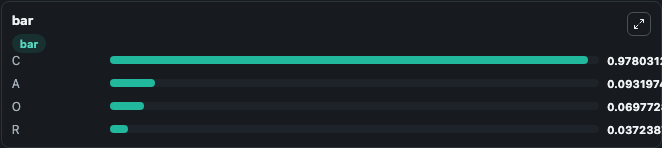

# Gupta2007_HypothalamicPituitaryAdrenal_ModelB

This Biosimulant lab wraps `Gupta2007_HypothalamicPituitaryAdrenal_ModelB` as a runnable signaling model with a companion visualization module.
Clean Biosimulant lab for systems signaling model: Gupta2007_HypothalamicPituitaryAdrenal_ModelB. It can be used to explore second-messenger and pathway-signaling dynamics and compare scenario outcomes across configurations.

## What You'll See

The lab asks: How does Gupta2007 HypothalamicPituitaryAdrenal ModelB route receptor activity into cAMP/PKA-linked readouts? It runs for 1.0 time units with a communication step of 0.1. The run uses the model defaults declared by the curated SBML wrapper. The generated visualizations focus on Source Defined C State, Source Defined A State, Source Defined R State, and Source Defined O State, combining trajectory, endpoint-comparison, and summary-table views from one completed dark-mode run.

In this captured run, **C** moved from 0.6000 to 0.9780 across 1.0 simulation windows.

<!-- BIOSIMULANT_VISUALS_START -->
### Output Visualizations



*Summary table for Gupta2007_HypothalamicPituitaryAdrenal_ModelB, reporting the scientific question, observed answer, dominant module, and caveat.*



*Trajectories of C, A, R, and O across the 1.0 simulation. In this run **C** climbed from 0.6000 to 0.9780 — the largest movements among the focused observables.*



*Largest-excursion ranking of the focused observables — the absolute movement magnitude during the run. Top 3: **C** = 0.9780, **A** = 0.0932, **O** = 0.0698, with 1 more observable below.*

<!-- BIOSIMULANT_VISUALS_END -->

## Model Context

- Core model: `models/core`
- Visualization model: `models/visualisation`
- Standard: `other`
- Upstream source: `biomodels_ebi:MODEL1006230036`
- License: `CC0`
- Visual scope: GPCR and cAMP/PKA signaling
- Caveat: Values are native SBML quantities; equations, parameters, units, and initial values remain in the bundled source file.

## Inputs

| Input | Maps To | Default | Notes |
|---|---|---|---|
| Initial source-defined C state | `signaling_sbml_gupta2007_hypothalamicpituitaryadrenal_modelb_model1006230036_model.initial_source_defined_c_state` |  | Initial level of source-defined C state. Maps to SBML symbol `c`; exposed as a traceable initial-condition perturbation. |

## Outputs

| Output | Maps To | Role |
|---|---|---|
| `source_defined_c_state` | `signaling_sbml_gupta2007_hypothalamicpituitaryadrenal_modelb_model1006230036_model.source_defined_c_state` | source-defined C state. |
| `source_defined_a_state` | `signaling_sbml_gupta2007_hypothalamicpituitaryadrenal_modelb_model1006230036_model.source_defined_a_state` | source-defined A state. |
| `source_defined_r_state` | `signaling_sbml_gupta2007_hypothalamicpituitaryadrenal_modelb_model1006230036_model.source_defined_r_state` | source-defined R state. |
| `state` | `signaling_sbml_gupta2007_hypothalamicpituitaryadrenal_modelb_model1006230036_model.state` | Available to the visualization model and downstream workflows. |
| `summary` | `signaling_sbml_gupta2007_hypothalamicpituitaryadrenal_modelb_model1006230036_model.summary` | Available to the visualization model and downstream workflows. |
| `species_labels` | `signaling_sbml_gupta2007_hypothalamicpituitaryadrenal_modelb_model1006230036_model.species_labels` | Available to the visualization model and downstream workflows. |

## Runtime

- Duration: `1.0`
- Communication step: `0.1`

## Running Locally

```bash
biosimulant labs serve .
```
