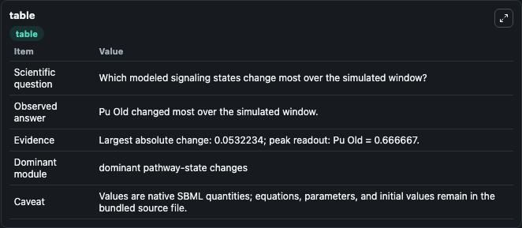
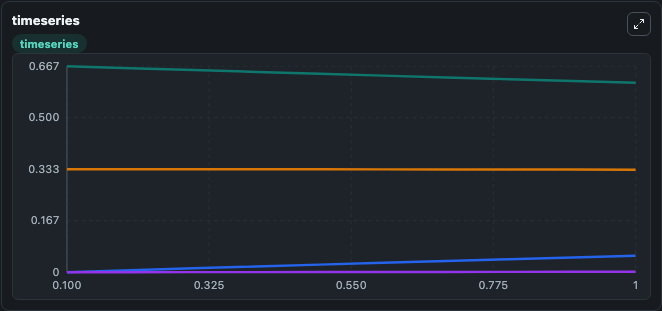
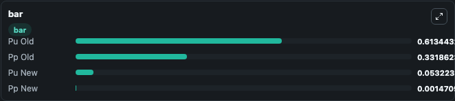

# Hammaren-Geissen2022_PPToP_Model12

This Biosimulant lab wraps `Hammaren-Geissen2022_PPToP_Model12` as a runnable signaling model with a companion visualization module.
Clean Biosimulant lab for systems signaling model: Hammaren-Geissen2022_PPToP_Model12. It can be used to explore second-messenger and pathway-signaling dynamics and compare scenario outcomes across configurations.

## What You'll See

The lab asks: What baseline signaling response is generated by Hammaren-Geissen2022 PPToP Model12? It runs for 1.0 time units with a communication step of 0.1. The run uses the model defaults declared by the curated SBML wrapper. The generated visualizations focus on Pu Old, Pp Old, Pu New, and Pp New, combining trajectory, endpoint-comparison, and summary-table views from one completed dark-mode run.

In this captured run, **Pu Old** moved from 0.6667 to 0.6134 across 1.0 simulation windows.

<!-- BIOSIMULANT_VISUALS_START -->
### Output Visualizations



*Summary table for Hammaren-Geissen2022_PPToP_Model12, reporting the scientific question, observed answer, dominant module, and caveat.*



*Trajectories of Pu Old, Pu New, Pp Old, and Pp New across the 1.0 simulation. In this run **Pu New** climbed from 0 to 0.0532 and **Pu Old** fell from 0.6667 to 0.6134 — the largest movements among the focused observables.*



*Largest-excursion ranking of the focused observables — the absolute movement magnitude during the run. Top 3: **Pu Old** = 0.6134, **Pp Old** = 0.3319, **Pu New** = 0.0532, with 1 more observable below.*

<!-- BIOSIMULANT_VISUALS_END -->

## Model Context

- Core model: `models/core`
- Visualization model: `models/visualisation`
- Standard: `other`
- Upstream source: `biomodels_ebi:BIOMD0000001078`
- License: `CC0`
- Visual scope: curated source-model signaling response
- Caveat: Values are native SBML quantities; equations, parameters, units, and initial values remain in the bundled source file.

## Inputs

| Input | Maps To | Default | Notes |
|---|---|---|---|
| Initial Pp New | `signaling_sbml_hammaren_geissen2022_pptop_model12_biomd0000001078_model.initial_pp_new` |  | Initial level of Pp New. Maps to SBML symbol `Pp_new`; exposed as a traceable initial-condition perturbation. |
| Initial Pu New | `signaling_sbml_hammaren_geissen2022_pptop_model12_biomd0000001078_model.initial_pu_new` |  | Initial level of Pu New. Maps to SBML symbol `Pu_new`; exposed as a traceable initial-condition perturbation. |

## Outputs

| Output | Maps To | Role |
|---|---|---|
| `pu_old` | `signaling_sbml_hammaren_geissen2022_pptop_model12_biomd0000001078_model.pu_old` | Pu Old. |
| `pp_old` | `signaling_sbml_hammaren_geissen2022_pptop_model12_biomd0000001078_model.pp_old` | Pp Old. |
| `pu_new` | `signaling_sbml_hammaren_geissen2022_pptop_model12_biomd0000001078_model.pu_new` | Pu New. |
| `state` | `signaling_sbml_hammaren_geissen2022_pptop_model12_biomd0000001078_model.state` | Available to the visualization model and downstream workflows. |
| `summary` | `signaling_sbml_hammaren_geissen2022_pptop_model12_biomd0000001078_model.summary` | Available to the visualization model and downstream workflows. |
| `species_labels` | `signaling_sbml_hammaren_geissen2022_pptop_model12_biomd0000001078_model.species_labels` | Available to the visualization model and downstream workflows. |

## Runtime

- Duration: `1.0`
- Communication step: `0.1`

## Running Locally

```bash
biosimulant labs serve .
```
