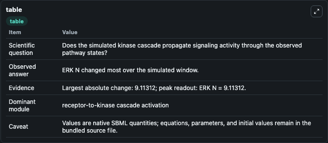
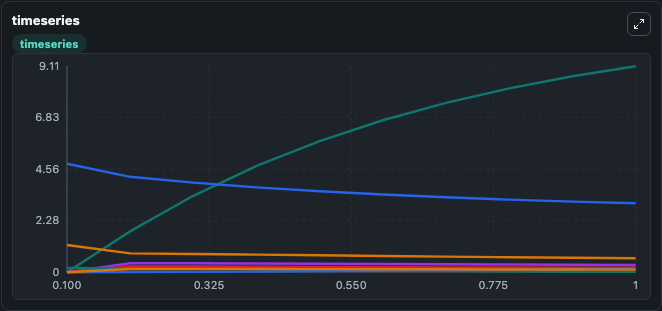
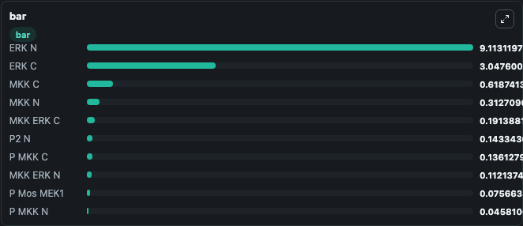

# Harish2009 - nuclear–cytoplasmic ERK oscillation model

This Biosimulant lab wraps `Harish2009 - nuclear–cytoplasmic ERK oscillation model` as a runnable signaling model with a companion visualization module.
Clean Biosimulant lab for MAPK/ERK receptor signaling. It can be used to explore second-messenger and pathway-signaling dynamics and compare scenario outcomes across configurations.

## What You'll See

The lab asks: How does Harish2009 - nuclear–cytoplasmic ERK oscillation model propagate receptor or RAS/ERK pathway activity? It runs for 1.0 time units with a communication step of 0.1. The run uses the model defaults declared by the curated SBML wrapper. The generated visualizations focus on E1 Mos kinase, source-defined MOS-P state, E2 Mos kinase P, Source Defined MAPK Kinase C State, P Mos kinase Mek1, and P MAPK Kinase C, and related outputs, combining trajectory, endpoint-comparison, and summary-table views from one completed dark-mode run.

In this captured run, **ERK N** moved from 0 to 9.113 across 1.0 simulation windows.

<!-- BIOSIMULANT_VISUALS_START -->
### Output Visualizations



*Summary table for Harish2009 - nuclear–cytoplasmic ERK oscillation model, reporting the scientific question, observed answer, dominant module, and caveat.*



*Trajectories of ERK N, ERK C, MKK C, MKK N, MKK ERK C, and P1 N across the 1.0 simulation. In this run **ERK N** climbed from 0 to 9.113 and **ERK C** fell from 4.800 to 3.048 — the largest movements among the focused observables.*



*Largest-excursion ranking of the focused observables — the absolute movement magnitude during the run. Top 3: **ERK N** = 9.113, **ERK C** = 3.048, **MKK C** = 0.6187, with 7 more observables below.*

<!-- BIOSIMULANT_VISUALS_END -->

## Model Context

- Core model: `models/core`
- Visualization model: `models/visualisation`
- Standard: `other`
- Upstream source: `biomodels_ebi:MODEL2306170002`
- License: `CC0`
- Visual scope: receptor-to-MAPK cascade signaling
- Caveat: Values are native SBML quantities; equations, parameters, units, and initial values remain in the bundled source file.

## Inputs

| Input | Maps To | Default | Notes |
|---|---|---|---|
| Initial E1 Mos kinase | `signaling_sbml_harish2009_nuclear_cytoplasmic_erk_oscillation_m_model2306170002_model.initial_e1_mos_kinase` |  | Initial level of E1 Mos kinase. Maps to SBML symbol `E1_MKKK`; exposed as a traceable initial-condition perturbation. |

## Outputs

| Output | Maps To | Role |
|---|---|---|
| `cytosolic_phosphorylated_erk` | `signaling_sbml_harish2009_nuclear_cytoplasmic_erk_oscillation_m_model2306170002_model.cytosolic_phosphorylated_erk` | cytosolic Phosphorylated ERK. |
| `pp_mapk_kinase_erk_c` | `signaling_sbml_harish2009_nuclear_cytoplasmic_erk_oscillation_m_model2306170002_model.pp_mapk_kinase_erk_c` | PP MAPK Kinase ERK C. |
| `p_erk_c` | `signaling_sbml_harish2009_nuclear_cytoplasmic_erk_oscillation_m_model2306170002_model.p_erk_c` | P ERK C. |
| `state` | `signaling_sbml_harish2009_nuclear_cytoplasmic_erk_oscillation_m_model2306170002_model.state` | Available to the visualization model and downstream workflows. |
| `summary` | `signaling_sbml_harish2009_nuclear_cytoplasmic_erk_oscillation_m_model2306170002_model.summary` | Available to the visualization model and downstream workflows. |
| `species_labels` | `signaling_sbml_harish2009_nuclear_cytoplasmic_erk_oscillation_m_model2306170002_model.species_labels` | Available to the visualization model and downstream workflows. |

## Runtime

- Duration: `1.0`
- Communication step: `0.1`

## Running Locally

```bash
biosimulant labs serve .
```
