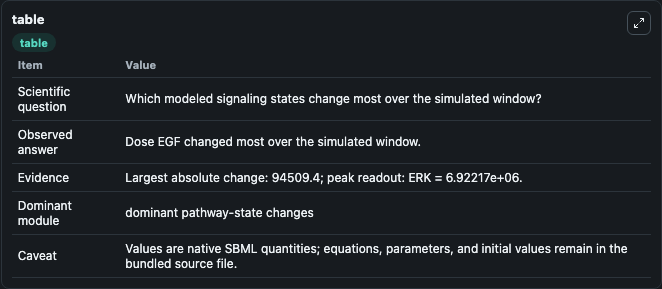
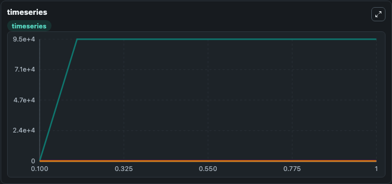
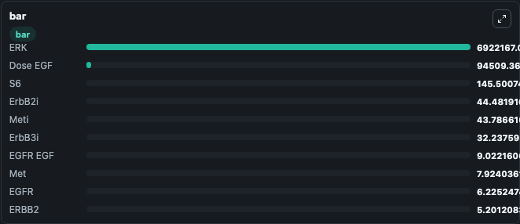

# PanRTK model for single cell line

This Biosimulant lab wraps `PanRTK model for single cell line` as a runnable signaling model with a companion visualization module.
Clean Biosimulant lab for systems signaling model: PanRTK model for single cell line. It can be used to explore second-messenger and pathway-signaling dynamics and compare scenario outcomes across configurations.

## What You'll See

The lab asks: How does PanRTK model for single cell line route receptor activity into cAMP/PKA-linked readouts? It runs for 1.0 time units with a communication step of 0.1. The run uses the model defaults declared by the curated SBML wrapper. The generated visualizations focus on Dose EGF, Dose HGF, Rtkph, Dose IGF1, Dose heregulin, and EGFR, and related outputs, combining trajectory, endpoint-comparison, and summary-table views from one completed dark-mode run.

In this captured run, **Dose EGF** moved from 0 to 9.45e+04 across 1.0 simulation windows.

<!-- BIOSIMULANT_VISUALS_START -->
### Output Visualizations



*Summary table for PanRTK model for single cell line, reporting the scientific question, observed answer, dominant module, and caveat.*



*Trajectories of Dose EGF, EGFR, EGFR EGF, Meti, ErbB3i, and phospho-EGFRd across the 1.0 simulation. In this run **Dose EGF** climbed from 0 to 9.45e+04 and **EGFR** fell from 17.862 to 6.225 — the largest movements among the focused observables.*



*Largest-excursion ranking of the focused observables — the absolute movement magnitude during the run. Top 3: **ERK** = 6.92e+06, **Dose EGF** = 9.45e+04, **S6** = 145.5, with 7 more observables below.*

<!-- BIOSIMULANT_VISUALS_END -->

## Model Context

- Core model: `models/core`
- Visualization model: `models/visualisation`
- Standard: `other`
- Upstream source: `biomodels_ebi:MODEL1708210000`
- License: `CC0`
- Visual scope: GPCR and cAMP/PKA signaling
- Caveat: Values are native SBML quantities; equations, parameters, units, and initial values remain in the bundled source file.

## Inputs

| Input | Maps To | Default | Notes |
|---|---|---|---|
| AKT Activation P EGFR | `signaling_sbml_panrtk_model_for_single_cell_line_model1708210000_model.initial_akt_activation_p_egfr_level` |  | AKT Activation P EGFR source parameter. Maps to SBML symbol `AKT_activation_pEGFR` and preserves the bundled default. |
| AKT Activation P Met EGFR | `signaling_sbml_panrtk_model_for_single_cell_line_model1708210000_model.initial_akt_activation_p_met_egfr_level` |  | AKT Activation P Met EGFR source parameter. Maps to SBML symbol `AKT_activation_pMetEGFR` and preserves the bundled default. |
| EGF K D | `signaling_sbml_panrtk_model_for_single_cell_line_model1708210000_model.initial_egf_k_d_level` |  | EGF K D source parameter. Maps to SBML symbol `EGF_kD` and preserves the bundled default. |

## Outputs

| Output | Maps To | Role |
|---|---|---|
| `erk` | `signaling_sbml_panrtk_model_for_single_cell_line_model1708210000_model.erk` | ERK. |
| `perk_kinase` | `signaling_sbml_panrtk_model_for_single_cell_line_model1708210000_model.perk_kinase` | PERK kinase. |
| `akt` | `signaling_sbml_panrtk_model_for_single_cell_line_model1708210000_model.akt` | AKT. |
| `state` | `signaling_sbml_panrtk_model_for_single_cell_line_model1708210000_model.state` | Available to the visualization model and downstream workflows. |
| `summary` | `signaling_sbml_panrtk_model_for_single_cell_line_model1708210000_model.summary` | Available to the visualization model and downstream workflows. |
| `species_labels` | `signaling_sbml_panrtk_model_for_single_cell_line_model1708210000_model.species_labels` | Available to the visualization model and downstream workflows. |

## Runtime

- Duration: `1.0`
- Communication step: `0.1`

## Running Locally

```bash
biosimulant labs serve .
```
