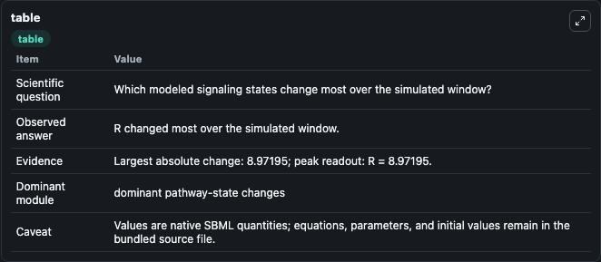
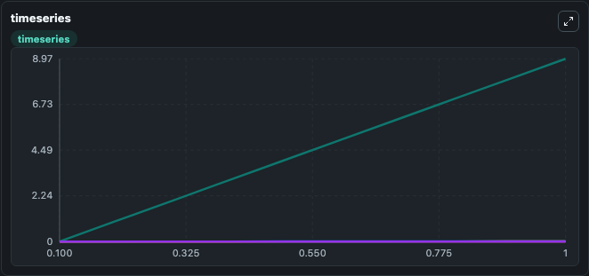
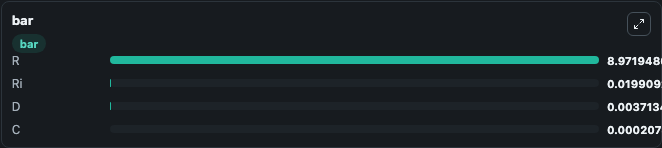

# Haugh2004_hGH

This Biosimulant lab wraps `Haugh2004_hGH` as a runnable signaling model with a companion visualization module.
Clean Biosimulant lab for systems signaling model: Haugh2004_hGH. It can be used to explore second-messenger and pathway-signaling dynamics and compare scenario outcomes across configurations.

## What You'll See

The lab asks: How does Haugh2004 hGH route receptor activity into cAMP/PKA-linked readouts? It runs for 1.0 time units with a communication step of 0.1. The run uses the model defaults declared by the curated SBML wrapper. The generated visualizations focus on Source Defined C State, Source Defined D State, Source Defined R State, and Source Defined RI State, combining trajectory, endpoint-comparison, and summary-table views from one completed dark-mode run.

In this captured run, **R** moved from 0 to 8.972 across 1.0 simulation windows.

<!-- BIOSIMULANT_VISUALS_START -->
### Output Visualizations



*Summary table for Haugh2004_hGH, reporting the scientific question, observed answer, dominant module, and caveat.*



*Trajectories of R, Ri, D, and C across the 1.0 simulation. In this run **R** climbed from 0 to 8.972 — the largest movements among the focused observables.*



*Largest-excursion ranking of the focused observables — the absolute movement magnitude during the run. Top 3: **R** = 8.972, **Ri** = 0.0199, **D** = 0.00371, with 1 more observable below.*

<!-- BIOSIMULANT_VISUALS_END -->

## Model Context

- Core model: `models/core`
- Visualization model: `models/visualisation`
- Standard: `other`
- Upstream source: `biomodels_ebi:MODEL0848676877`
- License: `CC0`
- Visual scope: GPCR and cAMP/PKA signaling
- Caveat: Values are native SBML quantities; equations, parameters, units, and initial values remain in the bundled source file.

## Inputs

| Input | Maps To | Default | Notes |
|---|---|---|---|
| Initial source-defined C state | `signaling_sbml_haugh2004_hgh_model0848676877_model.initial_source_defined_c_state` |  | Initial level of source-defined C state. Maps to SBML symbol `C`; exposed as a traceable initial-condition perturbation. |

## Outputs

| Output | Maps To | Role |
|---|---|---|
| `source_defined_c_state` | `signaling_sbml_haugh2004_hgh_model0848676877_model.source_defined_c_state` | source-defined C state. |
| `source_defined_d_state` | `signaling_sbml_haugh2004_hgh_model0848676877_model.source_defined_d_state` | source-defined D state. |
| `source_defined_r_state` | `signaling_sbml_haugh2004_hgh_model0848676877_model.source_defined_r_state` | source-defined R state. |
| `state` | `signaling_sbml_haugh2004_hgh_model0848676877_model.state` | Available to the visualization model and downstream workflows. |
| `summary` | `signaling_sbml_haugh2004_hgh_model0848676877_model.summary` | Available to the visualization model and downstream workflows. |
| `species_labels` | `signaling_sbml_haugh2004_hgh_model0848676877_model.species_labels` | Available to the visualization model and downstream workflows. |

## Runtime

- Duration: `1.0`
- Communication step: `0.1`

## Running Locally

```bash
biosimulant labs serve .
```
