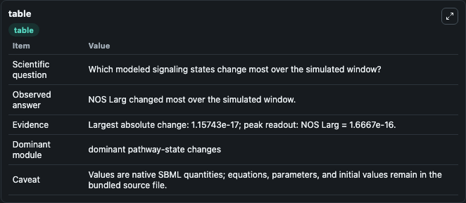
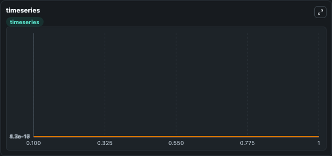
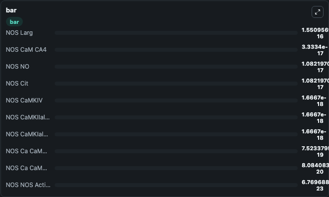

# Hayashi1999_NOSynth_Phospho

This Biosimulant lab wraps `Hayashi1999_NOSynth_Phospho` as a runnable signaling model with a companion visualization module.
Clean Biosimulant lab for systems signaling model: Hayashi1999_NOSynth_Phospho. It can be used to explore second-messenger and pathway-signaling dynamics and compare scenario outcomes across configurations.

## What You'll See

The lab asks: How does Hayashi1999 NOSynth Phospho express its source-modeled signaling motif over the baseline run? It runs for 1.0 time units with a communication step of 0.1. The run uses the model defaults declared by the curated SBML wrapper. The generated visualizations focus on NOS NNOS, NOS NOS active, NOS Calcium Calcium Mn NOS, NOS Calcium Calcium Mn NOS Kenz Kenz Cplx, NOS NO, and NOS Cit, and related outputs, combining trajectory, endpoint-comparison, and summary-table views from one completed dark-mode run.

In this captured run, **NOS Larg** moved from 1.67e-16 to 1.55e-16 across 1.0 simulation windows.

<!-- BIOSIMULANT_VISUALS_START -->
### Output Visualizations



*Summary table for Hayashi1999_NOSynth_Phospho, reporting the scientific question, observed answer, dominant module, and caveat.*



*Trajectories of NOS Larg, NOS NO, NOS Cit, NOS NNOS, NOS Ca CaMnNOS Kenz Kenz Cplx, and NOS Ca CaMnNOS across the 1.0 simulation. In this run **NOS NO** climbed from 0 to 1.08e-17 and **NOS Larg** fell from 1.67e-16 to 1.55e-16 — the largest movements among the focused observables.*



*Largest-excursion ranking of the focused observables — the absolute movement magnitude during the run. Top 3: **NOS Larg** = 1.55e-16, **NOS CaM CA4** = 3.33e-17, **NOS NO** = 1.08e-17, with 7 more observables below.*

<!-- BIOSIMULANT_VISUALS_END -->

## Model Context

- Core model: `models/core`
- Visualization model: `models/visualisation`
- Standard: `other`
- Upstream source: `biomodels_ebi:MODEL4780784080`
- License: `CC0`
- Visual scope: phosphorylation and regulatory motif dynamics
- Caveat: Values are native SBML quantities; equations, parameters, units, and initial values remain in the bundled source file.

## Inputs

| Input | Maps To | Default | Notes |
|---|---|---|---|
| Initial NOS calcium M Ca4 | `signaling_sbml_hayashi1999_nosynth_phospho_model4780784080_model.initial_nos_calcium_m_ca4` |  | Initial level of NOS calcium M Ca4. Maps to SBML symbol `NOS_slash_CaM_minus_Ca4`; exposed as a traceable initial-condition perturbation. |
| Initial NOS calcium Mkialpha | `signaling_sbml_hayashi1999_nosynth_phospho_model4780784080_model.initial_nos_calcium_mkialpha` |  | Initial level of NOS calcium Mkialpha. Maps to SBML symbol `NOS_slash_CaMKIalpha`; exposed as a traceable initial-condition perturbation. |
| Initial NOS calcium Mkiialpha | `signaling_sbml_hayashi1999_nosynth_phospho_model4780784080_model.initial_nos_calcium_mkiialpha` |  | Initial level of NOS calcium Mkiialpha. Maps to SBML symbol `NOS_slash_CaMKIIalpha`; exposed as a traceable initial-condition perturbation. |

## Outputs

| Output | Maps To | Role |
|---|---|---|
| `nos_calcium_calcium_mn_nos` | `signaling_sbml_hayashi1999_nosynth_phospho_model4780784080_model.nos_calcium_calcium_mn_nos` | NOS Calcium Calcium Mn NOS. |
| `nos_calcium_calcium_mn_nos_kenz_kenz_cplx` | `signaling_sbml_hayashi1999_nosynth_phospho_model4780784080_model.nos_calcium_calcium_mn_nos_kenz_kenz_cplx` | NOS Calcium Calcium Mn NOS Kenz Kenz Cplx. |
| `nos_calcium_mkiv_kenz_kenz_cplx` | `signaling_sbml_hayashi1999_nosynth_phospho_model4780784080_model.nos_calcium_mkiv_kenz_kenz_cplx` | NOS Calcium MKIV Kenz Kenz Cplx. |
| `state` | `signaling_sbml_hayashi1999_nosynth_phospho_model4780784080_model.state` | Available to the visualization model and downstream workflows. |
| `summary` | `signaling_sbml_hayashi1999_nosynth_phospho_model4780784080_model.summary` | Available to the visualization model and downstream workflows. |
| `species_labels` | `signaling_sbml_hayashi1999_nosynth_phospho_model4780784080_model.species_labels` | Available to the visualization model and downstream workflows. |

## Runtime

- Duration: `1.0`
- Communication step: `0.1`

## Running Locally

```bash
biosimulant labs serve .
```
