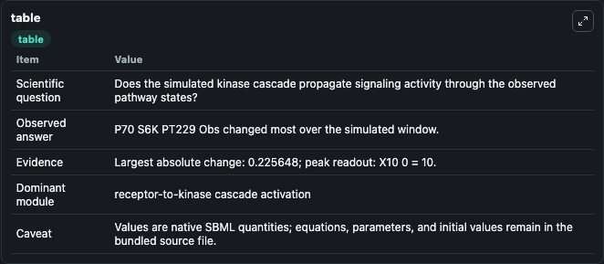
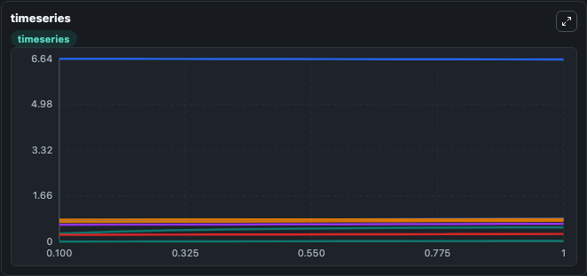
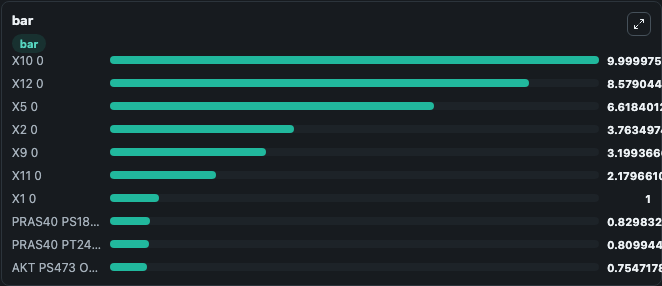

# Heberle-Razquin Navas-2019 - PI3K-MAPK/p38-mTOR Model V

This Biosimulant lab wraps `Heberle-Razquin Navas-2019 - PI3K-MAPK/p38-mTOR Model V` as a runnable signaling model with a companion visualization module.
Clean Biosimulant lab for MAPK/ERK receptor signaling. It can be used to explore second-messenger and pathway-signaling dynamics and compare scenario outcomes across configurations.

## What You'll See

The lab asks: How does Heberle-Razquin Navas-2019 - PI3K-MAPK/p38-mTOR Model V propagate receptor or RAS/ERK pathway activity? It runs for 1.0 time units with a communication step of 0.1. The run uses the model defaults declared by the curated SBML wrapper. The generated visualizations focus on X1 0, X1 1, X2 0, X2 1, X2 2, and X4 0, and related outputs, combining trajectory, endpoint-comparison, and summary-table views from one completed dark-mode run.

In this captured run, **P70 S6K PT229 Obs** moved from 0.2905 to 0.5161 across 1.0 simulation windows.

<!-- BIOSIMULANT_VISUALS_START -->
### Output Visualizations



*Summary table for Heberle-Razquin Navas-2019 - PI3K-MAPK/p38-mTOR Model V, reporting the scientific question, observed answer, dominant module, and caveat.*



*Trajectories of P70 S6K PT229 Obs, PRAS40 PS183 Obs, AKT PS473 Obs, FOUREBP1 PT37 46 Obs, P70 S6K PT389 Obs, and X5 1 across the 1.0 simulation. In this run **P70 S6K PT229 Obs** climbed from 0.2905 to 0.5161 and **X5 0** fell from 6.642 to 6.618 — the largest movements among the focused observables.*



*Largest-excursion ranking of the focused observables — the absolute movement magnitude during the run. Top 3: **X10 0** = 10.000, **X12 0** = 8.579, **X5 0** = 6.618, with 7 more observables below.*

<!-- BIOSIMULANT_VISUALS_END -->

## Model Context

- Core model: `models/core`
- Visualization model: `models/visualisation`
- Standard: `other`
- Upstream source: `biomodels_ebi:MODEL1902140002`
- License: `CC0`
- Visual scope: receptor-to-MAPK cascade signaling
- Caveat: Values are native SBML quantities; equations, parameters, units, and initial values remain in the bundled source file.

## Inputs

| Input | Maps To | Default | Notes |
|---|---|---|---|
| Initial AKT P S473 Obs | `signaling_sbml_heberle_razquin_navas_2019_pi3k_mapk_p38_mtor_mo_model1902140002_model.initial_akt_p_s473_obs` |  | Initial level of AKT P S473 Obs. Maps to SBML symbol `Akt_pS473_obs`; exposed as a traceable initial-condition perturbation. |
| Initial AKT P T308 Obs | `signaling_sbml_heberle_razquin_navas_2019_pi3k_mapk_p38_mtor_mo_model1902140002_model.initial_akt_p_t308_obs` |  | Initial level of AKT P T308 Obs. Maps to SBML symbol `Akt_pT308_obs`; exposed as a traceable initial-condition perturbation. |
| Initial Four EBP1 P T37 46 Obs | `signaling_sbml_heberle_razquin_navas_2019_pi3k_mapk_p38_mtor_mo_model1902140002_model.initial_four_ebp1_p_t37_46_obs` |  | Initial level of Four EBP1 P T37 46 Obs. Maps to SBML symbol `fourEBP1_pT37_46_obs`; exposed as a traceable initial-condition perturbation. |

## Outputs

| Output | Maps To | Role |
|---|---|---|
| `akt_p_t308_obs` | `signaling_sbml_heberle_razquin_navas_2019_pi3k_mapk_p38_mtor_mo_model1902140002_model.akt_p_t308_obs` | AKT P T308 Obs. |
| `akt_p_s473_obs` | `signaling_sbml_heberle_razquin_navas_2019_pi3k_mapk_p38_mtor_mo_model1902140002_model.akt_p_s473_obs` | AKT P S473 Obs. |
| `pras40_p_t246_obs` | `signaling_sbml_heberle_razquin_navas_2019_pi3k_mapk_p38_mtor_mo_model1902140002_model.pras40_p_t246_obs` | PRAS40 P T246 Obs. |
| `state` | `signaling_sbml_heberle_razquin_navas_2019_pi3k_mapk_p38_mtor_mo_model1902140002_model.state` | Available to the visualization model and downstream workflows. |
| `summary` | `signaling_sbml_heberle_razquin_navas_2019_pi3k_mapk_p38_mtor_mo_model1902140002_model.summary` | Available to the visualization model and downstream workflows. |
| `species_labels` | `signaling_sbml_heberle_razquin_navas_2019_pi3k_mapk_p38_mtor_mo_model1902140002_model.species_labels` | Available to the visualization model and downstream workflows. |

## Runtime

- Duration: `1.0`
- Communication step: `0.1`

## Running Locally

```bash
biosimulant labs serve .
```
