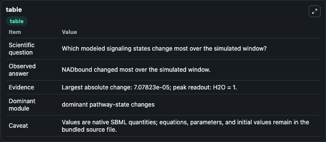
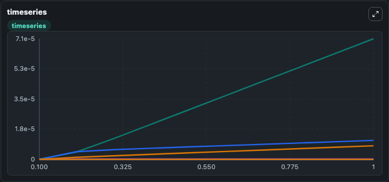
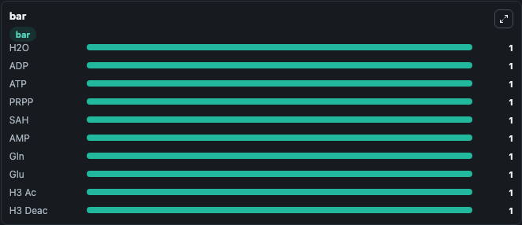

# Heiland2019 - NAD pathway model analysing the impact of NNMT on pathway dynamics and evolution

This Biosimulant lab wraps `Heiland2019 - NAD pathway model analysing the impact of NNMT on pathway dynamics and evolution` as a runnable signaling model with a companion visualization module.
Clean Biosimulant lab for systems signaling model: Heiland2019 - NAD pathway model analysing the impact of NNMT on pathway dynamics and evolution. It can be used to explore second-messenger and pathway-signaling dynamics and compare scenario outcomes across configurations.

## What You'll See

The lab asks: How does Heiland2019 - NAD pathway model analysing the impact of NNMT on pathway dynamics and evolution shift hormone-linked signaling readouts? It runs for 1.0 time units with a communication step of 0.1. The run uses the model defaults declared by the curated SBML wrapper. The generated visualizations focus on source-defined NA state, nicotinate mononucleotide, nicotinamide, NAD, source-defined NAAD state, and source-defined NMN state, and related outputs, combining trajectory, endpoint-comparison, and summary-table views from one completed dark-mode run.

In this captured run, **NADbound** moved from 0 to 7.08e-05 across 1.0 simulation windows.

<!-- BIOSIMULANT_VISUALS_START -->
### Output Visualizations



*Summary table for Heiland2019 - NAD pathway model analysing the impact of NNMT on pathway dynamics and evolution, reporting the scientific question, observed answer, dominant module, and caveat.*



*Trajectories of NADbound, NMN, NAD, NAM, NR, and NA across the 1.0 simulation. In this run **NADbound** climbed from 0 to 7.08e-05 — the largest movements among the focused observables.*



*Largest-excursion ranking of the focused observables — the absolute movement magnitude during the run. Top 3: **H2O** = 1.000, **ADP** = 1.000, **ATP** = 1.000, with 7 more observables below.*

<!-- BIOSIMULANT_VISUALS_END -->

## Model Context

- Core model: `models/core`
- Visualization model: `models/visualisation`
- Standard: `other`
- Upstream source: `biomodels_ebi:MODEL1905220001`
- License: `CC0`
- Visual scope: metabolic and hormone signaling response
- Caveat: Values are native SBML quantities; equations, parameters, units, and initial values remain in the bundled source file.

## Inputs

| Input | Maps To | Default | Notes |
|---|---|---|---|
| Initial ADP | `signaling_sbml_heiland2019_nad_pathway_model_analysing_the_impa_model1905220001_model.initial_adp` |  | Initial level of ADP. Maps to SBML symbol `ADP`; exposed as a traceable initial-condition perturbation. |
| Initial AMP | `signaling_sbml_heiland2019_nad_pathway_model_analysing_the_impa_model1905220001_model.initial_amp` |  | Initial level of AMP. Maps to SBML symbol `AMP`; exposed as a traceable initial-condition perturbation. |
| Initial ATP | `signaling_sbml_heiland2019_nad_pathway_model_analysing_the_impa_model1905220001_model.initial_atp` |  | Initial level of ATP. Maps to SBML symbol `ATP`; exposed as a traceable initial-condition perturbation. |

## Outputs

| Output | Maps To | Role |
|---|---|---|
| `nicotinate_mononucleotide` | `signaling_sbml_heiland2019_nad_pathway_model_analysing_the_impa_model1905220001_model.nicotinate_mononucleotide` | nicotinate mononucleotide. |
| `nicotinamide` | `signaling_sbml_heiland2019_nad_pathway_model_analysing_the_impa_model1905220001_model.nicotinamide` | nicotinamide. |
| `nad` | `signaling_sbml_heiland2019_nad_pathway_model_analysing_the_impa_model1905220001_model.nad` | NAD. |
| `state` | `signaling_sbml_heiland2019_nad_pathway_model_analysing_the_impa_model1905220001_model.state` | Available to the visualization model and downstream workflows. |
| `summary` | `signaling_sbml_heiland2019_nad_pathway_model_analysing_the_impa_model1905220001_model.summary` | Available to the visualization model and downstream workflows. |
| `species_labels` | `signaling_sbml_heiland2019_nad_pathway_model_analysing_the_impa_model1905220001_model.species_labels` | Available to the visualization model and downstream workflows. |

## Runtime

- Duration: `1.0`
- Communication step: `0.1`

## Running Locally

```bash
biosimulant labs serve .
```
