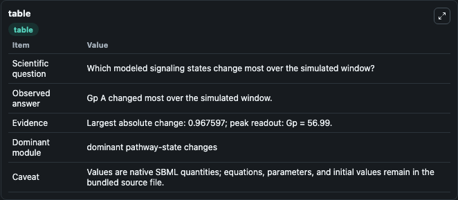
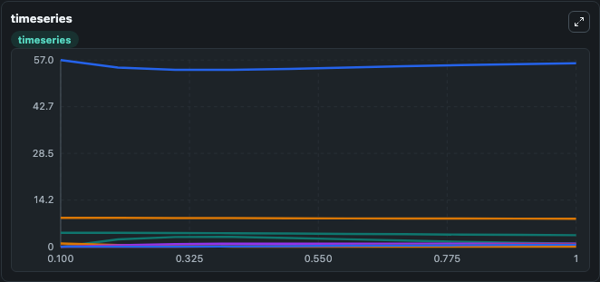
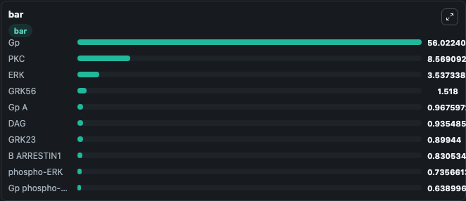

# Heitzler2012 - GPCR signalling

This Biosimulant lab wraps `Heitzler2012 - GPCR signalling` as a runnable signaling model with a companion visualization module.
Clean Biosimulant lab for systems signaling model: Heitzler2012 - GPCR signalling. It can be used to explore second-messenger and pathway-signaling dynamics and compare scenario outcomes across configurations.

## What You'll See

The lab asks: How does Heitzler2012 - GPCR signalling route receptor activity into cAMP/PKA-linked readouts? It runs for 1.0 time units with a communication step of 0.1. The run uses the model defaults declared by the curated SBML wrapper. The generated visualizations focus on source-defined HR state, source-defined GP state, ERK, source-defined PIP2 state, DAG, and PKC, and related outputs, combining trajectory, endpoint-comparison, and summary-table views from one completed dark-mode run.

In this captured run, **Gp A** moved from 0 to 0.9676 across 1.0 simulation windows.

<!-- BIOSIMULANT_VISUALS_START -->
### Output Visualizations



*Summary table for Heitzler2012 - GPCR signalling, reporting the scientific question, observed answer, dominant module, and caveat.*



*Trajectories of Gp A, Gp, PIP2, DAG, phospho-ERK, and ERK across the 1.0 simulation. In this run **Gp A** climbed from 0 to 0.9676 and **Gp** fell from 56.990 to 56.022 — the largest movements among the focused observables.*



*Largest-excursion ranking of the focused observables — the absolute movement magnitude during the run. Top 3: **Gp** = 56.022, **PKC** = 8.569, **ERK** = 3.537, with 7 more observables below.*

<!-- BIOSIMULANT_VISUALS_END -->

## Model Context

- Core model: `models/core`
- Visualization model: `models/visualisation`
- Standard: `other`
- Upstream source: `biomodels_ebi:BIOMD0000000842`
- License: `CC0`
- Visual scope: GPCR and cAMP/PKA signaling
- Caveat: Values are native SBML quantities; equations, parameters, units, and initial values remain in the bundled source file.

## Inputs

| Input | Maps To | Default | Notes |
|---|---|---|---|
| Initial PERK kinase | `signaling_sbml_heitzler2012_gpcr_signalling_biomd0000000842_model.initial_perk_kinase` |  | Initial level of PERK kinase. Maps to SBML symbol `pERK`; exposed as a traceable initial-condition perturbation. |

## Outputs

| Output | Maps To | Role |
|---|---|---|
| `erk` | `signaling_sbml_heitzler2012_gpcr_signalling_biomd0000000842_model.erk` | ERK. |
| `gp_p_erk` | `signaling_sbml_heitzler2012_gpcr_signalling_biomd0000000842_model.gp_p_erk` | Gp P ERK. |
| `b_p_erk` | `signaling_sbml_heitzler2012_gpcr_signalling_biomd0000000842_model.b_p_erk` | B P ERK. |
| `state` | `signaling_sbml_heitzler2012_gpcr_signalling_biomd0000000842_model.state` | Available to the visualization model and downstream workflows. |
| `summary` | `signaling_sbml_heitzler2012_gpcr_signalling_biomd0000000842_model.summary` | Available to the visualization model and downstream workflows. |
| `species_labels` | `signaling_sbml_heitzler2012_gpcr_signalling_biomd0000000842_model.species_labels` | Available to the visualization model and downstream workflows. |

## Runtime

- Duration: `1.0`
- Communication step: `0.1`

## Running Locally

```bash
biosimulant labs serve .
```
