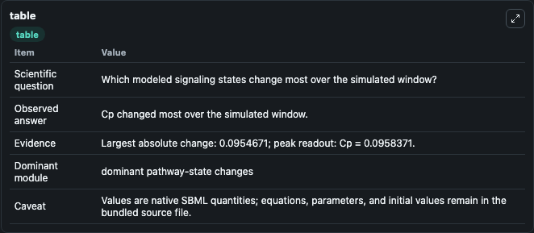
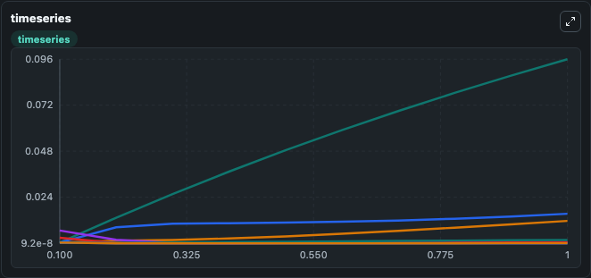
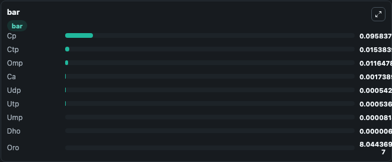

# Hermansen2015 - denovo biosynthesis of pyrimidines in yeast

This Biosimulant lab wraps `Hermansen2015 - denovo biosynthesis of pyrimidines in yeast` as a runnable signaling model with a companion visualization module.
Clean Biosimulant lab for systems signaling model: Hermansen2015 - denovo biosynthesis of pyrimidines in yeast. It can be used to explore second-messenger and pathway-signaling dynamics and compare scenario outcomes across configurations.

## What You'll See

The lab asks: How does Hermansen2015 - denovo biosynthesis of pyrimidines in yeast shift hormone-linked signaling readouts? It runs for 1.0 time units with a communication step of 0.1. The run uses the model defaults declared by the curated SBML wrapper. The generated visualizations focus on source-defined CP state, calcium, dihydroorotate, orotate, source-defined OMP state, and source-defined UMP state, and related outputs, combining trajectory, endpoint-comparison, and summary-table views from one completed dark-mode run.

In this captured run, **Cp** moved from 0.00037 to 0.0958 across 1.0 simulation windows.

<!-- BIOSIMULANT_VISUALS_START -->
### Output Visualizations



*Summary table for Hermansen2015 - denovo biosynthesis of pyrimidines in yeast, reporting the scientific question, observed answer, dominant module, and caveat.*



*Trajectories of Cp, Ctp, Omp, Utp, Udp, and Ca across the 1.0 simulation. In this run **Cp** climbed from 0.00037 to 0.0958 and **Utp** fell from 0.00666 to 0.000537 — the largest movements among the focused observables.*



*Largest-excursion ranking of the focused observables — the absolute movement magnitude during the run. Top 3: **Cp** = 0.0958, **Ctp** = 0.0154, **Omp** = 0.0116, with 6 more observables below.*

<!-- BIOSIMULANT_VISUALS_END -->

## Model Context

- Core model: `models/core`
- Visualization model: `models/visualisation`
- Standard: `other`
- Upstream source: `biomodels_ebi:BIOMD0000000590`
- License: `CC0`
- Visual scope: metabolic and hormone signaling response
- Caveat: Values are native SBML quantities; equations, parameters, units, and initial values remain in the bundled source file.

## Inputs

| Input | Maps To | Default | Notes |
|---|---|---|---|
| Initial source-defined CP state | `signaling_sbml_hermansen2015_denovo_biosynthesis_of_pyrimidines_biomd0000000590_model.initial_source_defined_cp_state` |  | Initial level of source-defined CP state. Maps to SBML symbol `cp`; exposed as a traceable initial-condition perturbation. |

## Outputs

| Output | Maps To | Role |
|---|---|---|
| `calcium` | `signaling_sbml_hermansen2015_denovo_biosynthesis_of_pyrimidines_biomd0000000590_model.calcium` | calcium. |
| `dihydroorotate` | `signaling_sbml_hermansen2015_denovo_biosynthesis_of_pyrimidines_biomd0000000590_model.dihydroorotate` | dihydroorotate. |
| `orotate` | `signaling_sbml_hermansen2015_denovo_biosynthesis_of_pyrimidines_biomd0000000590_model.orotate` | orotate. |
| `state` | `signaling_sbml_hermansen2015_denovo_biosynthesis_of_pyrimidines_biomd0000000590_model.state` | Available to the visualization model and downstream workflows. |
| `summary` | `signaling_sbml_hermansen2015_denovo_biosynthesis_of_pyrimidines_biomd0000000590_model.summary` | Available to the visualization model and downstream workflows. |
| `species_labels` | `signaling_sbml_hermansen2015_denovo_biosynthesis_of_pyrimidines_biomd0000000590_model.species_labels` | Available to the visualization model and downstream workflows. |

## Runtime

- Duration: `1.0`
- Communication step: `0.1`

## Running Locally

```bash
biosimulant labs serve .
```
