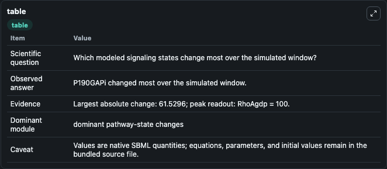
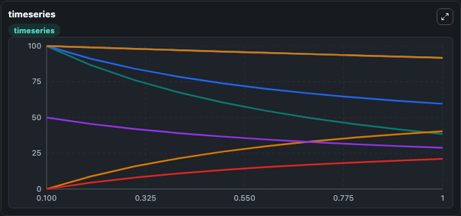
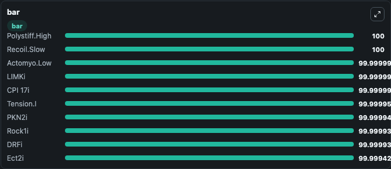

# Hetmanski2019 - Mechanochemical signaling controlled rear retraction of migrating cell

This Biosimulant lab wraps `Hetmanski2019 - Mechanochemical signaling controlled rear retraction of migrating cell` as a runnable signaling model with a companion visualization module.
Clean Biosimulant lab for systems signaling model: Hetmanski2019 - Mechanochemical signaling controlled rear retraction of migrating cell. It can be used to explore second-messenger and pathway-signaling dynamics and compare scenario outcomes across configurations.

## What You'll See

The lab asks: What baseline signaling response is generated by Hetmanski2019 - Mechanochemical signaling controlled rear retraction of migrating cell? It runs for 1.0 time units with a communication step of 0.1. The run uses the model defaults declared by the curated SBML wrapper. The generated visualizations focus on Rho Agdp, Rho Agtp, Rock1i, Rock1a, Rho A Rock1, and source-defined DRFI state, and related outputs, combining trajectory, endpoint-comparison, and summary-table views from one completed dark-mode run.

In this captured run, **P190GAPi** moved from 100.0 to 38.470 across 1.0 simulation windows.

<!-- BIOSIMULANT_VISUALS_START -->
### Output Visualizations



*Summary table for Hetmanski2019 - Mechanochemical signaling controlled rear retraction of migrating cell, reporting the scientific question, observed answer, dominant module, and caveat.*



*Trajectories of P190GAPi, RhoAgdp, P190GAP:RhoA, Srca, Src P190, and phospho-MLCi across the 1.0 simulation. In this run **P190GAP:RhoA** climbed from 0 to 40.367 and **P190GAPi** fell from 100.0 to 38.470 — the largest movements among the focused observables.*



*Largest-excursion ranking of the focused observables — the absolute movement magnitude during the run. Top 3: **Polystiff.High** = 100.0, **Recoil.Slow** = 100.0, **Actomyo.Low** = 100.000, with 7 more observables below.*

<!-- BIOSIMULANT_VISUALS_END -->

## Model Context

- Core model: `models/core`
- Visualization model: `models/visualisation`
- Standard: `other`
- Upstream source: `biomodels_ebi:MODEL1908290001`
- License: `CC0`
- Visual scope: curated source-model signaling response
- Caveat: Values are native SBML quantities; equations, parameters, units, and initial values remain in the bundled source file.

## Inputs

| Input | Maps To | Default | Notes |
|---|---|---|---|
| Initial Rho Agdp | `signaling_sbml_hetmanski2019_mechanochemical_signaling_controll_model1908290001_model.initial_rho_agdp` |  | Initial level of Rho Agdp. Maps to SBML symbol `RhoAgdp`; exposed as a traceable initial-condition perturbation. |

## Outputs

| Output | Maps To | Role |
|---|---|---|
| `actinf` | `signaling_sbml_hetmanski2019_mechanochemical_signaling_controll_model1908290001_model.actinf` | Actinf. |
| `p_mlca` | `signaling_sbml_hetmanski2019_mechanochemical_signaling_controll_model1908290001_model.p_mlca` | P Mlca. |
| `cavi_src` | `signaling_sbml_hetmanski2019_mechanochemical_signaling_controll_model1908290001_model.cavi_src` | Cavi Src. |
| `state` | `signaling_sbml_hetmanski2019_mechanochemical_signaling_controll_model1908290001_model.state` | Available to the visualization model and downstream workflows. |
| `summary` | `signaling_sbml_hetmanski2019_mechanochemical_signaling_controll_model1908290001_model.summary` | Available to the visualization model and downstream workflows. |
| `species_labels` | `signaling_sbml_hetmanski2019_mechanochemical_signaling_controll_model1908290001_model.species_labels` | Available to the visualization model and downstream workflows. |

## Runtime

- Duration: `1.0`
- Communication step: `0.1`

## Running Locally

```bash
biosimulant labs serve .
```
