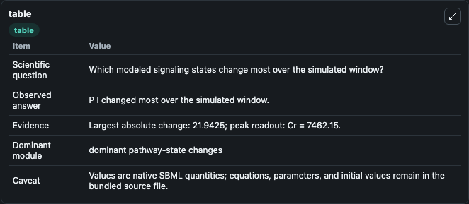
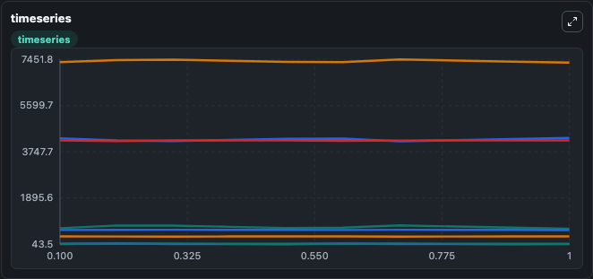
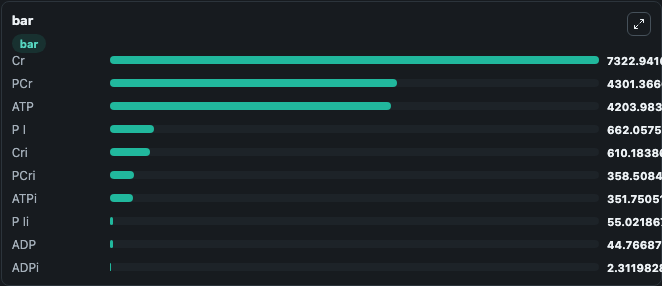

# Hettling2011_CreatineKinase

This Biosimulant lab wraps `Hettling2011_CreatineKinase` as a runnable signaling model with a companion visualization module.
Clean Biosimulant lab for systems signaling model: Hettling2011_CreatineKinase. It can be used to explore second-messenger and pathway-signaling dynamics and compare scenario outcomes across configurations.

## What You'll See

The lab asks: How does Hettling2011 CreatineKinase shift hormone-linked signaling readouts? It runs for 1.0 time units with a communication step of 0.1. The run uses the model defaults declared by the curated SBML wrapper. The generated visualizations focus on intracellular ADP, intracellular ATP, intracellular creatine, source-defined PCRI state, source-defined PCR state, and ADP, and related outputs, combining trajectory, endpoint-comparison, and summary-table views from one completed dark-mode run.

In this captured run, **P I** moved from 684.0 to 662.1 across 1.0 simulation windows.

<!-- BIOSIMULANT_VISUALS_START -->
### Output Visualizations



*Summary table for Hettling2011_CreatineKinase, reporting the scientific question, observed answer, dominant module, and caveat.*



*Trajectories of P I, PCr, Cr, ADP, ATP, and P Ii across the 1.0 simulation. In this run **PCr** climbed from 4282.5 to 4301.4 and **P I** fell from 684.0 to 662.1 — the largest movements among the focused observables.*



*Largest-excursion ranking of the focused observables — the absolute movement magnitude during the run. Top 3: **Cr** = 7322.9, **PCr** = 4301.4, **ATP** = 4204.0, with 7 more observables below.*

<!-- BIOSIMULANT_VISUALS_END -->

## Model Context

- Core model: `models/core`
- Visualization model: `models/visualisation`
- Standard: `other`
- Upstream source: `biomodels_ebi:BIOMD0000000408`
- License: `CC0`
- Visual scope: metabolic and hormone signaling response
- Caveat: Values are native SBML quantities; equations, parameters, units, and initial values remain in the bundled source file.

## Inputs

| Input | Maps To | Default | Notes |
|---|---|---|---|
| Ck Factor Ia | `signaling_sbml_hettling2011_creatinekinase_biomd0000000408_model.initial_ck_factor_ia_level` |  | Ck Factor Ia source parameter. Maps to SBML symbol `ck_factor_ia` and preserves the bundled default. |
| Ck Factor indole-3-acetic acid | `signaling_sbml_hettling2011_creatinekinase_biomd0000000408_model.initial_ck_factor_indole_3_acetic_acid_level` |  | Ck Factor indole-3-acetic acid source parameter. Maps to SBML symbol `ck_factor_iaa` and preserves the bundled default. |
| Tmito Factor | `signaling_sbml_hettling2011_creatinekinase_biomd0000000408_model.initial_tmito_factor_level` |  | Tmito Factor source parameter. Maps to SBML symbol `tmito_factor` and preserves the bundled default. |

## Outputs

| Output | Maps To | Role |
|---|---|---|
| `intracellular_adp` | `signaling_sbml_hettling2011_creatinekinase_biomd0000000408_model.intracellular_adp` | intracellular ADP. |
| `intracellular_atp` | `signaling_sbml_hettling2011_creatinekinase_biomd0000000408_model.intracellular_atp` | intracellular ATP. |
| `intracellular_creatine` | `signaling_sbml_hettling2011_creatinekinase_biomd0000000408_model.intracellular_creatine` | intracellular creatine. |
| `state` | `signaling_sbml_hettling2011_creatinekinase_biomd0000000408_model.state` | Available to the visualization model and downstream workflows. |
| `summary` | `signaling_sbml_hettling2011_creatinekinase_biomd0000000408_model.summary` | Available to the visualization model and downstream workflows. |
| `species_labels` | `signaling_sbml_hettling2011_creatinekinase_biomd0000000408_model.species_labels` | Available to the visualization model and downstream workflows. |

## Runtime

- Duration: `1.0`
- Communication step: `0.1`

## Running Locally

```bash
biosimulant labs serve .
```
