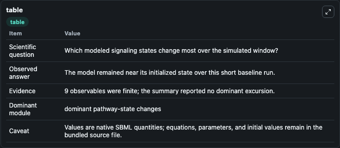
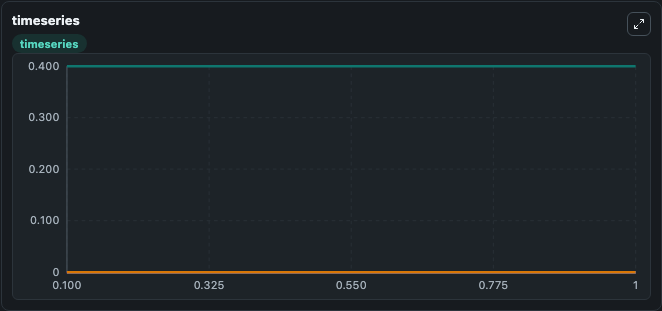
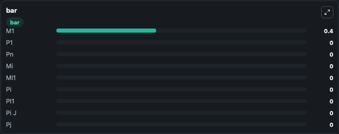

# Hingant2014 - Micellar On-Pathway Intermediate in Prion Amyloid Formation

This Biosimulant lab wraps `Hingant2014 - Micellar On-Pathway Intermediate in Prion Amyloid Formation` as a runnable signaling model with a companion visualization module.
Clean Biosimulant lab for systems signaling model: Hingant2014 - Micellar On-Pathway Intermediate in Prion Amyloid Formation. It can be used to explore second-messenger and pathway-signaling dynamics and compare scenario outcomes across configurations.

## What You'll See

The lab asks: How does Hingant2014 - Micellar On-Pathway Intermediate in Prion Amyloid Formation shift hormone-linked signaling readouts? It runs for 1.0 time units with a communication step of 0.1. The run uses the model defaults declared by the curated SBML wrapper. The generated visualizations focus on source-defined M1 state, source-defined P1 state, source-defined PN state, source-defined MI state, source-defined MI+1 state, and source-defined PI state, and related outputs, combining trajectory, endpoint-comparison, and summary-table views from one completed dark-mode run.

In this captured run, **M1** moved from 0.4000 to 0.4000 across 1.0 simulation windows.

<!-- BIOSIMULANT_VISUALS_START -->
### Output Visualizations



*Summary table for Hingant2014 - Micellar On-Pathway Intermediate in Prion Amyloid Formation, reporting the scientific question, observed answer, dominant module, and caveat.*



*Trajectories of M1, P1, Pn, Mi, MI1, and Pi across the 1.0 simulation. In this run M1, P1, Pn, Mi stayed near their initial values — no observable moved appreciably.*



*Largest-excursion ranking of the focused observables — the absolute movement magnitude during the run. Top 3: **M1** = 0.4000, **P1** = 0, **Pn** = 0, with 6 more observables below.*

<!-- BIOSIMULANT_VISUALS_END -->

## Model Context

- Core model: `models/core`
- Visualization model: `models/visualisation`
- Standard: `other`
- Upstream source: `biomodels_ebi:MODEL1409230001`
- License: `CC0`
- Visual scope: metabolic and hormone signaling response
- Caveat: Values are native SBML quantities; equations, parameters, units, and initial values remain in the bundled source file.

## Inputs

| Input | Maps To | Default | Notes |
|---|---|---|---|
| Initial source-defined M1 state | `signaling_sbml_hingant2014_micellar_on_pathway_intermediate_in_model1409230001_model.initial_source_defined_m1_state` |  | Initial level of source-defined M1 state. Maps to SBML symbol `M1`; exposed as a traceable initial-condition perturbation. |

## Outputs

| Output | Maps To | Role |
|---|---|---|
| `source_defined_mi_1_state` | `signaling_sbml_hingant2014_micellar_on_pathway_intermediate_in_model1409230001_model.source_defined_mi_1_state` | source-defined MI+1 state. |
| `source_defined_pi_1_state` | `signaling_sbml_hingant2014_micellar_on_pathway_intermediate_in_model1409230001_model.source_defined_pi_1_state` | source-defined PI+1 state. |
| `source_defined_pi_j_state` | `signaling_sbml_hingant2014_micellar_on_pathway_intermediate_in_model1409230001_model.source_defined_pi_j_state` | source-defined PI-J state. |
| `state` | `signaling_sbml_hingant2014_micellar_on_pathway_intermediate_in_model1409230001_model.state` | Available to the visualization model and downstream workflows. |
| `summary` | `signaling_sbml_hingant2014_micellar_on_pathway_intermediate_in_model1409230001_model.summary` | Available to the visualization model and downstream workflows. |
| `species_labels` | `signaling_sbml_hingant2014_micellar_on_pathway_intermediate_in_model1409230001_model.species_labels` | Available to the visualization model and downstream workflows. |

## Runtime

- Duration: `1.0`
- Communication step: `0.1`

## Running Locally

```bash
biosimulant labs serve .
```
