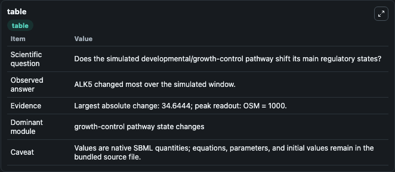
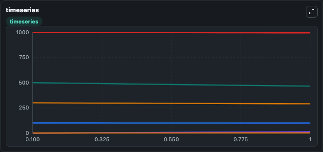
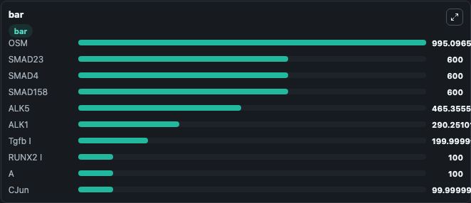

# Hodgson2018 - TGFbeta signalling and inflammatory response

This Biosimulant lab wraps `Hodgson2018 - TGFbeta signalling and inflammatory response` as a runnable signaling model with a companion visualization module.
Clean Biosimulant lab for developmental and growth-control signaling. It can be used to explore second-messenger and pathway-signaling dynamics and compare scenario outcomes across configurations.

## What You'll See

The lab asks: How does Hodgson2018 - TGFbeta signalling and inflammatory response shift developmental or growth-control pathway states? It runs for 1.0 time units with a communication step of 0.1. The run uses the model defaults declared by the curated SBML wrapper. The generated visualizations focus on source-defined IL1 state, source-defined JNK_P state, source-defined JNK state, IL1R, IL1RR, and IL1RR Int, and related outputs, combining trajectory, endpoint-comparison, and summary-table views from one completed dark-mode run.

In this captured run, **ALK5** moved from 500.0 to 465.4 across 1.0 simulation windows.

<!-- BIOSIMULANT_VISUALS_START -->
### Output Visualizations



*Summary table for Hodgson2018 - TGFbeta signalling and inflammatory response, reporting the scientific question, observed answer, dominant module, and caveat.*



*Trajectories of ALK5, ALK5 Dimer, ALK1, ALK1 ALK5, OSM, and IL1 across the 1.0 simulation. In this run **ALK5 Dimer** climbed from 0 to 12.448 and **ALK5** fell from 500.0 to 465.4 — the largest movements among the focused observables.*



*Largest-excursion ranking of the focused observables — the absolute movement magnitude during the run. Top 3: **OSM** = 995.1, **SMAD23** = 600.0, **SMAD4** = 600.0, with 7 more observables below.*

<!-- BIOSIMULANT_VISUALS_END -->

## Model Context

- Core model: `models/core`
- Visualization model: `models/visualisation`
- Standard: `other`
- Upstream source: `biomodels_ebi:MODEL1805080001`
- License: `CC0`
- Visual scope: growth-control pathway signaling
- Caveat: Values are native SBML quantities; equations, parameters, units, and initial values remain in the bundled source file.

## Inputs

| Input | Maps To | Default | Notes |
|---|---|---|---|
| Initial sink species | `signaling_sbml_hodgson2018_tgfbeta_signalling_and_inflammatory_model1805080001_model.initial_sink_species` |  | Initial level of sink species. Maps to SBML symbol `Sink`; exposed as a traceable initial-condition perturbation. |
| Initial Source | `signaling_sbml_hodgson2018_tgfbeta_signalling_and_inflammatory_model1805080001_model.initial_source` |  | Initial level of Source. Maps to SBML symbol `Source`; exposed as a traceable initial-condition perturbation. |
| Initial TGF-beta A | `signaling_sbml_hodgson2018_tgfbeta_signalling_and_inflammatory_model1805080001_model.initial_tgf_beta_a` |  | Initial level of TGF-beta A. Maps to SBML symbol `Tgfb_A`; exposed as a traceable initial-condition perturbation. |

## Outputs

| Output | Maps To | Role |
|---|---|---|
| `stat3_nuc` | `signaling_sbml_hodgson2018_tgfbeta_signalling_and_inflammatory_model1805080001_model.stat3_nuc` | STAT3 Nuc. |
| `stat3_cyt` | `signaling_sbml_hodgson2018_tgfbeta_signalling_and_inflammatory_model1805080001_model.stat3_cyt` | STAT3 Cyt. |
| `smad7` | `signaling_sbml_hodgson2018_tgfbeta_signalling_and_inflammatory_model1805080001_model.smad7` | SMAD7. |
| `state` | `signaling_sbml_hodgson2018_tgfbeta_signalling_and_inflammatory_model1805080001_model.state` | Available to the visualization model and downstream workflows. |
| `summary` | `signaling_sbml_hodgson2018_tgfbeta_signalling_and_inflammatory_model1805080001_model.summary` | Available to the visualization model and downstream workflows. |
| `species_labels` | `signaling_sbml_hodgson2018_tgfbeta_signalling_and_inflammatory_model1805080001_model.species_labels` | Available to the visualization model and downstream workflows. |

## Runtime

- Duration: `1.0`
- Communication step: `0.1`

## Running Locally

```bash
biosimulant labs serve .
```
