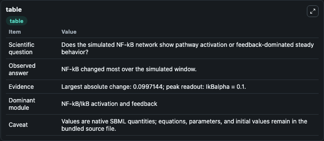
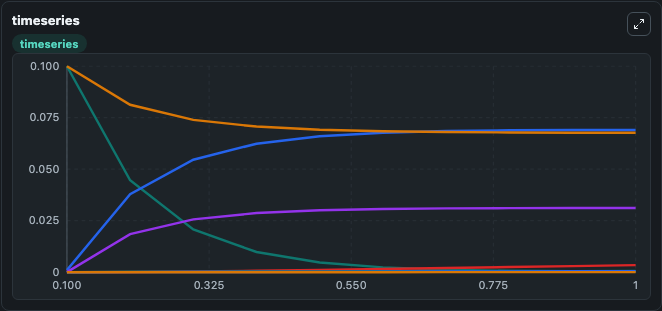
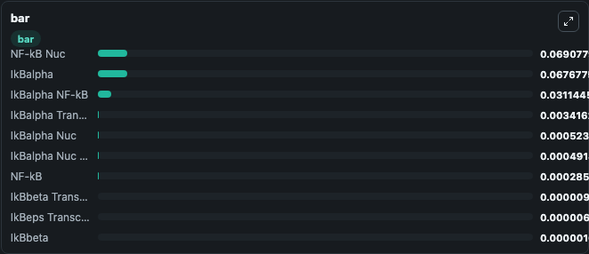

# Hoffmann2002_WT_IkBNFkB_Signaling

This Biosimulant lab wraps `Hoffmann2002_WT_IkBNFkB_Signaling` as a runnable signaling model with a companion visualization module.
Clean Biosimulant lab for NF-kB pathway signaling. It can be used to explore second-messenger and pathway-signaling dynamics and compare scenario outcomes across configurations.

## What You'll See

The lab asks: How does Hoffmann2002 WT IkBNFkB Signaling move NF-kB and inhibitor-linked signaling states? It runs for 1.0 time units with a communication step of 0.1. The run uses the model defaults declared by the curated SBML wrapper. The generated visualizations focus on Ik Balpha, NF-kB, Ik Balpha NF K B, Ik Bbeta, Ik Bbeta NF K B, and Ik Beps, and related outputs, combining trajectory, endpoint-comparison, and summary-table views from one completed dark-mode run.

In this captured run, **NF-kB** moved from 0.1000 to 0.000286 across 1.0 simulation windows.

<!-- BIOSIMULANT_VISUALS_START -->
### Output Visualizations



*Summary table for Hoffmann2002_WT_IkBNFkB_Signaling, reporting the scientific question, observed answer, dominant module, and caveat.*



*Trajectories of NF-kB, NF-kB Nuc, IkBalpha, IkBalpha NF-kB, IkBalpha Transcript, and IkBalpha Nuc across the 1.0 simulation. In this run **NF-kB Nuc** climbed from 0.001 to 0.0691 and **NF-kB** fell from 0.1000 to 0.000286 — the largest movements among the focused observables.*



*Largest-excursion ranking of the focused observables — the absolute movement magnitude during the run. Top 3: **NF-kB Nuc** = 0.0691, **IkBalpha** = 0.0677, **IkBalpha NF-kB** = 0.0311, with 7 more observables below.*

<!-- BIOSIMULANT_VISUALS_END -->

## Model Context

- Core model: `models/core`
- Visualization model: `models/visualisation`
- Standard: `other`
- Upstream source: `biomodels_ebi:BIOMD0000000140`
- License: `CC0`
- Visual scope: NF-kB activation and feedback signaling
- Caveat: Values are native SBML quantities; equations, parameters, units, and initial values remain in the bundled source file.

## Inputs

| Input | Maps To | Default | Notes |
|---|---|---|---|
| Initial Ik Balpha | `signaling_sbml_hoffmann2002_wt_ikbnfkb_signaling_biomd0000000140_model.initial_ik_balpha` |  | Initial level of Ik Balpha. Maps to SBML symbol `IkBalpha`; exposed as a traceable initial-condition perturbation. |

## Outputs

| Output | Maps To | Role |
|---|---|---|
| `nfkb` | `signaling_sbml_hoffmann2002_wt_ikbnfkb_signaling_biomd0000000140_model.nfkb` | NF-kB. |
| `ik_balpha_nf_k_b` | `signaling_sbml_hoffmann2002_wt_ikbnfkb_signaling_biomd0000000140_model.ik_balpha_nf_k_b` | Ik Balpha NF K B. |
| `ik_bbeta_nf_k_b` | `signaling_sbml_hoffmann2002_wt_ikbnfkb_signaling_biomd0000000140_model.ik_bbeta_nf_k_b` | Ik Bbeta NF K B. |
| `state` | `signaling_sbml_hoffmann2002_wt_ikbnfkb_signaling_biomd0000000140_model.state` | Available to the visualization model and downstream workflows. |
| `summary` | `signaling_sbml_hoffmann2002_wt_ikbnfkb_signaling_biomd0000000140_model.summary` | Available to the visualization model and downstream workflows. |
| `species_labels` | `signaling_sbml_hoffmann2002_wt_ikbnfkb_signaling_biomd0000000140_model.species_labels` | Available to the visualization model and downstream workflows. |

## Runtime

- Duration: `1.0`
- Communication step: `0.1`

## Running Locally

```bash
biosimulant labs serve .
```
