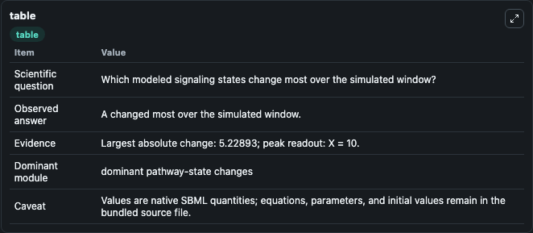
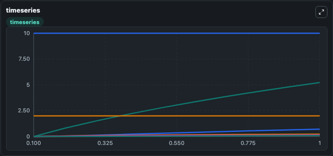
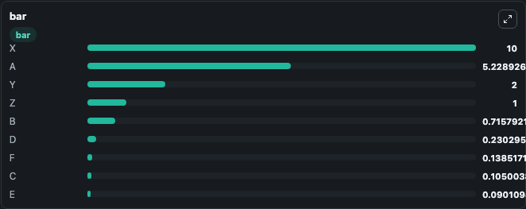

# Hofmeyer1986_SeqFb_Proc_AA_Synthesis

This Biosimulant lab wraps `Hofmeyer1986_SeqFb_Proc_AA_Synthesis` as a runnable signaling model with a companion visualization module.
Clean Biosimulant lab for systems signaling model: Hofmeyer1986_SeqFb_Proc_AA_Synthesis. It can be used to explore second-messenger and pathway-signaling dynamics and compare scenario outcomes across configurations.

## What You'll See

The lab asks: How does Hofmeyer1986 SeqFb Proc AA Synthesis shift hormone-linked signaling readouts? It runs for 1.0 time units with a communication step of 0.1. The run uses the model defaults declared by the curated SBML wrapper. The generated visualizations focus on source-defined A state, source-defined B state, source-defined C state, source-defined D state, source-defined E state, and source-defined F state, and related outputs, combining trajectory, endpoint-comparison, and summary-table views from one completed dark-mode run.

In this captured run, **A** moved from 0 to 5.229 across 1.0 simulation windows.

<!-- BIOSIMULANT_VISUALS_START -->
### Output Visualizations



*Summary table for Hofmeyer1986_SeqFb_Proc_AA_Synthesis, reporting the scientific question, observed answer, dominant module, and caveat.*



*Trajectories of A, B, D, F, C, and E across the 1.0 simulation. In this run **A** climbed from 0 to 5.229 — the largest movements among the focused observables.*



*Largest-excursion ranking of the focused observables — the absolute movement magnitude during the run. Top 3: **X** = 10.000, **A** = 5.229, **Y** = 2.000, with 6 more observables below.*

<!-- BIOSIMULANT_VISUALS_END -->

## Model Context

- Core model: `models/core`
- Visualization model: `models/visualisation`
- Standard: `other`
- Upstream source: `biomodels_ebi:BIOMD0000000284`
- License: `CC0`
- Visual scope: metabolic and hormone signaling response
- Caveat: Values are native SBML quantities; equations, parameters, units, and initial values remain in the bundled source file.

## Inputs

| Input | Maps To | Default | Notes |
|---|---|---|---|
| Initial response node X | `signaling_sbml_hofmeyer1986_seqfb_proc_aa_synthesis_biomd0000000284_model.initial_response_node_x` |  | Initial level of response node X. Maps to SBML symbol `X`; exposed as a traceable initial-condition perturbation. |
| Initial source-defined Y state | `signaling_sbml_hofmeyer1986_seqfb_proc_aa_synthesis_biomd0000000284_model.initial_source_defined_y_state` |  | Initial level of source-defined Y state. Maps to SBML symbol `Y`; exposed as a traceable initial-condition perturbation. |
| Initial source-defined Z state | `signaling_sbml_hofmeyer1986_seqfb_proc_aa_synthesis_biomd0000000284_model.initial_source_defined_z_state` |  | Initial level of source-defined Z state. Maps to SBML symbol `Z`; exposed as a traceable initial-condition perturbation. |

## Outputs

| Output | Maps To | Role |
|---|---|---|
| `source_defined_a_state` | `signaling_sbml_hofmeyer1986_seqfb_proc_aa_synthesis_biomd0000000284_model.source_defined_a_state` | source-defined A state. |
| `source_defined_b_state` | `signaling_sbml_hofmeyer1986_seqfb_proc_aa_synthesis_biomd0000000284_model.source_defined_b_state` | source-defined B state. |
| `source_defined_c_state` | `signaling_sbml_hofmeyer1986_seqfb_proc_aa_synthesis_biomd0000000284_model.source_defined_c_state` | source-defined C state. |
| `state` | `signaling_sbml_hofmeyer1986_seqfb_proc_aa_synthesis_biomd0000000284_model.state` | Available to the visualization model and downstream workflows. |
| `summary` | `signaling_sbml_hofmeyer1986_seqfb_proc_aa_synthesis_biomd0000000284_model.summary` | Available to the visualization model and downstream workflows. |
| `species_labels` | `signaling_sbml_hofmeyer1986_seqfb_proc_aa_synthesis_biomd0000000284_model.species_labels` | Available to the visualization model and downstream workflows. |

## Runtime

- Duration: `1.0`
- Communication step: `0.1`

## Running Locally

```bash
biosimulant labs serve .
```
