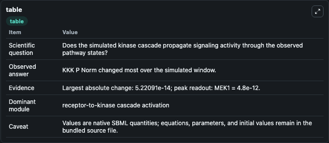
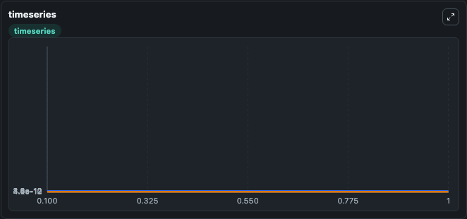
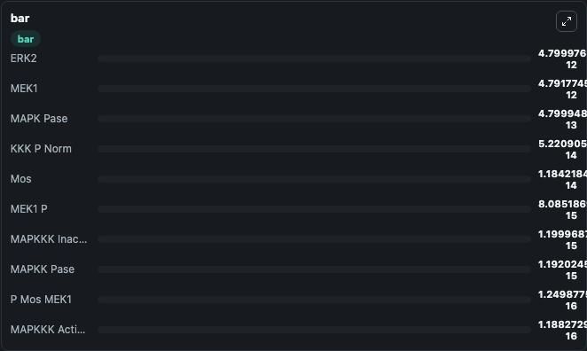

# Huang1996 - Ultrasensitivity in MAPK cascade

This Biosimulant lab wraps `Huang1996 - Ultrasensitivity in MAPK cascade` as a runnable signaling model with a companion visualization module.
Clean Biosimulant lab for MAPK/ERK receptor signaling. It can be used to explore second-messenger and pathway-signaling dynamics and compare scenario outcomes across configurations.

## What You'll See

The lab asks: How does Huang1996 - Ultrasensitivity in MAPK cascade propagate receptor or RAS/ERK pathway activity? It runs for 1.0 time units with a communication step of 0.1. The run uses the model defaults declared by the curated SBML wrapper. The generated visualizations focus on MAPKKK Activator RAS, MAPKKK Inactivator, Mos kinase, source-defined MOS-P state, source-defined MEK1 state, and Mek1 P, and related outputs, combining trajectory, endpoint-comparison, and summary-table views from one completed dark-mode run.

In this captured run, **KKK P Norm** moved from 0 to 5.22e-14 across 1.0 simulation windows.

<!-- BIOSIMULANT_VISUALS_START -->
### Output Visualizations



*Summary table for Huang1996 - Ultrasensitivity in MAPK cascade, reporting the scientific question, observed answer, dominant module, and caveat.*



*Trajectories of KKK P Norm, MEK1, MEK1 P, Mos, P Mos MEK1, and Mos P across the 1.0 simulation. In this run **KKK P Norm** climbed from 0 to 5.22e-14 and **MEK1** fell from 4.8e-12 to 4.79e-12 — the largest movements among the focused observables.*



*Largest-excursion ranking of the focused observables — the absolute movement magnitude during the run. Top 3: **ERK2** = 4.8e-12, **MEK1** = 4.79e-12, **MAPK Pase** = 4.8e-13, with 7 more observables below.*

<!-- BIOSIMULANT_VISUALS_END -->

## Model Context

- Core model: `models/core`
- Visualization model: `models/visualisation`
- Standard: `other`
- Upstream source: `biomodels_ebi:BIOMD0000000009`
- License: `CC0`
- Visual scope: receptor-to-MAPK cascade signaling
- Caveat: Values are native SBML quantities; equations, parameters, units, and initial values remain in the bundled source file.

## Inputs

| Input | Maps To | Default | Notes |
|---|---|---|---|
| Initial MAPKKK Activator RAS | `signaling_sbml_huang1996_ultrasensitivity_in_mapk_cascade_biomd0000000009_model.initial_mapkkk_activator_ras` |  | Initial level of MAPKKK Activator RAS. Maps to SBML symbol `E1`; exposed as a traceable initial-condition perturbation. |

## Outputs

| Output | Maps To | Role |
|---|---|---|
| `mapkkk_activator_ras` | `signaling_sbml_huang1996_ultrasensitivity_in_mapk_cascade_biomd0000000009_model.mapkkk_activator_ras` | MAPKKK Activator RAS. |
| `mapkkk_inactivator` | `signaling_sbml_huang1996_ultrasensitivity_in_mapk_cascade_biomd0000000009_model.mapkkk_inactivator` | MAPKKK Inactivator. |
| `source_defined_erk2_state` | `signaling_sbml_huang1996_ultrasensitivity_in_mapk_cascade_biomd0000000009_model.source_defined_erk2_state` | source-defined ERK2 state. |
| `state` | `signaling_sbml_huang1996_ultrasensitivity_in_mapk_cascade_biomd0000000009_model.state` | Available to the visualization model and downstream workflows. |
| `summary` | `signaling_sbml_huang1996_ultrasensitivity_in_mapk_cascade_biomd0000000009_model.summary` | Available to the visualization model and downstream workflows. |
| `species_labels` | `signaling_sbml_huang1996_ultrasensitivity_in_mapk_cascade_biomd0000000009_model.species_labels` | Available to the visualization model and downstream workflows. |

## Runtime

- Duration: `1.0`
- Communication step: `0.1`

## Running Locally

```bash
biosimulant labs serve .
```
