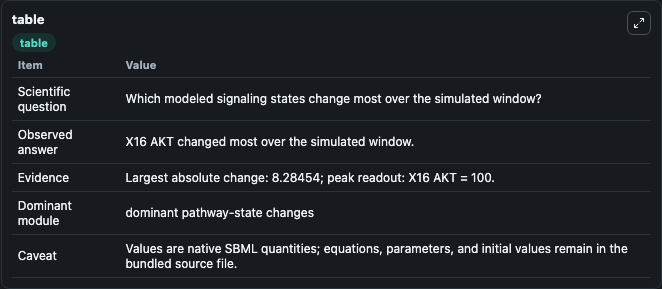
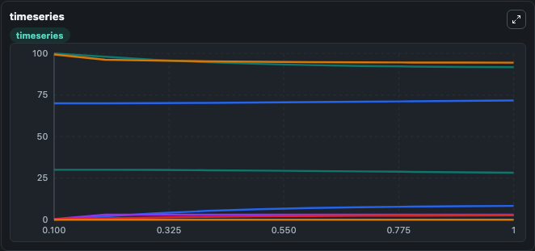
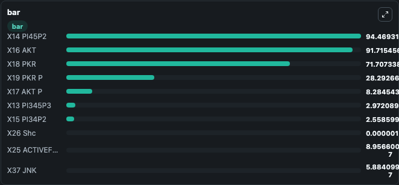

# Huang2014 - Systematic modeling for the insulin signaling network mediated by IRS1 and IRS2

This Biosimulant lab wraps `Huang2014 - Systematic modeling for the insulin signaling network mediated by IRS1 and IRS2` as a runnable signaling model with a companion visualization module.
Clean Biosimulant lab for metabolic and hormone-linked signaling. It can be used to explore second-messenger and pathway-signaling dynamics and compare scenario outcomes across configurations.

## What You'll See

The lab asks: How does Huang2014 - Systematic modeling for the insulin signaling network mediated by IRS1 and IRS2 route receptor activity into cAMP/PKA-linked readouts? It runs for 1.0 time units with a communication step of 0.1. The run uses the model defaults declared by the curated SBML wrapper. The generated visualizations focus on X2 Receptor, X6 EN Receptor, X9 IRS 1, X21 IRS 2, X11 PI3K, and X14 PI45P2, and related outputs, combining trajectory, endpoint-comparison, and summary-table views from one completed dark-mode run.

In this captured run, **X16 AKT** moved from 100.0 to 91.715 across 1.0 simulation windows.

<!-- BIOSIMULANT_VISUALS_START -->
### Output Visualizations



*Summary table for Huang2014 - Systematic modeling for the insulin signaling network mediated by IRS1 and IRS2, reporting the scientific question, observed answer, dominant module, and caveat.*



*Trajectories of X16 AKT, X17 AKT P, X14 PI45P2, X13 PI345P3, X15 PI34P2, and X19 PKR P across the 1.0 simulation. In this run **X17 AKT P** climbed from 0 to 8.285 and **X16 AKT** fell from 100.0 to 91.715 — the largest movements among the focused observables.*



*Largest-excursion ranking of the focused observables — the absolute movement magnitude during the run. Top 3: **X14 PI45P2** = 94.469, **X16 AKT** = 91.715, **X18 PKR** = 71.707, with 7 more observables below.*

<!-- BIOSIMULANT_VISUALS_END -->

## Model Context

- Core model: `models/core`
- Visualization model: `models/visualisation`
- Standard: `other`
- Upstream source: `biomodels_ebi:MODEL1912090001`
- License: `CC0`
- Visual scope: GPCR and cAMP/PKA signaling
- Caveat: Values are native SBML quantities; equations, parameters, units, and initial values remain in the bundled source file.

## Inputs

| Input | Maps To | Default | Notes |
|---|---|---|---|
| Initial X1 Insulin | `signaling_sbml_huang2014_systematic_modeling_for_the_insulin_si_model1912090001_model.initial_x1_insulin` |  | Initial level of X1 Insulin. Maps to SBML symbol `x1_Insulin`; exposed as a traceable initial-condition perturbation. |

## Outputs

| Output | Maps To | Role |
|---|---|---|
| `x2_receptor` | `signaling_sbml_huang2014_systematic_modeling_for_the_insulin_si_model1912090001_model.x2_receptor` | X2 Receptor. |
| `x6_en_receptor` | `signaling_sbml_huang2014_systematic_modeling_for_the_insulin_si_model1912090001_model.x6_en_receptor` | X6 EN Receptor. |
| `x16_akt` | `signaling_sbml_huang2014_systematic_modeling_for_the_insulin_si_model1912090001_model.x16_akt` | X16 AKT. |
| `state` | `signaling_sbml_huang2014_systematic_modeling_for_the_insulin_si_model1912090001_model.state` | Available to the visualization model and downstream workflows. |
| `summary` | `signaling_sbml_huang2014_systematic_modeling_for_the_insulin_si_model1912090001_model.summary` | Available to the visualization model and downstream workflows. |
| `species_labels` | `signaling_sbml_huang2014_systematic_modeling_for_the_insulin_si_model1912090001_model.species_labels` | Available to the visualization model and downstream workflows. |

## Runtime

- Duration: `1.0`
- Communication step: `0.1`

## Running Locally

```bash
biosimulant labs serve .
```
