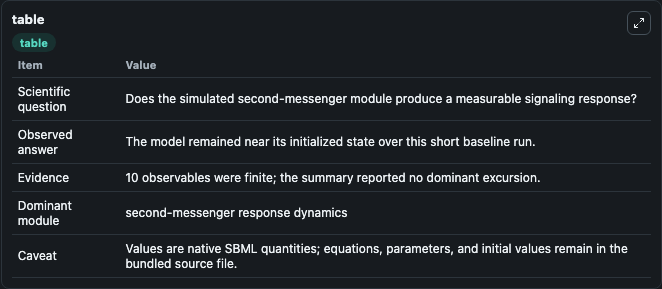
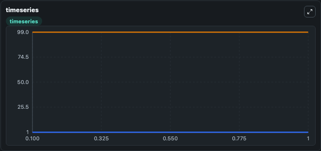
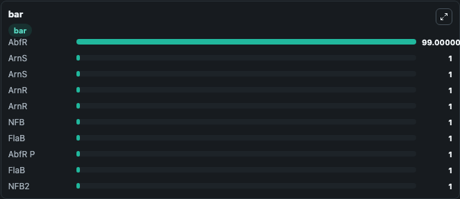

# Huarat2016 -Starvation-induced Ser/Thr protein kinase ArnS (Saci_1181) (Model 14)

This Biosimulant lab wraps `Huarat2016 -Starvation-induced Ser/Thr protein kinase ArnS (Saci_1181) (Model 14)` as a runnable signaling model with a companion visualization module.
Clean Biosimulant lab for systems signaling model: Huarat2016 -Starvation-induced Ser/Thr protein kinase ArnS (Saci_1181) (Model 14). It can be used to explore second-messenger and pathway-signaling dynamics and compare scenario outcomes across configurations.

## What You'll See

The lab asks: How does Huarat2016 -Starvation-induced Ser/Thr protein kinase ArnS (Saci 1181) (Model 14) route receptor activity into cAMP/PKA-linked readouts? It runs for 1.0 time units with a communication step of 0.1. The run uses the model defaults declared by the curated SBML wrapper. The generated visualizations focus on source-defined ARNS state, source-defined ARNR state, source-defined NFB state, source-defined FLAB state, Abf R P, and source-defined ABFR state, and related outputs, combining trajectory, endpoint-comparison, and summary-table views from one completed dark-mode run.

In this captured run, **ArnS** moved from 1.000 to 1.000 across 1.0 simulation windows.

<!-- BIOSIMULANT_VISUALS_START -->
### Output Visualizations



*Summary table for Huarat2016 -Starvation-induced Ser/Thr protein kinase ArnS (Saci_1181) (Model 14), reporting the scientific question, observed answer, dominant module, and caveat.*



*Trajectories of ArnS, ArnS, ArnR, ArnR, NFB, and FlaB across the 1.0 simulation. In this run ArnS, ArnS, ArnR, ArnR stayed near their initial values — no observable moved appreciably.*



*Largest-excursion ranking of the focused observables — the absolute movement magnitude during the run. Top 3: **AbfR** = 99.000, **ArnS** = 1.000, **ArnS** = 1.000, with 7 more observables below.*

<!-- BIOSIMULANT_VISUALS_END -->

## Model Context

- Core model: `models/core`
- Visualization model: `models/visualisation`
- Standard: `other`
- Upstream source: `biomodels_ebi:MODEL1607210000`
- License: `CC0`
- Visual scope: GPCR and cAMP/PKA signaling
- Caveat: Values are native SBML quantities; equations, parameters, units, and initial values remain in the bundled source file.

## Inputs

| Input | Maps To | Default | Notes |
|---|---|---|---|
| Initial source-defined ARNS state | `signaling_sbml_huarat2016_starvation_induced_ser_thr_protein_ki_model1607210000_model.initial_source_defined_arns_state` |  | Initial level of source-defined ARNS state. Maps to SBML symbol `saci1181`; exposed as a traceable initial-condition perturbation. |

## Outputs

| Output | Maps To | Role |
|---|---|---|
| `source_defined_nfb_state` | `signaling_sbml_huarat2016_starvation_induced_ser_thr_protein_ki_model1607210000_model.source_defined_nfb_state` | source-defined NFB state. |
| `source_defined_nfb2_state` | `signaling_sbml_huarat2016_starvation_induced_ser_thr_protein_ki_model1607210000_model.source_defined_nfb2_state` | source-defined NFB2 state. |
| `source_defined_arns_state` | `signaling_sbml_huarat2016_starvation_induced_ser_thr_protein_ki_model1607210000_model.source_defined_arns_state` | source-defined ARNS state. |
| `state` | `signaling_sbml_huarat2016_starvation_induced_ser_thr_protein_ki_model1607210000_model.state` | Available to the visualization model and downstream workflows. |
| `summary` | `signaling_sbml_huarat2016_starvation_induced_ser_thr_protein_ki_model1607210000_model.summary` | Available to the visualization model and downstream workflows. |
| `species_labels` | `signaling_sbml_huarat2016_starvation_induced_ser_thr_protein_ki_model1607210000_model.species_labels` | Available to the visualization model and downstream workflows. |

## Runtime

- Duration: `1.0`
- Communication step: `0.1`

## Running Locally

```bash
biosimulant labs serve .
```
