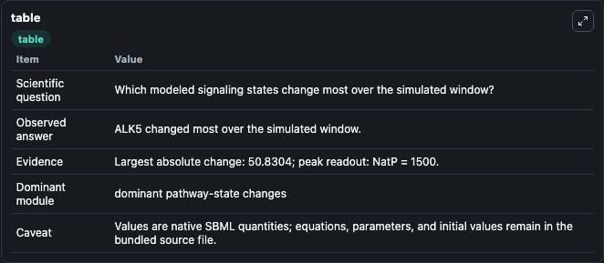
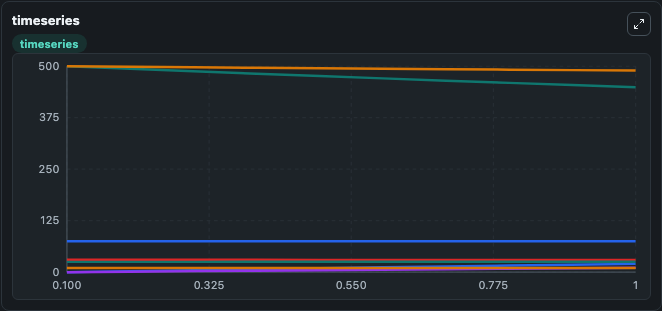
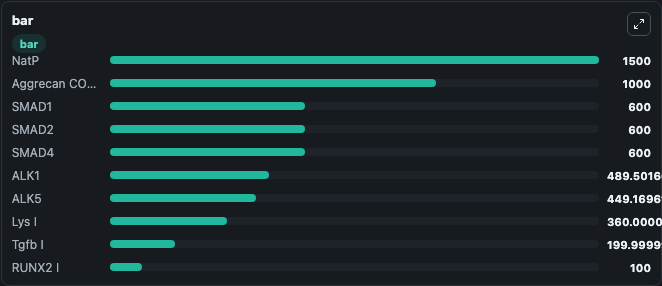

# Hui2016 - Age-related changes in articular cartilage

This Biosimulant lab wraps `Hui2016 - Age-related changes in articular cartilage` as a runnable signaling model with a companion visualization module.
Clean Biosimulant lab for systems signaling model: Hui2016 - Age-related changes in articular cartilage. It can be used to explore second-messenger and pathway-signaling dynamics and compare scenario outcomes across configurations.

## What You'll See

The lab asks: What baseline signaling response is generated by Hui2016 - Age-related changes in articular cartilage? It runs for 1.0 time units with a communication step of 0.1. The run uses the model defaults declared by the curated SBML wrapper. The generated visualizations focus on Acanm RNA, ADAMTS5, Ageprod, Source Defined ALK1 State, ALK1 ALK5, and Source Defined ALK5 State, and related outputs, combining trajectory, endpoint-comparison, and summary-table views from one completed dark-mode run.

In this captured run, **ALK5** moved from 500.0 to 449.2 across 1.0 simulation windows.

<!-- BIOSIMULANT_VISUALS_START -->
### Output Visualizations



*Summary table for Hui2016 - Age-related changes in articular cartilage, reporting the scientific question, observed answer, dominant module, and caveat.*



*Trajectories of ALK5, ALK5 Dimer, ALK1, ALK1 ALK5, BCL2, and BCL2 Beclin across the 1.0 simulation. In this run **ALK5 Dimer** climbed from 0 to 20.166 and **ALK5** fell from 500.0 to 449.2 — the largest movements among the focused observables.*



*Largest-excursion ranking of the focused observables — the absolute movement magnitude during the run. Top 3: **NatP** = 1500.0, **Aggrecan COLLAGEN2** = 1000.0, **SMAD1** = 600.0, with 7 more observables below.*

<!-- BIOSIMULANT_VISUALS_END -->

## Model Context

- Core model: `models/core`
- Visualization model: `models/visualisation`
- Standard: `other`
- Upstream source: `biomodels_ebi:BIOMD0000000560`
- License: `CC0`
- Visual scope: curated source-model signaling response
- Caveat: Values are native SBML quantities; equations, parameters, units, and initial values remain in the bundled source file.

## Inputs

| Input | Maps To | Default | Notes |
|---|---|---|---|
| Initial source-defined NATP state | `signaling_sbml_hui2016_age_related_changes_in_articular_cartila_biomd0000000560_model.initial_source_defined_natp_state` |  | Initial level of source-defined NATP state. Maps to SBML symbol `NatP`; exposed as a traceable initial-condition perturbation. |
| Initial sink species | `signaling_sbml_hui2016_age_related_changes_in_articular_cartila_biomd0000000560_model.initial_sink_species` |  | Initial level of sink species. Maps to SBML symbol `Sink`; exposed as a traceable initial-condition perturbation. |
| Initial Source | `signaling_sbml_hui2016_age_related_changes_in_articular_cartila_biomd0000000560_model.initial_source` |  | Initial level of Source. Maps to SBML symbol `Source`; exposed as a traceable initial-condition perturbation. |

## Outputs

| Output | Maps To | Role |
|---|---|---|
| `acanm_rna` | `signaling_sbml_hui2016_age_related_changes_in_articular_cartila_biomd0000000560_model.acanm_rna` | Acanm RNA. |
| `caspase_a` | `signaling_sbml_hui2016_age_related_changes_in_articular_cartila_biomd0000000560_model.caspase_a` | Caspase A. |
| `caspase_i` | `signaling_sbml_hui2016_age_related_changes_in_articular_cartila_biomd0000000560_model.caspase_i` | Caspase I. |
| `state` | `signaling_sbml_hui2016_age_related_changes_in_articular_cartila_biomd0000000560_model.state` | Available to the visualization model and downstream workflows. |
| `summary` | `signaling_sbml_hui2016_age_related_changes_in_articular_cartila_biomd0000000560_model.summary` | Available to the visualization model and downstream workflows. |
| `species_labels` | `signaling_sbml_hui2016_age_related_changes_in_articular_cartila_biomd0000000560_model.species_labels` | Available to the visualization model and downstream workflows. |

## Runtime

- Duration: `1.0`
- Communication step: `0.1`

## Running Locally

```bash
biosimulant labs serve .
```
