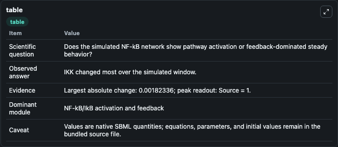
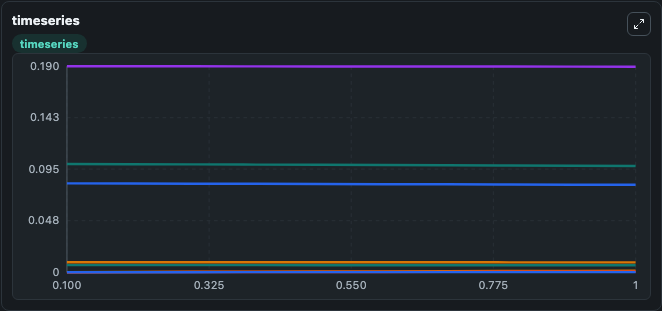
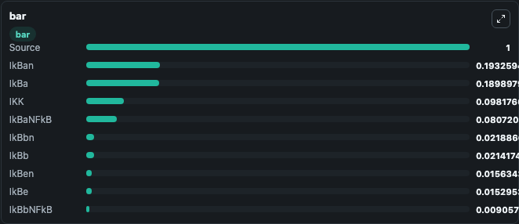

# Ihekwaba2004_NFkB_Sensitivity

This Biosimulant lab wraps `Ihekwaba2004_NFkB_Sensitivity` as a runnable signaling model with a companion visualization module.
Clean Biosimulant lab for NF-kB pathway signaling. It can be used to explore second-messenger and pathway-signaling dynamics and compare scenario outcomes across configurations.

## What You'll See

The lab asks: How does Ihekwaba2004 NFkB Sensitivity move NF-kB and inhibitor-linked signaling states? It runs for 1.0 time units with a communication step of 0.1. The run uses the model defaults declared by the curated SBML wrapper. The generated visualizations focus on NF-kB, Ikkik Ba, Ikkik Ba Nfk B, source-defined IKK state, source-defined IKBA state, and Ikkik complement factor Bb, and related outputs, combining trajectory, endpoint-comparison, and summary-table views from one completed dark-mode run.

In this captured run, **IKK** moved from 0.1000 to 0.0982 across 1.0 simulation windows.

<!-- BIOSIMULANT_VISUALS_START -->
### Output Visualizations



*Summary table for Ihekwaba2004_NFkB_Sensitivity, reporting the scientific question, observed answer, dominant module, and caveat.*



*Trajectories of IKK, IkBaNFkB, IKKIkBaNFkB, IkBa, IKKIkBa, and IkBeNFkB across the 1.0 simulation. In this run **IKKIkBaNFkB** climbed from 0 to 0.00133 and **IKK** fell from 0.1000 to 0.0982 — the largest movements among the focused observables.*



*Largest-excursion ranking of the focused observables — the absolute movement magnitude during the run. Top 3: **Source** = 1.000, **IkBan** = 0.1933, **IkBa** = 0.1899, with 7 more observables below.*

<!-- BIOSIMULANT_VISUALS_END -->

## Model Context

- Core model: `models/core`
- Visualization model: `models/visualisation`
- Standard: `other`
- Upstream source: `biomodels_ebi:BIOMD0000000230`
- License: `CC0`
- Visual scope: NF-kB activation and feedback signaling
- Caveat: Values are native SBML quantities; equations, parameters, units, and initial values remain in the bundled source file.

## Inputs

| Input | Maps To | Default | Notes |
|---|---|---|---|
| Initial sink species | `signaling_sbml_ihekwaba2004_nfkb_sensitivity_biomd0000000230_model.initial_sink_species` |  | Initial level of sink species. Maps to SBML symbol `sink`; exposed as a traceable initial-condition perturbation. |
| Initial Source | `signaling_sbml_ihekwaba2004_nfkb_sensitivity_biomd0000000230_model.initial_source` |  | Initial level of Source. Maps to SBML symbol `source`; exposed as a traceable initial-condition perturbation. |

## Outputs

| Output | Maps To | Role |
|---|---|---|
| `nfkb` | `signaling_sbml_ihekwaba2004_nfkb_sensitivity_biomd0000000230_model.nfkb` | NF-kB. |
| `ikkik_ba_nfk_b` | `signaling_sbml_ihekwaba2004_nfkb_sensitivity_biomd0000000230_model.ikkik_ba_nfk_b` | Ikkik Ba Nfk B. |
| `ikkik_complement_factor_bb_nfk_b` | `signaling_sbml_ihekwaba2004_nfkb_sensitivity_biomd0000000230_model.ikkik_complement_factor_bb_nfk_b` | Ikkik complement factor Bb Nfk B. |
| `state` | `signaling_sbml_ihekwaba2004_nfkb_sensitivity_biomd0000000230_model.state` | Available to the visualization model and downstream workflows. |
| `summary` | `signaling_sbml_ihekwaba2004_nfkb_sensitivity_biomd0000000230_model.summary` | Available to the visualization model and downstream workflows. |
| `species_labels` | `signaling_sbml_ihekwaba2004_nfkb_sensitivity_biomd0000000230_model.species_labels` | Available to the visualization model and downstream workflows. |

## Runtime

- Duration: `1.0`
- Communication step: `0.1`

## Running Locally

```bash
biosimulant labs serve .
```
