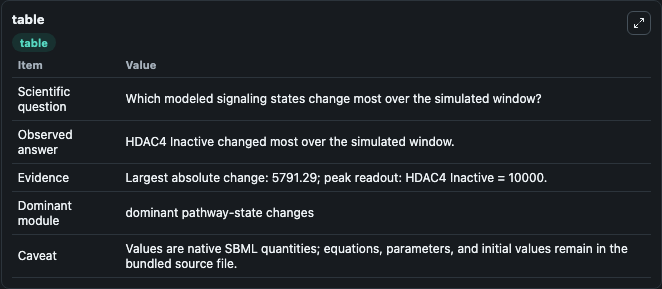
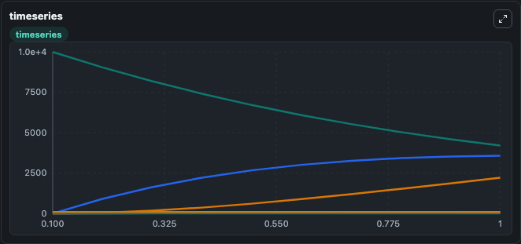
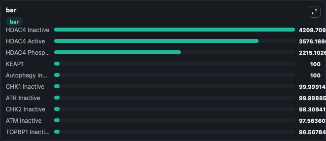

# Integrated Model of DNA Damage Response and p53 Signaling in ATM/ATR-Deficient Ataxia Telangiectasia: Exploring the Therapeutic Roles of Possible repurposed drugs

This Biosimulant lab wraps `Integrated Model of DNA Damage Response and p53 Signaling in ATM/ATR-Deficient Ataxia Telangiectasia: Exploring the Therapeutic Roles of Possible repurposed drugs` as a runnable signaling model with a companion visualization module.
Clean Biosimulant lab for systems signaling model: Integrated Model of DNA Damage Response and p53 Signaling in ATM/ATR-Deficient Ataxia Telangiectasia: Exploring the Therapeutic Roles of Possible repurposed drugs. It can be used to explore second-messenger and pathway-signaling dynamics and compare scenario outcomes across configurations.

## What You'll See

The lab asks: How does Integrated Model of DNA Damage Response and p53 Signaling in ATM/ATR-Deficient Ataxia Telangiectasia: Exploring the Therapeutic Roles of Possible repurposed drugs move checkpoint or cycle-control signaling states? It runs for 1.0 time units with a communication step of 0.1. The run uses the model defaults declared by the curated SBML wrapper. The generated visualizations focus on ATM Inactive, ATM active, ATR Inactive, ATR active, DNA Damage, and P53 Inactive, and related outputs, combining trajectory, endpoint-comparison, and summary-table views from one completed dark-mode run.

In this captured run, **HDAC4 Inactive** moved from 1e+04 to 4208.7 across 1.0 simulation windows.

<!-- BIOSIMULANT_VISUALS_START -->
### Output Visualizations



*Summary table for Integrated Model of DNA Damage Response and p53 Signaling in ATM/ATR-Deficient Ataxia Telangiectasia: Exploring the Therapeutic Roles of Possible repurposed drugs, reporting the scientific question, observed answer, dominant module, and caveat.*



*Trajectories of HDAC4 Inactive, HDAC4 Active, HDAC4 Phospho, NRF2 Inactive, NRF2 Degraded, and TOPBP1 Active across the 1.0 simulation. In this run **HDAC4 Active** climbed from 0 to 3576.2 and **HDAC4 Inactive** fell from 1e+04 to 4208.7 — the largest movements among the focused observables.*



*Largest-excursion ranking of the focused observables — the absolute movement magnitude during the run. Top 3: **HDAC4 Inactive** = 4208.7, **HDAC4 Active** = 3576.2, **HDAC4 Phospho** = 2215.1, with 7 more observables below.*

<!-- BIOSIMULANT_VISUALS_END -->

## Model Context

- Core model: `models/core`
- Visualization model: `models/visualisation`
- Standard: `other`
- Upstream source: `biomodels_ebi:MODEL2503190002`
- License: `CC0`
- Visual scope: cell-cycle regulatory signaling
- Caveat: Values are native SBML quantities; equations, parameters, units, and initial values remain in the bundled source file.

## Inputs

| Input | Maps To | Default | Notes |
|---|---|---|---|
| Initial source-defined CK2 state | `signaling_sbml_integrated_model_of_dna_damage_response_and_p53_model2503190002_model.initial_source_defined_ck2_state` |  | Initial level of source-defined CK2 state. Maps to SBML symbol `CK2`; exposed as a traceable initial-condition perturbation. |
| Initial KEAP1 | `signaling_sbml_integrated_model_of_dna_damage_response_and_p53_model2503190002_model.initial_keap1` |  | Initial level of KEAP1. Maps to SBML symbol `KEAP1`; exposed as a traceable initial-condition perturbation. |
| Initial Omaveloxolone | `signaling_sbml_integrated_model_of_dna_damage_response_and_p53_model2503190002_model.initial_omaveloxolone` |  | Initial level of Omaveloxolone. Maps to SBML symbol `Omaveloxolone`; exposed as a traceable initial-condition perturbation. |

## Outputs

| Output | Maps To | Role |
|---|---|---|
| `atm_inactive` | `signaling_sbml_integrated_model_of_dna_damage_response_and_p53_model2503190002_model.atm_inactive` | ATM Inactive. |
| `atm_active` | `signaling_sbml_integrated_model_of_dna_damage_response_and_p53_model2503190002_model.atm_active` | ATM active. |
| `atr_inactive` | `signaling_sbml_integrated_model_of_dna_damage_response_and_p53_model2503190002_model.atr_inactive` | ATR Inactive. |
| `state` | `signaling_sbml_integrated_model_of_dna_damage_response_and_p53_model2503190002_model.state` | Available to the visualization model and downstream workflows. |
| `summary` | `signaling_sbml_integrated_model_of_dna_damage_response_and_p53_model2503190002_model.summary` | Available to the visualization model and downstream workflows. |
| `species_labels` | `signaling_sbml_integrated_model_of_dna_damage_response_and_p53_model2503190002_model.species_labels` | Available to the visualization model and downstream workflows. |

## Runtime

- Duration: `1.0`
- Communication step: `0.1`

## Running Locally

```bash
biosimulant labs serve .
```
