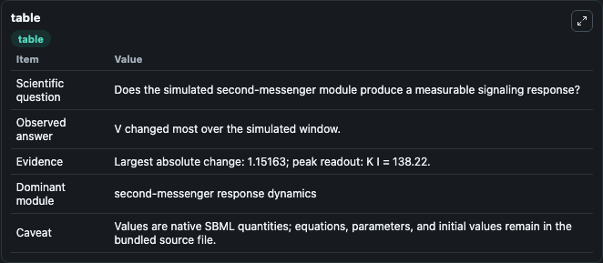
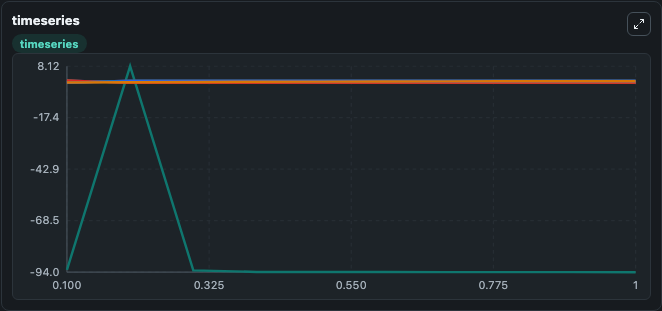
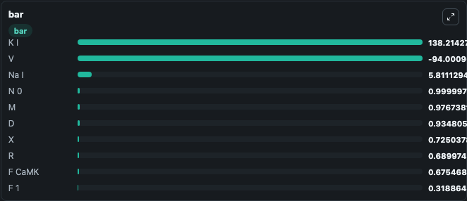

# Iribe2006_CaMKIIkineticsModel

This Biosimulant lab wraps `Iribe2006_CaMKIIkineticsModel` as a runnable signaling model with a companion visualization module.
Clean Biosimulant lab for calcium and second-messenger signaling. It can be used to explore second-messenger and pathway-signaling dynamics and compare scenario outcomes across configurations.

## What You'll See

The lab asks: How do calcium-linked states respond in Iribe2006 CaMKIIkineticsModel? It runs for 1.0 time units with a communication step of 0.1. The run uses the model defaults declared by the curated SBML wrapper. The generated visualizations focus on V Membrane Potential, Source Defined M State, Source Defined H State, Response Node X, Source Defined S State, and Source Defined R State, and related outputs, combining trajectory, endpoint-comparison, and summary-table views from one completed dark-mode run.

In this captured run, **V** moved from -92.849 to -94.001 across 1.0 simulation windows.

<!-- BIOSIMULANT_VISUALS_START -->
### Output Visualizations



*Summary table for Iribe2006_CaMKIIkineticsModel, reporting the scientific question, observed answer, dominant module, and caveat.*



*Trajectories of V, F, H, M, S, and D across the 1.0 simulation. In this run **M** climbed from 0.00138 to 0.9767 and **V** fell from -92.849 to -94.001 — the largest movements among the focused observables.*



*Largest-excursion ranking of the focused observables — the absolute movement magnitude during the run. Top 3: **K I** = 138.2, **Na I** = 5.811, **N 0** = 1.0000, with 7 more observables below.*

<!-- BIOSIMULANT_VISUALS_END -->

## Model Context

- Core model: `models/core`
- Visualization model: `models/visualisation`
- Standard: `other`
- Upstream source: `biomodels_ebi:MODEL1006230085`
- License: `CC0`
- Visual scope: calcium second-messenger signaling
- Caveat: Values are native SBML quantities; equations, parameters, units, and initial values remain in the bundled source file.

## Inputs

| Input | Maps To | Default | Notes |
|---|---|---|---|
| Initial V Membrane Potential | `signaling_sbml_iribe2006_camkiikineticsmodel_model1006230085_model.initial_v_membrane_potential` |  | Initial level of V Membrane Potential. Maps to SBML symbol `V_membrane_potential`; exposed as a traceable initial-condition perturbation. |

## Outputs

| Output | Maps To | Role |
|---|---|---|
| `f_calcium_map_kinase` | `signaling_sbml_iribe2006_camkiikineticsmodel_model1006230085_model.f_calcium_map_kinase` | F calcium MAP kinase. |
| `f_srca_ry_r` | `signaling_sbml_iribe2006_camkiikineticsmodel_model1006230085_model.f_srca_ry_r` | F Srca Ry R. |
| `cmdn_calcium` | `signaling_sbml_iribe2006_camkiikineticsmodel_model1006230085_model.cmdn_calcium` | Cmdn calcium. |
| `state` | `signaling_sbml_iribe2006_camkiikineticsmodel_model1006230085_model.state` | Available to the visualization model and downstream workflows. |
| `summary` | `signaling_sbml_iribe2006_camkiikineticsmodel_model1006230085_model.summary` | Available to the visualization model and downstream workflows. |
| `species_labels` | `signaling_sbml_iribe2006_camkiikineticsmodel_model1006230085_model.species_labels` | Available to the visualization model and downstream workflows. |

## Runtime

- Duration: `1.0`
- Communication step: `0.1`

## Running Locally

```bash
biosimulant labs serve .
```
