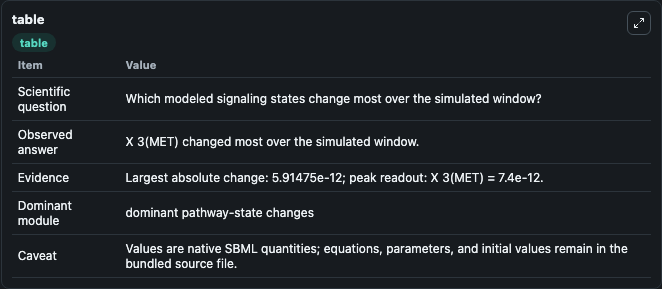
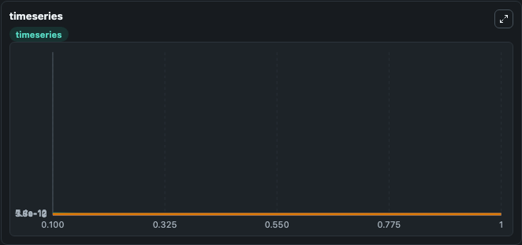
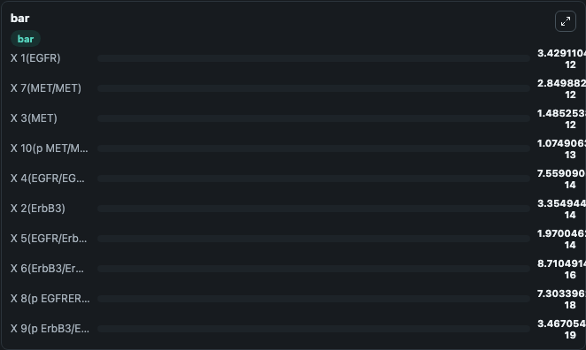

# Ito2019 - gefitnib resistance of lung adenocarcinoma caused by MET amplification

This Biosimulant lab wraps `Ito2019 - gefitnib resistance of lung adenocarcinoma caused by MET amplification` as a runnable signaling model with a companion visualization module.
Clean Biosimulant lab for systems signaling model: Ito2019 - gefitnib resistance of lung adenocarcinoma caused by MET amplification. It can be used to explore second-messenger and pathway-signaling dynamics and compare scenario outcomes across configurations.

## What You'll See

The lab asks: How does Ito2019 - gefitnib resistance of lung adenocarcinoma caused by MET amplification propagate receptor or RAS/ERK pathway activity? It runs for 1.0 time units with a communication step of 0.1. The run uses the model defaults declared by the curated SBML wrapper. The generated visualizations focus on X 1 EGFR, X 4 EGFR EGFR, X 2 Erb B3, X 6 Erb B3 Erb B3, X 5 EGFR Erb B3, and X 3 MET, and related outputs, combining trajectory, endpoint-comparison, and summary-table views from one completed dark-mode run.

In this captured run, **X 3(MET)** moved from 7.4e-12 to 1.49e-12 across 1.0 simulation windows.

<!-- BIOSIMULANT_VISUALS_START -->
### Output Visualizations



*Summary table for Ito2019 - gefitnib resistance of lung adenocarcinoma caused by MET amplification, reporting the scientific question, observed answer, dominant module, and caveat.*



*Trajectories of X 3(MET), X 7(MET/MET), X 1(EGFR), X 10(p MET/MET), X 4(EGFR/EGFR), and X 2(ErbB3) across the 1.0 simulation. In this run **X 7(MET/MET)** climbed from 0 to 2.85e-12 and **X 3(MET)** fell from 7.4e-12 to 1.49e-12 — the largest movements among the focused observables.*



*Largest-excursion ranking of the focused observables — the absolute movement magnitude during the run. Top 3: **X 1(EGFR)** = 3.43e-12, **X 7(MET/MET)** = 2.85e-12, **X 3(MET)** = 1.49e-12, with 7 more observables below.*

<!-- BIOSIMULANT_VISUALS_END -->

## Model Context

- Core model: `models/core`
- Visualization model: `models/visualisation`
- Standard: `other`
- Upstream source: `biomodels_ebi:BIOMD0000000827`
- License: `CC0`
- Visual scope: receptor-to-MAPK cascade signaling
- Caveat: Values are native SBML quantities; equations, parameters, units, and initial values remain in the bundled source file.

## Inputs

| Input | Maps To | Default | Notes |
|---|---|---|---|
| Initial X 1 EGFR | `signaling_sbml_ito2019_gefitnib_resistance_of_lung_adenocarcino_biomd0000000827_model.initial_x_1_egfr` |  | Initial level of X 1 EGFR. Maps to SBML symbol `X_1_EGFR`; exposed as a traceable initial-condition perturbation. |
| Initial X 4 EGFR EGFR | `signaling_sbml_ito2019_gefitnib_resistance_of_lung_adenocarcino_biomd0000000827_model.initial_x_4_egfr_egfr` |  | Initial level of X 4 EGFR EGFR. Maps to SBML symbol `X_4_EGFR_EGFR`; exposed as a traceable initial-condition perturbation. |
| Initial X 5 EGFR Erb B3 | `signaling_sbml_ito2019_gefitnib_resistance_of_lung_adenocarcino_biomd0000000827_model.initial_x_5_egfr_erb_b3` |  | Initial level of X 5 EGFR Erb B3. Maps to SBML symbol `X_5_EGFR_ErbB3`; exposed as a traceable initial-condition perturbation. |

## Outputs

| Output | Maps To | Role |
|---|---|---|
| `x_1_egfr` | `signaling_sbml_ito2019_gefitnib_resistance_of_lung_adenocarcino_biomd0000000827_model.x_1_egfr` | X 1 EGFR. |
| `x_4_egfr_egfr` | `signaling_sbml_ito2019_gefitnib_resistance_of_lung_adenocarcino_biomd0000000827_model.x_4_egfr_egfr` | X 4 EGFR EGFR. |
| `x_2_erb_b3` | `signaling_sbml_ito2019_gefitnib_resistance_of_lung_adenocarcino_biomd0000000827_model.x_2_erb_b3` | X 2 Erb B3. |
| `state` | `signaling_sbml_ito2019_gefitnib_resistance_of_lung_adenocarcino_biomd0000000827_model.state` | Available to the visualization model and downstream workflows. |
| `summary` | `signaling_sbml_ito2019_gefitnib_resistance_of_lung_adenocarcino_biomd0000000827_model.summary` | Available to the visualization model and downstream workflows. |
| `species_labels` | `signaling_sbml_ito2019_gefitnib_resistance_of_lung_adenocarcino_biomd0000000827_model.species_labels` | Available to the visualization model and downstream workflows. |

## Runtime

- Duration: `1.0`
- Communication step: `0.1`

## Running Locally

```bash
biosimulant labs serve .
```
