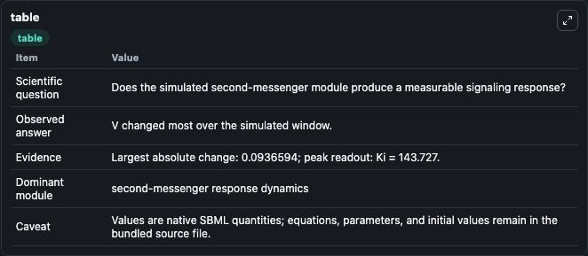
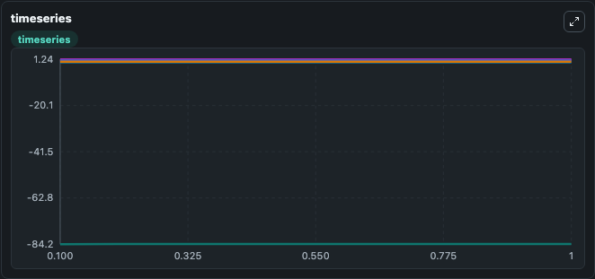
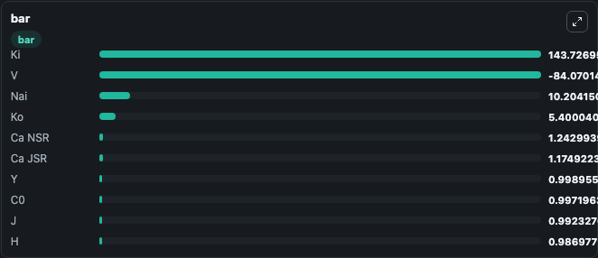

# Jafri1998_VentricularMyocyte

This Biosimulant lab wraps `Jafri1998_VentricularMyocyte` as a runnable signaling model with a companion visualization module.
Clean Biosimulant lab for calcium and second-messenger signaling. It can be used to explore second-messenger and pathway-signaling dynamics and compare scenario outcomes across configurations.

## What You'll See

The lab asks: How do calcium-linked states respond in Jafri1998 VentricularMyocyte? It runs for 1.0 time units with a communication step of 0.1. The run uses the model defaults declared by the curated SBML wrapper. The generated visualizations focus on V Membrane, Source Defined M State, Source Defined H State, Source Defined J State, Source Defined C0 State, and Source Defined C1 State, and related outputs, combining trajectory, endpoint-comparison, and summary-table views from one completed dark-mode run.

In this captured run, **V** moved from -84.164 to -84.070 across 1.0 simulation windows.

<!-- BIOSIMULANT_VISUALS_START -->
### Output Visualizations



*Summary table for Jafri1998_VentricularMyocyte, reporting the scientific question, observed answer, dominant module, and caveat.*



*Trajectories of V, M, H, Ca NSR, J, and LTRPNCa across the 1.0 simulation. In this run **V** climbed from -84.164 to -84.070 and **M** fell from 0.0328 to 0.0018 — the largest movements among the focused observables.*



*Largest-excursion ranking of the focused observables — the absolute movement magnitude during the run. Top 3: **Ki** = 143.7, **Nai** = 10.204, **Ko** = 5.400, with 7 more observables below.*

<!-- BIOSIMULANT_VISUALS_END -->

## Model Context

- Core model: `models/core`
- Visualization model: `models/visualisation`
- Standard: `other`
- Upstream source: `biomodels_ebi:MODEL0847869198`
- License: `CC0`
- Visual scope: calcium second-messenger signaling
- Caveat: Values are native SBML quantities; equations, parameters, units, and initial values remain in the bundled source file.

## Inputs

| Input | Maps To | Default | Notes |
|---|---|---|---|
| Initial V Membrane | `signaling_sbml_jafri1998_ventricularmyocyte_model0847869198_model.initial_v_membrane` |  | Initial level of V Membrane. Maps to SBML symbol `V_membrane`; exposed as a traceable initial-condition perturbation. |

## Outputs

| Output | Maps To | Role |
|---|---|---|
| `source_defined_c_ca0_state` | `signaling_sbml_jafri1998_ventricularmyocyte_model0847869198_model.source_defined_c_ca0_state` | source-defined C_CA0 state. |
| `source_defined_c_ca1_state` | `signaling_sbml_jafri1998_ventricularmyocyte_model0847869198_model.source_defined_c_ca1_state` | source-defined C_CA1 state. |
| `source_defined_c_ca2_state` | `signaling_sbml_jafri1998_ventricularmyocyte_model0847869198_model.source_defined_c_ca2_state` | source-defined C_CA2 state. |
| `state` | `signaling_sbml_jafri1998_ventricularmyocyte_model0847869198_model.state` | Available to the visualization model and downstream workflows. |
| `summary` | `signaling_sbml_jafri1998_ventricularmyocyte_model0847869198_model.summary` | Available to the visualization model and downstream workflows. |
| `species_labels` | `signaling_sbml_jafri1998_ventricularmyocyte_model0847869198_model.species_labels` | Available to the visualization model and downstream workflows. |

## Runtime

- Duration: `1.0`
- Communication step: `0.1`

## Running Locally

```bash
biosimulant labs serve .
```
