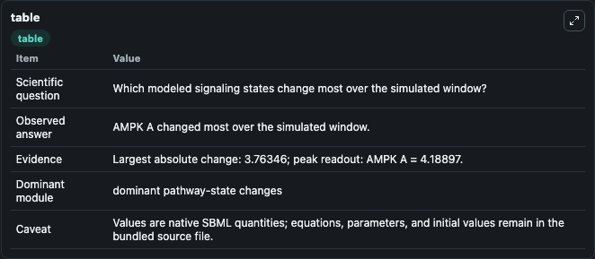
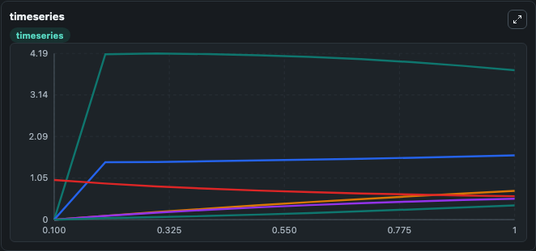
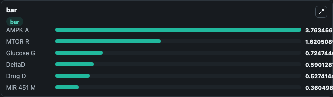

# Jung2019 - Regulating glioblastoma signaling pathways and anti-invasion therapy - core control model

This Biosimulant lab wraps `Jung2019 - Regulating glioblastoma signaling pathways and anti-invasion therapy - core control model` as a runnable signaling model with a companion visualization module.
Clean Biosimulant lab for systems signaling model: Jung2019 - Regulating glioblastoma signaling pathways and anti-invasion therapy - core control model. It can be used to explore second-messenger and pathway-signaling dynamics and compare scenario outcomes across configurations.

## What You'll See

The lab asks: How does Jung2019 - Regulating glioblastoma signaling pathways and anti-invasion therapy - core control model shift hormone-linked signaling readouts? It runs for 1.0 time units with a communication step of 0.1. The run uses the model defaults declared by the curated SBML wrapper. The generated visualizations focus on Glucose G, Drug D, Mi R 451 M, AMPK A, M TOR R, and Delta D, combining trajectory, endpoint-comparison, and summary-table views from one completed dark-mode run.

In this captured run, **AMPK A** moved from 2.08e-21 to 3.763 across 1.0 simulation windows.

<!-- BIOSIMULANT_VISUALS_START -->
### Output Visualizations



*Summary table for Jung2019 - Regulating glioblastoma signaling pathways and anti-invasion therapy - core control model, reporting the scientific question, observed answer, dominant module, and caveat.*



*Trajectories of AMPK A, MTOR R, Glucose G, Drug D, DeltaD, and MiR 451 M across the 1.0 simulation. In this run **AMPK A** climbed from 2.08e-21 to 3.763 and **DeltaD** fell from 1.000 to 0.5901 — the largest movements among the focused observables.*



*Largest-excursion ranking of the focused observables — the absolute movement magnitude during the run. Top 3: **AMPK A** = 3.763, **MTOR R** = 1.621, **Glucose G** = 0.7247, with 3 more observables below.*

<!-- BIOSIMULANT_VISUALS_END -->

## Model Context

- Core model: `models/core`
- Visualization model: `models/visualisation`
- Standard: `other`
- Upstream source: `biomodels_ebi:BIOMD0000000828`
- License: `CC0`
- Visual scope: metabolic and hormone signaling response
- Caveat: Values are native SBML quantities; equations, parameters, units, and initial values remain in the bundled source file.

## Inputs

| Input | Maps To | Default | Notes |
|---|---|---|---|
| Initial Delta D | `signaling_sbml_jung2019_regulating_glioblastoma_signaling_pathw_biomd0000000828_model.initial_delta_d` |  | Initial level of Delta D. Maps to SBML symbol `deltaD`; exposed as a traceable initial-condition perturbation. |
| Initial Drug D | `signaling_sbml_jung2019_regulating_glioblastoma_signaling_pathw_biomd0000000828_model.initial_drug_d` |  | Initial level of Drug D. Maps to SBML symbol `Drug_D`; exposed as a traceable initial-condition perturbation. |
| Initial Glucose G | `signaling_sbml_jung2019_regulating_glioblastoma_signaling_pathw_biomd0000000828_model.initial_glucose_g` |  | Initial level of Glucose G. Maps to SBML symbol `Glucose_G`; exposed as a traceable initial-condition perturbation. |

## Outputs

| Output | Maps To | Role |
|---|---|---|
| `glucose_g` | `signaling_sbml_jung2019_regulating_glioblastoma_signaling_pathw_biomd0000000828_model.glucose_g` | Glucose G. |
| `drug_d` | `signaling_sbml_jung2019_regulating_glioblastoma_signaling_pathw_biomd0000000828_model.drug_d` | Drug D. |
| `mi_r_451_m` | `signaling_sbml_jung2019_regulating_glioblastoma_signaling_pathw_biomd0000000828_model.mi_r_451_m` | Mi R 451 M. |
| `state` | `signaling_sbml_jung2019_regulating_glioblastoma_signaling_pathw_biomd0000000828_model.state` | Available to the visualization model and downstream workflows. |
| `summary` | `signaling_sbml_jung2019_regulating_glioblastoma_signaling_pathw_biomd0000000828_model.summary` | Available to the visualization model and downstream workflows. |
| `species_labels` | `signaling_sbml_jung2019_regulating_glioblastoma_signaling_pathw_biomd0000000828_model.species_labels` | Available to the visualization model and downstream workflows. |

## Runtime

- Duration: `1.0`
- Communication step: `0.1`

## Running Locally

```bash
biosimulant labs serve .
```
