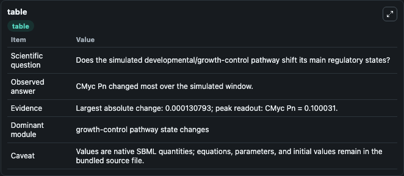
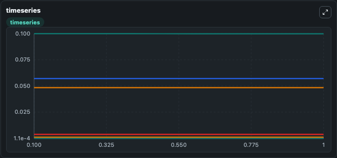
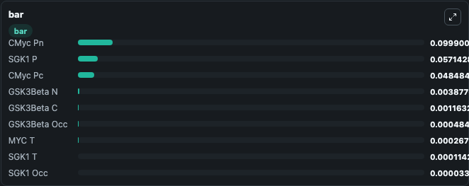

# Kawka2014 - Revealing the role of SGK1 in the dynamics of medulloblastoma using a mathematical model

This Biosimulant lab wraps `Kawka2014 - Revealing the role of SGK1 in the dynamics of medulloblastoma using a mathematical model` as a runnable signaling model with a companion visualization module.
Clean Biosimulant lab for developmental and growth-control signaling. It can be used to explore second-messenger and pathway-signaling dynamics and compare scenario outcomes across configurations.

## What You'll See

The lab asks: How does Kawka2014 - Revealing the role of SGK1 in the dynamics of medulloblastoma using a mathematical model shift developmental or growth-control pathway states? It runs for 1.0 time units with a communication step of 0.1. The run uses the model defaults declared by the curated SBML wrapper. The generated visualizations focus on SGK1 T, SGK1 P, source-defined MYC_T state, C MYC transcription factor Pc, C MYC transcription factor Pn, and Gsk3beta C, and related outputs, combining trajectory, endpoint-comparison, and summary-table views from one completed dark-mode run.

In this captured run, **CMyc Pn** moved from 0.1000 to 0.0999 across 1.0 simulation windows.

<!-- BIOSIMULANT_VISUALS_START -->
### Output Visualizations



*Summary table for Kawka2014 - Revealing the role of SGK1 in the dynamics of medulloblastoma using a mathematical model, reporting the scientific question, observed answer, dominant module, and caveat.*



*Trajectories of CMyc Pn, MYC T, CMyc Pc, GSK3Beta Occ, GSK3Beta N, and SGK1 T across the 1.0 simulation. In this run **MYC T** climbed from 0.000267 to 0.000268 and **CMyc Pn** fell from 0.1000 to 0.0999 — the largest movements among the focused observables.*



*Largest-excursion ranking of the focused observables — the absolute movement magnitude during the run. Top 3: **CMyc Pn** = 0.0999, **SGK1 P** = 0.0571, **CMyc Pc** = 0.0485, with 6 more observables below.*

<!-- BIOSIMULANT_VISUALS_END -->

## Model Context

- Core model: `models/core`
- Visualization model: `models/visualisation`
- Standard: `other`
- Upstream source: `biomodels_ebi:MODEL1912090002`
- License: `CC0`
- Visual scope: growth-control pathway signaling
- Caveat: Values are native SBML quantities; equations, parameters, units, and initial values remain in the bundled source file.

## Inputs

| Input | Maps To | Default | Notes |
|---|---|---|---|
| Initial SGK1 T | `signaling_sbml_kawka2014_revealing_the_role_of_sgk1_in_the_dyna_model1912090002_model.initial_sgk1_t` |  | Initial level of SGK1 T. Maps to SBML symbol `SGK1_t`; exposed as a traceable initial-condition perturbation. |

## Outputs

| Output | Maps To | Role |
|---|---|---|
| `sgk1_t` | `signaling_sbml_kawka2014_revealing_the_role_of_sgk1_in_the_dyna_model1912090002_model.sgk1_t` | SGK1 T. |
| `sgk1_p` | `signaling_sbml_kawka2014_revealing_the_role_of_sgk1_in_the_dyna_model1912090002_model.sgk1_p` | SGK1 P. |
| `source_defined_myc_t_state` | `signaling_sbml_kawka2014_revealing_the_role_of_sgk1_in_the_dyna_model1912090002_model.source_defined_myc_t_state` | source-defined MYC_T state. |
| `state` | `signaling_sbml_kawka2014_revealing_the_role_of_sgk1_in_the_dyna_model1912090002_model.state` | Available to the visualization model and downstream workflows. |
| `summary` | `signaling_sbml_kawka2014_revealing_the_role_of_sgk1_in_the_dyna_model1912090002_model.summary` | Available to the visualization model and downstream workflows. |
| `species_labels` | `signaling_sbml_kawka2014_revealing_the_role_of_sgk1_in_the_dyna_model1912090002_model.species_labels` | Available to the visualization model and downstream workflows. |

## Runtime

- Duration: `1.0`
- Communication step: `0.1`

## Running Locally

```bash
biosimulant labs serve .
```
