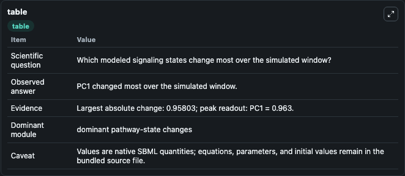
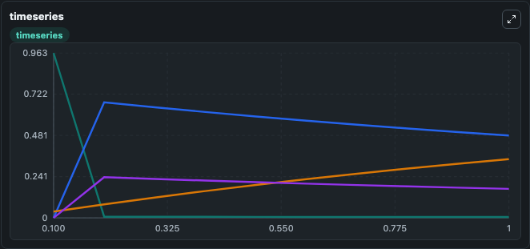
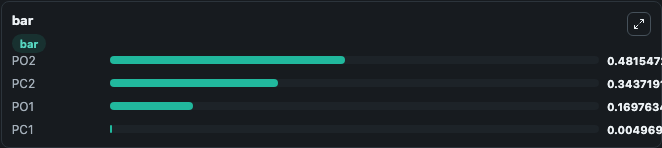

# Keizer1996_Ryanodine_receptor_adaptation

This Biosimulant lab wraps `Keizer1996_Ryanodine_receptor_adaptation` as a runnable signaling model with a companion visualization module.
Clean Biosimulant lab for systems signaling model: Keizer1996_Ryanodine_receptor_adaptation. It can be used to explore second-messenger and pathway-signaling dynamics and compare scenario outcomes across configurations.

## What You'll See

The lab asks: How do calcium-linked states respond in Keizer1996 Ryanodine receptor adaptation? It runs for 1.0 time units with a communication step of 0.1. The run uses the model defaults declared by the curated SBML wrapper. The generated visualizations focus on Source Defined PC1 State, Source Defined PO2 State, source-defined PO1 state, and source-defined PC2 state, combining trajectory, endpoint-comparison, and summary-table views from one completed dark-mode run.

In this captured run, **PC1** moved from 0.9630 to 0.00497 across 1.0 simulation windows.

<!-- BIOSIMULANT_VISUALS_START -->
### Output Visualizations



*Summary table for Keizer1996_Ryanodine_receptor_adaptation, reporting the scientific question, observed answer, dominant module, and caveat.*



*Trajectories of PC1, PO2, PC2, and PO1 across the 1.0 simulation. In this run **PO2** climbed from 0 to 0.4815 and **PC1** fell from 0.9630 to 0.00497 — the largest movements among the focused observables.*



*Largest-excursion ranking of the focused observables — the absolute movement magnitude during the run. Top 3: **PO2** = 0.4815, **PC2** = 0.3437, **PO1** = 0.1698, with 1 more observable below.*

<!-- BIOSIMULANT_VISUALS_END -->

## Model Context

- Core model: `models/core`
- Visualization model: `models/visualisation`
- Standard: `other`
- Upstream source: `biomodels_ebi:BIOMD0000000060`
- License: `CC0`
- Visual scope: calcium second-messenger signaling
- Caveat: Values are native SBML quantities; equations, parameters, units, and initial values remain in the bundled source file.

## Inputs

| Input | Maps To | Default | Notes |
|---|---|---|---|
| Initial source-defined PC1 state | `signaling_sbml_keizer1996_ryanodine_receptor_adaptation_biomd0000000060_model.initial_source_defined_pc1_state` |  | Initial level of source-defined PC1 state. Maps to SBML symbol `Pc1`; exposed as a traceable initial-condition perturbation. |

## Outputs

| Output | Maps To | Role |
|---|---|---|
| `source_defined_pc1_state` | `signaling_sbml_keizer1996_ryanodine_receptor_adaptation_biomd0000000060_model.source_defined_pc1_state` | Source Defined PC1 State. |
| `source_defined_po2_state` | `signaling_sbml_keizer1996_ryanodine_receptor_adaptation_biomd0000000060_model.source_defined_po2_state` | Source Defined PO2 State. |
| `source_defined_po1_state` | `signaling_sbml_keizer1996_ryanodine_receptor_adaptation_biomd0000000060_model.source_defined_po1_state` | source-defined PO1 state. |
| `state` | `signaling_sbml_keizer1996_ryanodine_receptor_adaptation_biomd0000000060_model.state` | Available to the visualization model and downstream workflows. |
| `summary` | `signaling_sbml_keizer1996_ryanodine_receptor_adaptation_biomd0000000060_model.summary` | Available to the visualization model and downstream workflows. |
| `species_labels` | `signaling_sbml_keizer1996_ryanodine_receptor_adaptation_biomd0000000060_model.species_labels` | Available to the visualization model and downstream workflows. |

## Runtime

- Duration: `1.0`
- Communication step: `0.1`

## Running Locally

```bash
biosimulant labs serve .
```
