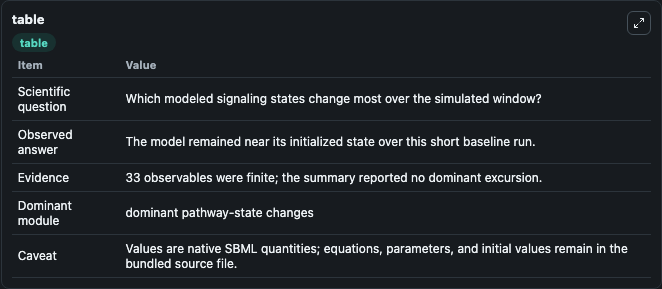
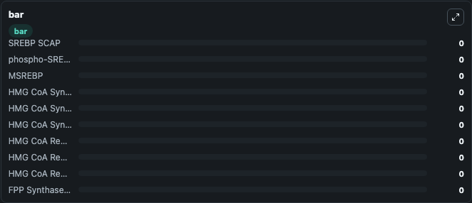

# Kervizic2008_Cholesterol_SREBP

This Biosimulant lab wraps `Kervizic2008_Cholesterol_SREBP` as a runnable signaling model with a companion visualization module.
Clean Biosimulant lab for metabolic and hormone-linked signaling. It can be used to explore second-messenger and pathway-signaling dynamics and compare scenario outcomes across configurations.

## What You'll See

The lab asks: How does Kervizic2008 Cholesterol SREBP shift hormone-linked signaling readouts? It runs for 1.0 time units with a communication step of 0.1. The run uses the model defaults declared by the curated SBML wrapper. The generated visualizations focus on SREBP SCAP, P SREBP, M SREBP, HMG Co A Synthase Gene, HMG Co A Synthase RNA, and HMG Co A Synthase, and related outputs, combining trajectory, endpoint-comparison, and summary-table views from one completed dark-mode run.

In this captured run, **SREBP SCAP** moved from 0 to 0 across 1.0 simulation windows.

<!-- BIOSIMULANT_VISUALS_START -->
### Output Visualizations



*Summary table for Kervizic2008_Cholesterol_SREBP, reporting the scientific question, observed answer, dominant module, and caveat.*


*Trajectories of SREBP SCAP, phospho-SREBP, MSREBP, HMG CoA Synthase Gene, HMG CoA Synthase RNA, and HMG CoA Synthase across the 1.0 simulation. In this run SREBP SCAP, phospho-SREBP, MSREBP, HMG CoA Synthase Gene stayed near their initial values — no observable moved appreciably.*



*Largest-excursion ranking of the focused observables — the absolute movement magnitude during the run. Top 3: **SREBP SCAP** = 0, **phospho-SREBP** = 0, **MSREBP** = 0, with 7 more observables below.*

<!-- BIOSIMULANT_VISUALS_END -->

## Model Context

- Core model: `models/core`
- Visualization model: `models/visualisation`
- Standard: `other`
- Upstream source: `biomodels_ebi:MODEL0568648427`
- License: `CC0`
- Visual scope: metabolic and hormone signaling response
- Caveat: Values are native SBML quantities; equations, parameters, units, and initial values remain in the bundled source file.

## Inputs

| Input | Maps To | Default | Notes |
|---|---|---|---|
| Initial SREBP SCAP | `signaling_sbml_kervizic2008_cholesterol_srebp_model0568648427_model.initial_srebp_scap` |  | Initial level of SREBP SCAP. Maps to SBML symbol `s0`; exposed as a traceable initial-condition perturbation. |

## Outputs

| Output | Maps To | Role |
|---|---|---|
| `srebp_scap` | `signaling_sbml_kervizic2008_cholesterol_srebp_model0568648427_model.srebp_scap` | SREBP SCAP. |
| `acetyl_co_a_c_acetyltransferase_gene` | `signaling_sbml_kervizic2008_cholesterol_srebp_model0568648427_model.acetyl_co_a_c_acetyltransferase_gene` | Acetyl Co A C Acetyltransferase Gene. |
| `acetyl_co_a_c_acetyltransferase_rna` | `signaling_sbml_kervizic2008_cholesterol_srebp_model0568648427_model.acetyl_co_a_c_acetyltransferase_rna` | Acetyl Co A C Acetyltransferase RNA. |
| `state` | `signaling_sbml_kervizic2008_cholesterol_srebp_model0568648427_model.state` | Available to the visualization model and downstream workflows. |
| `summary` | `signaling_sbml_kervizic2008_cholesterol_srebp_model0568648427_model.summary` | Available to the visualization model and downstream workflows. |
| `species_labels` | `signaling_sbml_kervizic2008_cholesterol_srebp_model0568648427_model.species_labels` | Available to the visualization model and downstream workflows. |

## Runtime

- Duration: `1.0`
- Communication step: `0.1`

## Running Locally

```bash
biosimulant labs serve .
```
