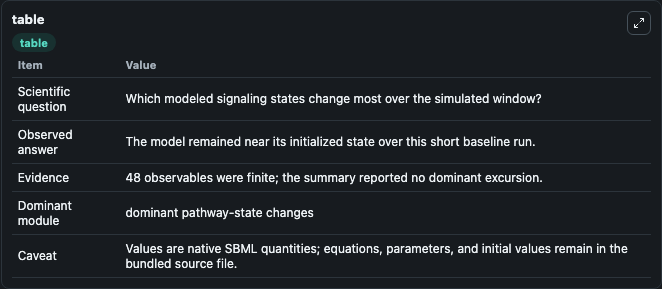
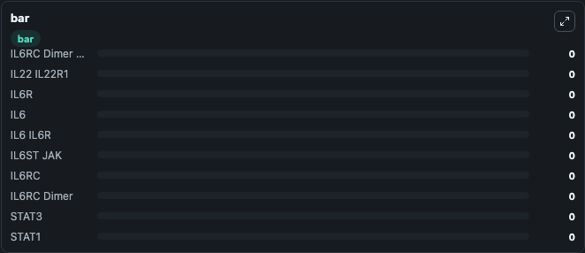

# Kessler2025 - IL-6 and IL-22 pathway in human hepatocytes

This Biosimulant lab wraps `Kessler2025 - IL-6 and IL-22 pathway in human hepatocytes` as a runnable signaling model with a companion visualization module.
Clean Biosimulant lab for systems signaling model: Kessler2025 - IL-6 and IL-22 pathway in human hepatocytes. It can be used to explore second-messenger and pathway-signaling dynamics and compare scenario outcomes across configurations.

## What You'll See

The lab asks: How does Kessler2025 - IL-6 and IL-22 pathway in human hepatocytes transmit cytokine receptor activity into STAT pathway states? It runs for 1.0 time units with a communication step of 0.1. The run uses the model defaults declared by the curated SBML wrapper. The generated visualizations focus on IL6RC Dimer SHP2, IL22 IL22R1, IL6R, source-defined IL6 state, IL6 IL6R, and IL6ST JAK, and related outputs, combining trajectory, endpoint-comparison, and summary-table views from one completed dark-mode run.

In this captured run, **IL6RC Dimer SHP2** moved from 0 to 0 across 1.0 simulation windows.

<!-- BIOSIMULANT_VISUALS_START -->
### Output Visualizations



*Summary table for Kessler2025 - IL-6 and IL-22 pathway in human hepatocytes, reporting the scientific question, observed answer, dominant module, and caveat.*


*Trajectories of IL6RC Dimer SHP2, IL22 IL22R1, IL6R, IL6, IL6 IL6R, and IL6ST JAK across the 1.0 simulation. In this run IL6RC Dimer SHP2, IL22 IL22R1, IL6R, IL6 stayed near their initial values — no observable moved appreciably.*



*Largest-excursion ranking of the focused observables — the absolute movement magnitude during the run. Top 3: **IL6RC Dimer SHP2** = 0, **IL22 IL22R1** = 0, **IL6R** = 0, with 7 more observables below.*

<!-- BIOSIMULANT_VISUALS_END -->

## Model Context

- Core model: `models/core`
- Visualization model: `models/visualisation`
- Standard: `other`
- Upstream source: `biomodels_ebi:MODEL2509100001`
- License: `CC0`
- Visual scope: JAK/STAT receptor-to-transcription signaling
- Caveat: Values are native SBML quantities; equations, parameters, units, and initial values remain in the bundled source file.

## Inputs

| Input | Maps To | Default | Notes |
|---|---|---|---|
| Initial IL6RC Dimer SHP2 | `signaling_sbml_kessler2025_il_6_and_il_22_pathway_in_human_hepa_model2509100001_model.initial_il6rc_dimer_shp2` |  | Initial level of IL6RC Dimer SHP2. Maps to SBML symbol `P0`; exposed as a traceable initial-condition perturbation. |

## Outputs

| Output | Maps To | Role |
|---|---|---|
| `stat3` | `signaling_sbml_kessler2025_il_6_and_il_22_pathway_in_human_hepa_model2509100001_model.stat3` | STAT3. |
| `stat1` | `signaling_sbml_kessler2025_il_6_and_il_22_pathway_in_human_hepa_model2509100001_model.stat1` | STAT1. |
| `il6rc_dimer_stat1` | `signaling_sbml_kessler2025_il_6_and_il_22_pathway_in_human_hepa_model2509100001_model.il6rc_dimer_stat1` | IL6RC Dimer STAT1. |
| `state` | `signaling_sbml_kessler2025_il_6_and_il_22_pathway_in_human_hepa_model2509100001_model.state` | Available to the visualization model and downstream workflows. |
| `summary` | `signaling_sbml_kessler2025_il_6_and_il_22_pathway_in_human_hepa_model2509100001_model.summary` | Available to the visualization model and downstream workflows. |
| `species_labels` | `signaling_sbml_kessler2025_il_6_and_il_22_pathway_in_human_hepa_model2509100001_model.species_labels` | Available to the visualization model and downstream workflows. |

## Runtime

- Duration: `1.0`
- Communication step: `0.1`

## Running Locally

```bash
biosimulant labs serve .
```
