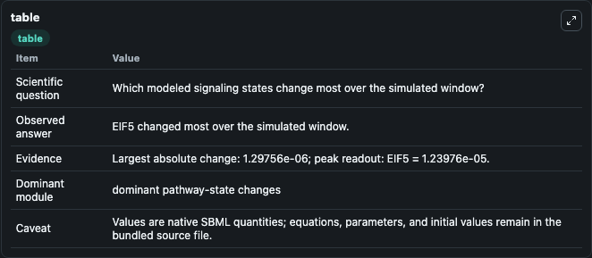
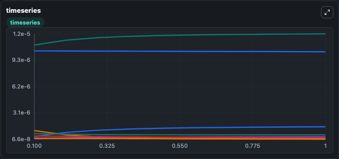
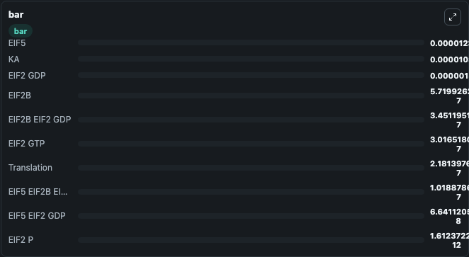

# Khan2018 - Origins of robustness in translational control via eukaryotic translation initiation factor (eIF) 2

This Biosimulant lab wraps `Khan2018 - Origins of robustness in translational control via eukaryotic translation initiation factor (eIF) 2` as a runnable signaling model with a companion visualization module.
Clean Biosimulant lab for systems signaling model: Khan2018 - Origins of robustness in translational control via eukaryotic translation initiation factor (eIF) 2. It can be used to explore second-messenger and pathway-signaling dynamics and compare scenario outcomes across configurations.

## What You'll See

The lab asks: How does Khan2018 - Origins of robustness in translational control via eukaryotic translation initiation factor (eIF) 2 route receptor activity into cAMP/PKA-linked readouts? It runs for 1.0 time units with a communication step of 0.1. The run uses the model defaults declared by the curated SBML wrapper. The generated visualizations focus on E IF2 GDP, E IF2B, E IF2 GTP, source-defined EIF5 state, E IF5 E IF2 GDP, and E IF5 E IF2B E IF2 GDP, and related outputs, combining trajectory, endpoint-comparison, and summary-table views from one completed dark-mode run.

In this captured run, **EIF5** moved from 1.11e-05 to 1.24e-05 across 1.0 simulation windows.

<!-- BIOSIMULANT_VISUALS_START -->
### Output Visualizations



*Summary table for Khan2018 - Origins of robustness in translational control via eukaryotic translation initiation factor (eIF) 2, reporting the scientific question, observed answer, dominant module, and caveat.*



*Trajectories of EIF5, EIF2 GDP, EIF5 EIF2 GDP, EIF2B EIF2 GDP, Translation, and EIF2B across the 1.0 simulation. In this run **EIF5** climbed from 1.11e-05 to 1.24e-05 and **EIF5 EIF2 GDP** fell from 1.07e-06 to 6.64e-08 — the largest movements among the focused observables.*



*Largest-excursion ranking of the focused observables — the absolute movement magnitude during the run. Top 3: **EIF5** = 1.24e-05, **KA** = 1.03e-05, **EIF2 GDP** = 1.52e-06, with 7 more observables below.*

<!-- BIOSIMULANT_VISUALS_END -->

## Model Context

- Core model: `models/core`
- Visualization model: `models/visualisation`
- Standard: `other`
- Upstream source: `biomodels_ebi:MODEL1911120001`
- License: `CC0`
- Visual scope: GPCR and cAMP/PKA signaling
- Caveat: Values are native SBML quantities; equations, parameters, units, and initial values remain in the bundled source file.

## Inputs

| Input | Maps To | Default | Notes |
|---|---|---|---|
| Initial E IF2 GDP | `signaling_sbml_khan2018_origins_of_robustness_in_translational_model1911120001_model.initial_e_if2_gdp` |  | Initial level of E IF2 GDP. Maps to SBML symbol `eIF2_GDP`; exposed as a traceable initial-condition perturbation. |

## Outputs

| Output | Maps To | Role |
|---|---|---|
| `e_if2_gdp` | `signaling_sbml_khan2018_origins_of_robustness_in_translational_model1911120001_model.e_if2_gdp` | E IF2 GDP. |
| `e_if2b` | `signaling_sbml_khan2018_origins_of_robustness_in_translational_model1911120001_model.e_if2b` | E IF2B. |
| `e_if2_gtp` | `signaling_sbml_khan2018_origins_of_robustness_in_translational_model1911120001_model.e_if2_gtp` | E IF2 GTP. |
| `state` | `signaling_sbml_khan2018_origins_of_robustness_in_translational_model1911120001_model.state` | Available to the visualization model and downstream workflows. |
| `summary` | `signaling_sbml_khan2018_origins_of_robustness_in_translational_model1911120001_model.summary` | Available to the visualization model and downstream workflows. |
| `species_labels` | `signaling_sbml_khan2018_origins_of_robustness_in_translational_model1911120001_model.species_labels` | Available to the visualization model and downstream workflows. |

## Runtime

- Duration: `1.0`
- Communication step: `0.1`

## Running Locally

```bash
biosimulant labs serve .
```
