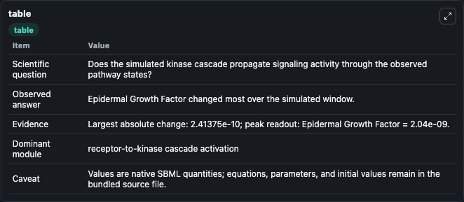
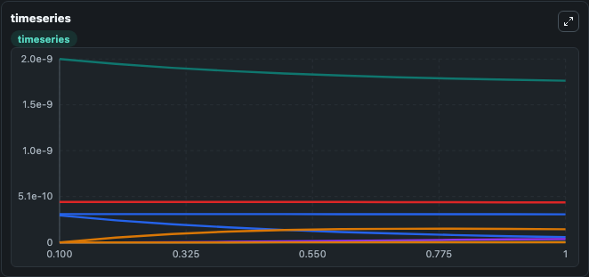
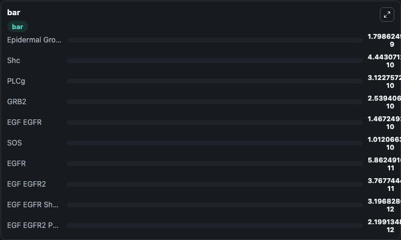

# Kholodenko1999 - EGFR signaling

This Biosimulant lab wraps `Kholodenko1999 - EGFR signaling` as a runnable signaling model with a companion visualization module.
Clean Biosimulant lab for MAPK/ERK receptor signaling. It can be used to explore second-messenger and pathway-signaling dynamics and compare scenario outcomes across configurations.

## What You'll See

The lab asks: How does Kholodenko1999 - EGFR signaling propagate receptor or RAS/ERK pathway activity? It runs for 1.0 time units with a communication step of 0.1. The run uses the model defaults declared by the curated SBML wrapper. The generated visualizations focus on Epidermal Growth Factor, EGFR, EGF EGFR, EGF EGFR 2, EGF EGFR 2 P, and source-defined PLCG state, and related outputs, combining trajectory, endpoint-comparison, and summary-table views from one completed dark-mode run.

In this captured run, **Epidermal Growth Factor** moved from 2.04e-09 to 1.8e-09 across 1.0 simulation windows.

<!-- BIOSIMULANT_VISUALS_START -->
### Output Visualizations



*Summary table for Kholodenko1999 - EGFR signaling, reporting the scientific question, observed answer, dominant module, and caveat.*



*Trajectories of Epidermal Growth Factor, EGFR, EGF EGFR, EGF EGFR2, Shc, and EGF EGFR Shc P across the 1.0 simulation. In this run **EGF EGFR** climbed from 0 to 1.47e-10 and **Epidermal Growth Factor** fell from 2.04e-09 to 1.8e-09 — the largest movements among the focused observables.*



*Largest-excursion ranking of the focused observables — the absolute movement magnitude during the run. Top 3: **Epidermal Growth Factor** = 1.8e-09, **Shc** = 4.44e-10, **PLCg** = 3.12e-10, with 7 more observables below.*

<!-- BIOSIMULANT_VISUALS_END -->

## Model Context

- Core model: `models/core`
- Visualization model: `models/visualisation`
- Standard: `other`
- Upstream source: `biomodels_ebi:BIOMD0000000048`
- License: `CC0`
- Visual scope: receptor-to-MAPK cascade signaling
- Caveat: Values are native SBML quantities; equations, parameters, units, and initial values remain in the bundled source file.

## Inputs

| Input | Maps To | Default | Notes |
|---|---|---|---|
| Initial EGF EGFR | `signaling_sbml_kholodenko1999_egfr_signaling_biomd0000000048_model.initial_egf_egfr` |  | Initial level of EGF EGFR. Maps to SBML symbol `Ra`; exposed as a traceable initial-condition perturbation. |
| Initial EGF EGFR 2 | `signaling_sbml_kholodenko1999_egfr_signaling_biomd0000000048_model.initial_egf_egfr_2` |  | Initial level of EGF EGFR 2. Maps to SBML symbol `R2`; exposed as a traceable initial-condition perturbation. |
| Initial EGF EGFR 2 Grb2 adapter protein | `signaling_sbml_kholodenko1999_egfr_signaling_biomd0000000048_model.initial_egf_egfr_2_grb2_adapter_protein` |  | Initial level of EGF EGFR 2 Grb2 adapter protein. Maps to SBML symbol `RG`; exposed as a traceable initial-condition perturbation. |

## Outputs

| Output | Maps To | Role |
|---|---|---|
| `epidermal_growth_factor` | `signaling_sbml_kholodenko1999_egfr_signaling_biomd0000000048_model.epidermal_growth_factor` | Epidermal Growth Factor. |
| `egfr` | `signaling_sbml_kholodenko1999_egfr_signaling_biomd0000000048_model.egfr` | EGFR. |
| `egf_egfr` | `signaling_sbml_kholodenko1999_egfr_signaling_biomd0000000048_model.egf_egfr` | EGF EGFR. |
| `state` | `signaling_sbml_kholodenko1999_egfr_signaling_biomd0000000048_model.state` | Available to the visualization model and downstream workflows. |
| `summary` | `signaling_sbml_kholodenko1999_egfr_signaling_biomd0000000048_model.summary` | Available to the visualization model and downstream workflows. |
| `species_labels` | `signaling_sbml_kholodenko1999_egfr_signaling_biomd0000000048_model.species_labels` | Available to the visualization model and downstream workflows. |

## Runtime

- Duration: `1.0`
- Communication step: `0.1`

## Running Locally

```bash
biosimulant labs serve .
```
