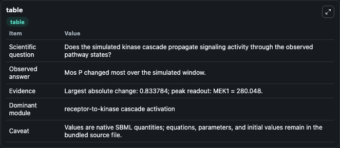
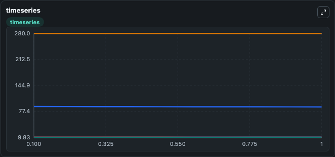
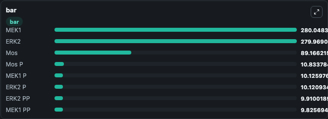

# Kholodenko2000 - Ultrasensitivity and negative feedback bring oscillations in MAPK cascade

This Biosimulant lab wraps `Kholodenko2000 - Ultrasensitivity and negative feedback bring oscillations in MAPK cascade` as a runnable signaling model with a companion visualization module.
Clean Biosimulant lab for MAPK/ERK receptor signaling. It can be used to explore second-messenger and pathway-signaling dynamics and compare scenario outcomes across configurations.

## What You'll See

The lab asks: How does Kholodenko2000 - Ultrasensitivity and negative feedback bring oscillations in MAPK cascade propagate receptor or RAS/ERK pathway activity? It runs for 1.0 time units with a communication step of 0.1. The run uses the model defaults declared by the curated SBML wrapper. The generated visualizations focus on Mos kinase, source-defined MOS-P state, source-defined MEK1 state, Mek1 P, Mek1 PP, and source-defined ERK2 state, and related outputs, combining trajectory, endpoint-comparison, and summary-table views from one completed dark-mode run.

In this captured run, **Mos P** moved from 10.000 to 10.834 across 1.0 simulation windows.

<!-- BIOSIMULANT_VISUALS_START -->
### Output Visualizations



*Summary table for Kholodenko2000 - Ultrasensitivity and negative feedback bring oscillations in MAPK cascade, reporting the scientific question, observed answer, dominant module, and caveat.*



*Trajectories of Mos P, Mos, MEK1 PP, MEK1 P, ERK2 P, and ERK2 PP across the 1.0 simulation. In this run **Mos P** climbed from 10.000 to 10.834 and **Mos** fell from 90.000 to 89.166 — the largest movements among the focused observables.*



*Largest-excursion ranking of the focused observables — the absolute movement magnitude during the run. Top 3: **MEK1** = 280.0, **ERK2** = 280.0, **Mos** = 89.166, with 5 more observables below.*

<!-- BIOSIMULANT_VISUALS_END -->

## Model Context

- Core model: `models/core`
- Visualization model: `models/visualisation`
- Standard: `other`
- Upstream source: `biomodels_ebi:BIOMD0000000010`
- License: `CC0`
- Visual scope: receptor-to-MAPK cascade signaling
- Caveat: Values are native SBML quantities; equations, parameters, units, and initial values remain in the bundled source file.

## Inputs

| Input | Maps To | Default | Notes |
|---|---|---|---|
| Initial Mos kinase | `signaling_sbml_kholodenko2000_ultrasensitivity_and_negative_fee_biomd0000000010_model.initial_mos_kinase` |  | Initial level of Mos kinase. Maps to SBML symbol `MKKK`; exposed as a traceable initial-condition perturbation. |

## Outputs

| Output | Maps To | Role |
|---|---|---|
| `source_defined_erk2_state` | `signaling_sbml_kholodenko2000_ultrasensitivity_and_negative_fee_biomd0000000010_model.source_defined_erk2_state` | source-defined ERK2 state. |
| `erk2_p` | `signaling_sbml_kholodenko2000_ultrasensitivity_and_negative_fee_biomd0000000010_model.erk2_p` | Erk2 P. |
| `erk2_pp` | `signaling_sbml_kholodenko2000_ultrasensitivity_and_negative_fee_biomd0000000010_model.erk2_pp` | Erk2 PP. |
| `state` | `signaling_sbml_kholodenko2000_ultrasensitivity_and_negative_fee_biomd0000000010_model.state` | Available to the visualization model and downstream workflows. |
| `summary` | `signaling_sbml_kholodenko2000_ultrasensitivity_and_negative_fee_biomd0000000010_model.summary` | Available to the visualization model and downstream workflows. |
| `species_labels` | `signaling_sbml_kholodenko2000_ultrasensitivity_and_negative_fee_biomd0000000010_model.species_labels` | Available to the visualization model and downstream workflows. |

## Runtime

- Duration: `1.0`
- Communication step: `0.1`

## Running Locally

```bash
biosimulant labs serve .
```
