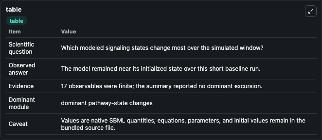
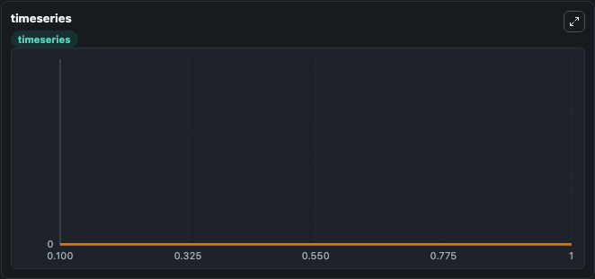
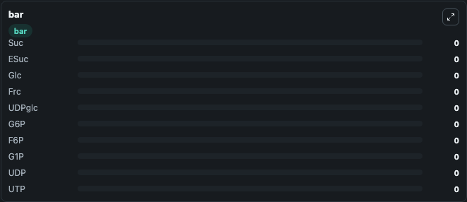

# Koch2005 - Sucrose breakdown pathway - Petri net

This Biosimulant lab wraps `Koch2005 - Sucrose breakdown pathway - Petri net` as a runnable signaling model with a companion visualization module.
Clean Biosimulant lab for systems signaling model: Koch2005 - Sucrose breakdown pathway - Petri net. It can be used to explore second-messenger and pathway-signaling dynamics and compare scenario outcomes across configurations.

## What You'll See

The lab asks: How does Koch2005 - Sucrose breakdown pathway - Petri net shift hormone-linked signaling readouts? It runs for 1.0 time units with a communication step of 0.1. The run uses the model defaults declared by the curated SBML wrapper. The generated visualizations focus on sucrose, source-defined ESUC state, glucose, source-defined FRC state, Udpglc, and G6P, and related outputs, combining trajectory, endpoint-comparison, and summary-table views from one completed dark-mode run.

In this captured run, **Suc** moved from 0 to 0 across 1.0 simulation windows.

<!-- BIOSIMULANT_VISUALS_START -->
### Output Visualizations



*Summary table for Koch2005 - Sucrose breakdown pathway - Petri net, reporting the scientific question, observed answer, dominant module, and caveat.*



*Trajectories of Suc, ESuc, Glc, Frc, UDPglc, and G6P across the 1.0 simulation. In this run Suc, ESuc, Glc, Frc stayed near their initial values — no observable moved appreciably.*



*Largest-excursion ranking of the focused observables — the absolute movement magnitude during the run. Top 3: **Suc** = 0, **ESuc** = 0, **Glc** = 0, with 7 more observables below.*

<!-- BIOSIMULANT_VISUALS_END -->

## Model Context

- Core model: `models/core`
- Visualization model: `models/visualisation`
- Standard: `other`
- Upstream source: `biomodels_ebi:MODEL1308080002`
- License: `CC0`
- Visual scope: metabolic and hormone signaling response
- Caveat: Values are native SBML quantities; equations, parameters, units, and initial values remain in the bundled source file.

## Inputs

| Input | Maps To | Default | Notes |
|---|---|---|---|
| Initial sucrose | `signaling_sbml_koch2005_sucrose_breakdown_pathway_petri_net_model1308080002_model.initial_sucrose` |  | Initial level of sucrose. Maps to SBML symbol `P0`; exposed as a traceable initial-condition perturbation. |

## Outputs

| Output | Maps To | Role |
|---|---|---|
| `sucrose` | `signaling_sbml_koch2005_sucrose_breakdown_pathway_petri_net_model1308080002_model.sucrose` | sucrose. |
| `source_defined_esuc_state` | `signaling_sbml_koch2005_sucrose_breakdown_pathway_petri_net_model1308080002_model.source_defined_esuc_state` | source-defined ESUC state. |
| `glucose` | `signaling_sbml_koch2005_sucrose_breakdown_pathway_petri_net_model1308080002_model.glucose` | glucose. |
| `state` | `signaling_sbml_koch2005_sucrose_breakdown_pathway_petri_net_model1308080002_model.state` | Available to the visualization model and downstream workflows. |
| `summary` | `signaling_sbml_koch2005_sucrose_breakdown_pathway_petri_net_model1308080002_model.summary` | Available to the visualization model and downstream workflows. |
| `species_labels` | `signaling_sbml_koch2005_sucrose_breakdown_pathway_petri_net_model1308080002_model.species_labels` | Available to the visualization model and downstream workflows. |

## Runtime

- Duration: `1.0`
- Communication step: `0.1`

## Running Locally

```bash
biosimulant labs serve .
```
