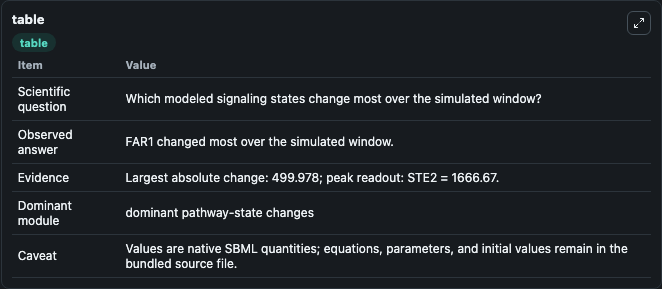
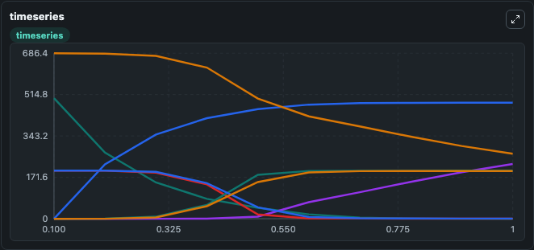
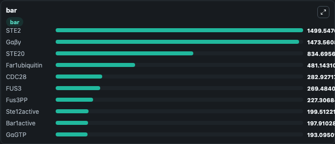

# Kofahl2004_PheromonePathway

This Biosimulant lab wraps `Kofahl2004_PheromonePathway` as a runnable signaling model with a companion visualization module.
Clean Biosimulant lab for systems signaling model: Kofahl2004_PheromonePathway. It can be used to explore second-messenger and pathway-signaling dynamics and compare scenario outcomes across configurations.

## What You'll See

The lab asks: How does Kofahl2004 PheromonePathway shift hormone-linked signaling readouts? It runs for 1.0 time units with a communication step of 0.1. The run uses the model defaults declared by the curated SBML wrapper. The generated visualizations focus on Factor, Source Defined STE2 State, Ste2active, source-defined GΑΒΓ state, source-defined GΑGTP state, and source-defined GΒΓ state, and related outputs, combining trajectory, endpoint-comparison, and summary-table views from one completed dark-mode run.

In this captured run, **FAR1** moved from 500.0 to 0.0215 across 1.0 simulation windows.

<!-- BIOSIMULANT_VISUALS_START -->
### Output Visualizations



*Summary table for Kofahl2004_PheromonePathway, reporting the scientific question, observed answer, dominant module, and caveat.*



*Trajectories of FAR1, Far1ubiquitin, FUS3, Fus3PP, STE12, and Ste12active across the 1.0 simulation. In this run **Far1ubiquitin** climbed from 0 to 481.1 and **FAR1** fell from 500.0 to 0.0215 — the largest movements among the focused observables.*



*Largest-excursion ranking of the focused observables — the absolute movement magnitude during the run. Top 3: **STE2** = 1499.5, **Gαβγ** = 1473.6, **STE20** = 834.7, with 7 more observables below.*

<!-- BIOSIMULANT_VISUALS_END -->

## Model Context

- Core model: `models/core`
- Visualization model: `models/visualisation`
- Standard: `other`
- Upstream source: `biomodels_ebi:BIOMD0000000032`
- License: `CC0`
- Visual scope: metabolic and hormone signaling response
- Caveat: Values are native SBML quantities; equations, parameters, units, and initial values remain in the bundled source file.

## Inputs

| Input | Maps To | Default | Notes |
|---|---|---|---|
| Initial source-defined P state | `signaling_sbml_kofahl2004_pheromonepathway_biomd0000000032_model.initial_source_defined_p_state` |  | Initial level of source-defined P state. Maps to SBML symbol `p`; exposed as a traceable initial-condition perturbation. |
| Initial Factor | `signaling_sbml_kofahl2004_pheromonepathway_biomd0000000032_model.initial_factor` |  | Initial level of Factor. Maps to SBML symbol `alpha`; exposed as a traceable initial-condition perturbation. |

## Outputs

| Output | Maps To | Role |
|---|---|---|
| `ste2active` | `signaling_sbml_kofahl2004_pheromonepathway_biomd0000000032_model.ste2active` | Ste2active. |
| `complex_c` | `signaling_sbml_kofahl2004_pheromonepathway_biomd0000000032_model.complex_c` | Complex C. |
| `complex_d` | `signaling_sbml_kofahl2004_pheromonepathway_biomd0000000032_model.complex_d` | Complex D. |
| `state` | `signaling_sbml_kofahl2004_pheromonepathway_biomd0000000032_model.state` | Available to the visualization model and downstream workflows. |
| `summary` | `signaling_sbml_kofahl2004_pheromonepathway_biomd0000000032_model.summary` | Available to the visualization model and downstream workflows. |
| `species_labels` | `signaling_sbml_kofahl2004_pheromonepathway_biomd0000000032_model.species_labels` | Available to the visualization model and downstream workflows. |

## Runtime

- Duration: `1.0`
- Communication step: `0.1`

## Running Locally

```bash
biosimulant labs serve .
```
