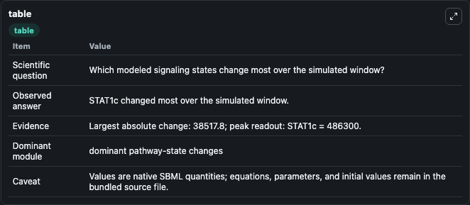
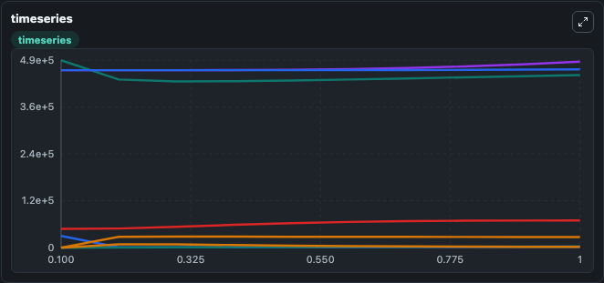
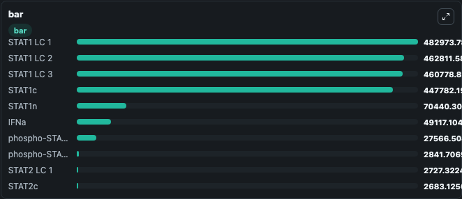

# Kok2020 - IFNalpha-induced signaling in Huh7.5 cells

This Biosimulant lab wraps `Kok2020 - IFNalpha-induced signaling in Huh7.5 cells` as a runnable signaling model with a companion visualization module.
Clean Biosimulant lab for systems signaling model: Kok2020 - IFNalpha-induced signaling in Huh7.5 cells. It can be used to explore second-messenger and pathway-signaling dynamics and compare scenario outcomes across configurations.

## What You'll See

The lab asks: How does Kok2020 - IFNalpha-induced signaling in Huh7.5 cells route receptor activity into cAMP/PKA-linked readouts? It runs for 1.0 time units with a communication step of 0.1. The run uses the model defaults declared by the curated SBML wrapper. The generated visualizations focus on source-defined REC state, source-defined SOCS1 state, source-defined IFNA state, A Rec Ifna, USP18, and Stat1c, and related outputs, combining trajectory, endpoint-comparison, and summary-table views from one completed dark-mode run.

In this captured run, **STAT1c** moved from 4.86e+05 to 4.48e+05 across 1.0 simulation windows.

<!-- BIOSIMULANT_VISUALS_START -->
### Output Visualizations



*Summary table for Kok2020 - IFNalpha-induced signaling in Huh7.5 cells, reporting the scientific question, observed answer, dominant module, and caveat.*



*Trajectories of STAT1c, STAT2c, phospho-STAT1pSTAT2c, STAT1 LC 1, STAT1n, and phospho-STAT1pSTAT2n across the 1.0 simulation. In this run **phospho-STAT1pSTAT2c** climbed from 0 to 2.76e+04 and **STAT1c** fell from 4.86e+05 to 4.48e+05 — the largest movements among the focused observables.*



*Largest-excursion ranking of the focused observables — the absolute movement magnitude during the run. Top 3: **STAT1 LC 1** = 4.83e+05, **STAT1 LC 2** = 4.63e+05, **STAT1 LC 3** = 4.61e+05, with 7 more observables below.*

<!-- BIOSIMULANT_VISUALS_END -->

## Model Context

- Core model: `models/core`
- Visualization model: `models/visualisation`
- Standard: `other`
- Upstream source: `biomodels_ebi:BIOMD0000000959`
- License: `CC0`
- Visual scope: GPCR and cAMP/PKA signaling
- Caveat: Values are native SBML quantities; equations, parameters, units, and initial values remain in the bundled source file.

## Inputs

| Input | Maps To | Default | Notes |
|---|---|---|---|
| Bind IFN | `signaling_sbml_kok2020_ifnalpha_induced_signaling_in_huh7_5_cel_biomd0000000959_model.initial_bind_ifn_level` |  | Bind IFN source parameter. Maps to SBML symbol `BindIFN` and preserves the bundled default. |
| Dega Rec Ifnby SOCS | `signaling_sbml_kok2020_ifnalpha_induced_signaling_in_huh7_5_cel_biomd0000000959_model.initial_dega_rec_ifnby_socs_level` |  | Dega Rec Ifnby SOCS source parameter. Maps to SBML symbol `degaRecIFNBySOCS` and preserves the bundled default. |
| Initial A Rec Ifna | `signaling_sbml_kok2020_ifnalpha_induced_signaling_in_huh7_5_cel_biomd0000000959_model.initial_a_rec_ifna` |  | Initial level of A Rec Ifna. Maps to SBML symbol `aRecIFN`; exposed as a traceable initial-condition perturbation. |

## Outputs

| Output | Maps To | Role |
|---|---|---|
| `stat1c` | `signaling_sbml_kok2020_ifnalpha_induced_signaling_in_huh7_5_cel_biomd0000000959_model.stat1c` | Stat1c. |
| `stat2c` | `signaling_sbml_kok2020_ifnalpha_induced_signaling_in_huh7_5_cel_biomd0000000959_model.stat2c` | Stat2c. |
| `p_stat1p_stat2c` | `signaling_sbml_kok2020_ifnalpha_induced_signaling_in_huh7_5_cel_biomd0000000959_model.p_stat1p_stat2c` | P Stat1p Stat2c. |
| `state` | `signaling_sbml_kok2020_ifnalpha_induced_signaling_in_huh7_5_cel_biomd0000000959_model.state` | Available to the visualization model and downstream workflows. |
| `summary` | `signaling_sbml_kok2020_ifnalpha_induced_signaling_in_huh7_5_cel_biomd0000000959_model.summary` | Available to the visualization model and downstream workflows. |
| `species_labels` | `signaling_sbml_kok2020_ifnalpha_induced_signaling_in_huh7_5_cel_biomd0000000959_model.species_labels` | Available to the visualization model and downstream workflows. |

## Runtime

- Duration: `1.0`
- Communication step: `0.1`

## Running Locally

```bash
biosimulant labs serve .
```
