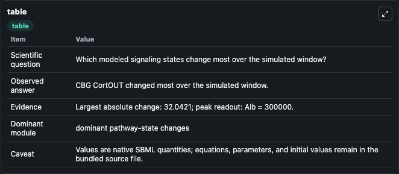
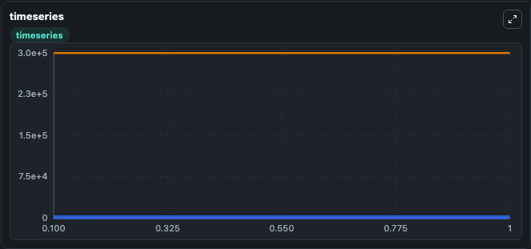
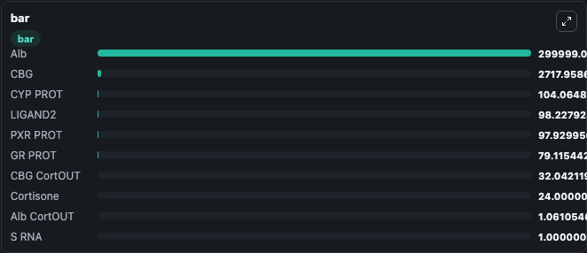

# Kolodkin2013 - Nuclear receptor-mediated cortisol signalling network

This Biosimulant lab wraps `Kolodkin2013 - Nuclear receptor-mediated cortisol signalling network` as a runnable signaling model with a companion visualization module.
Clean Biosimulant lab for systems signaling model: Kolodkin2013 - Nuclear receptor-mediated cortisol signalling network. It can be used to explore second-messenger and pathway-signaling dynamics and compare scenario outcomes across configurations.

## What You'll See

The lab asks: How does Kolodkin2013 - Nuclear receptor-mediated cortisol signalling network route receptor activity into cAMP/PKA-linked readouts? It runs for 1.0 time units with a communication step of 0.1. The run uses the model defaults declared by the curated SBML wrapper. The generated visualizations focus on source-defined S_RNA state, S PROT, PXR GENE, PXR RNA, PXR PROT, and Abstract source state S30, and related outputs, combining trajectory, endpoint-comparison, and summary-table views from one completed dark-mode run.

In this captured run, **CBG CortOUT** moved from 0 to 32.042 across 1.0 simulation windows.

<!-- BIOSIMULANT_VISUALS_START -->
### Output Visualizations



*Summary table for Kolodkin2013 - Nuclear receptor-mediated cortisol signalling network, reporting the scientific question, observed answer, dominant module, and caveat.*



*Trajectories of CBG CortOUT, CBG, GRprot Cort, GR PROT, PXR PROT, and LIGAND2 across the 1.0 simulation. In this run **CBG CortOUT** climbed from 0 to 32.042 and **CBG** fell from 2750.0 to 2718.0 — the largest movements among the focused observables.*



*Largest-excursion ranking of the focused observables — the absolute movement magnitude during the run. Top 3: **Alb** = 3e+05, **CBG** = 2718.0, **CYP PROT** = 104.1, with 7 more observables below.*

<!-- BIOSIMULANT_VISUALS_END -->

## Model Context

- Core model: `models/core`
- Visualization model: `models/visualisation`
- Standard: `other`
- Upstream source: `biomodels_ebi:BIOMD0000000576`
- License: `CC0`
- Visual scope: GPCR and cAMP/PKA signaling
- Caveat: Values are native SBML quantities; equations, parameters, units, and initial values remain in the bundled source file.

## Inputs

| Input | Maps To | Default | Notes |
|---|---|---|---|
| Initial Cort Degr | `signaling_sbml_kolodkin2013_nuclear_receptor_mediated_cortisol_biomd0000000576_model.initial_cort_degr` |  | Initial level of Cort Degr. Maps to SBML symbol `s10`; exposed as a traceable initial-condition perturbation. |
| Initial Cort Added | `signaling_sbml_kolodkin2013_nuclear_receptor_mediated_cortisol_biomd0000000576_model.initial_cort_added` |  | Initial level of Cort Added. Maps to SBML symbol `CortAdded`; exposed as a traceable initial-condition perturbation. |
| Initial Cortisone | `signaling_sbml_kolodkin2013_nuclear_receptor_mediated_cortisol_biomd0000000576_model.initial_cortisone` |  | Initial level of Cortisone. Maps to SBML symbol `Cortisone`; exposed as a traceable initial-condition perturbation. |

## Outputs

| Output | Maps To | Role |
|---|---|---|
| `source_defined_s_rna_state` | `signaling_sbml_kolodkin2013_nuclear_receptor_mediated_cortisol_biomd0000000576_model.source_defined_s_rna_state` | source-defined S_RNA state. |
| `s_prot` | `signaling_sbml_kolodkin2013_nuclear_receptor_mediated_cortisol_biomd0000000576_model.s_prot` | S PROT. |
| `pxr_gene` | `signaling_sbml_kolodkin2013_nuclear_receptor_mediated_cortisol_biomd0000000576_model.pxr_gene` | PXR GENE. |
| `state` | `signaling_sbml_kolodkin2013_nuclear_receptor_mediated_cortisol_biomd0000000576_model.state` | Available to the visualization model and downstream workflows. |
| `summary` | `signaling_sbml_kolodkin2013_nuclear_receptor_mediated_cortisol_biomd0000000576_model.summary` | Available to the visualization model and downstream workflows. |
| `species_labels` | `signaling_sbml_kolodkin2013_nuclear_receptor_mediated_cortisol_biomd0000000576_model.species_labels` | Available to the visualization model and downstream workflows. |

## Runtime

- Duration: `1.0`
- Communication step: `0.1`

## Running Locally

```bash
biosimulant labs serve .
```
